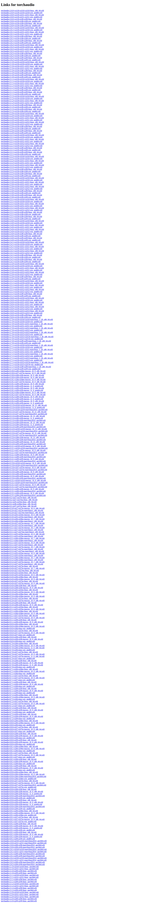

# Visited: http://download.pytorch.org/whl/cu118/torchaudio/
**Time:** Sun May 10 20:47:34 UTC 2026

## Screenshot

## Raw HTML
[page.html](./page.html)

## Downloaded Media (0 files)
_No media files downloaded_

## Other Links
- [https://download-r2.pytorch.org/whl/cu118/torchaudio-2.0.0%2Bcu118-cp310-cp310-linux_x86_64.whl#sha256=289d09b5ec8213907429ad953d4ec4c98096c380d99ce9f7b5ad2c64bc403555](https://download-r2.pytorch.org/whl/cu118/torchaudio-2.0.0%2Bcu118-cp310-cp310-linux_x86_64.whl#sha256=289d09b5ec8213907429ad953d4ec4c98096c380d99ce9f7b5ad2c64bc403555)
- [https://download-r2.pytorch.org/whl/cu118/torchaudio-2.0.0%2Bcu118-cp310-cp310-win_amd64.whl#sha256=a1e992950f0bfcb1cf60ac39a0f6227b70394c5a77b434a88529eb204c9ce9ad](https://download-r2.pytorch.org/whl/cu118/torchaudio-2.0.0%2Bcu118-cp310-cp310-win_amd64.whl#sha256=a1e992950f0bfcb1cf60ac39a0f6227b70394c5a77b434a88529eb204c9ce9ad)
- [https://download-r2.pytorch.org/whl/cu118/torchaudio-2.0.0%2Bcu118-cp311-cp311-linux_x86_64.whl#sha256=e700907139ae40ad8de4623e54b22c6f910d5ae51a5257c024d6a654ab83baea](https://download-r2.pytorch.org/whl/cu118/torchaudio-2.0.0%2Bcu118-cp311-cp311-linux_x86_64.whl#sha256=e700907139ae40ad8de4623e54b22c6f910d5ae51a5257c024d6a654ab83baea)
- [https://download-r2.pytorch.org/whl/cu118/torchaudio-2.0.0%2Bcu118-cp311-cp311-win_amd64.whl#sha256=cca0b548005455692d941356a65637da84f58b4768caa21716f533067e4313e7](https://download-r2.pytorch.org/whl/cu118/torchaudio-2.0.0%2Bcu118-cp311-cp311-win_amd64.whl#sha256=cca0b548005455692d941356a65637da84f58b4768caa21716f533067e4313e7)
- [https://download-r2.pytorch.org/whl/cu118/torchaudio-2.0.0%2Bcu118-cp38-cp38-linux_x86_64.whl#sha256=2ddb7ce2287eeddd2881812c5c46b00b346633d2cd2618dd9673ad0e819aaa0a](https://download-r2.pytorch.org/whl/cu118/torchaudio-2.0.0%2Bcu118-cp38-cp38-linux_x86_64.whl#sha256=2ddb7ce2287eeddd2881812c5c46b00b346633d2cd2618dd9673ad0e819aaa0a)
- [https://download-r2.pytorch.org/whl/cu118/torchaudio-2.0.0%2Bcu118-cp38-cp38-win_amd64.whl#sha256=b0cffddc7743332bed0e4f8c9842e2c0a3e551dbb851cc4c0fdc6358c40cfd68](https://download-r2.pytorch.org/whl/cu118/torchaudio-2.0.0%2Bcu118-cp38-cp38-win_amd64.whl#sha256=b0cffddc7743332bed0e4f8c9842e2c0a3e551dbb851cc4c0fdc6358c40cfd68)
- [https://download-r2.pytorch.org/whl/cu118/torchaudio-2.0.0%2Bcu118-cp39-cp39-linux_x86_64.whl#sha256=3155f40769a9f8f95da43a6e5d9b6c5c23e345aa69c29ca3637a22c0aff3cb2f](https://download-r2.pytorch.org/whl/cu118/torchaudio-2.0.0%2Bcu118-cp39-cp39-linux_x86_64.whl#sha256=3155f40769a9f8f95da43a6e5d9b6c5c23e345aa69c29ca3637a22c0aff3cb2f)
- [https://download-r2.pytorch.org/whl/cu118/torchaudio-2.0.0%2Bcu118-cp39-cp39-win_amd64.whl#sha256=921c206d274fbefad1c74719ec49c3f43aabf5b8d50dfccd7395e2019ccbb715](https://download-r2.pytorch.org/whl/cu118/torchaudio-2.0.0%2Bcu118-cp39-cp39-win_amd64.whl#sha256=921c206d274fbefad1c74719ec49c3f43aabf5b8d50dfccd7395e2019ccbb715)
- [https://download-r2.pytorch.org/whl/cu118/torchaudio-2.0.1%2Bcu118-cp310-cp310-linux_x86_64.whl#sha256=19c4ef9012324c4fb80ea66934551b7807d97148c28538e2eabafe16ab50e91c](https://download-r2.pytorch.org/whl/cu118/torchaudio-2.0.1%2Bcu118-cp310-cp310-linux_x86_64.whl#sha256=19c4ef9012324c4fb80ea66934551b7807d97148c28538e2eabafe16ab50e91c)
- [https://download-r2.pytorch.org/whl/cu118/torchaudio-2.0.1%2Bcu118-cp310-cp310-win_amd64.whl#sha256=c7054eebe9f0f0ff74cb5bf883375f8164db6a89ed08007040cb336f6010375b](https://download-r2.pytorch.org/whl/cu118/torchaudio-2.0.1%2Bcu118-cp310-cp310-win_amd64.whl#sha256=c7054eebe9f0f0ff74cb5bf883375f8164db6a89ed08007040cb336f6010375b)
- [https://download-r2.pytorch.org/whl/cu118/torchaudio-2.0.1%2Bcu118-cp311-cp311-linux_x86_64.whl#sha256=1a2722b6f66578edc563e77b4cc07a22d663a2bb5ee5c9de2539661a98a14db9](https://download-r2.pytorch.org/whl/cu118/torchaudio-2.0.1%2Bcu118-cp311-cp311-linux_x86_64.whl#sha256=1a2722b6f66578edc563e77b4cc07a22d663a2bb5ee5c9de2539661a98a14db9)
- [https://download-r2.pytorch.org/whl/cu118/torchaudio-2.0.1%2Bcu118-cp311-cp311-win_amd64.whl#sha256=3e884a271e6a1eb67a8694042bccb9f25a71bcdfbf0037222ac034193a176ead](https://download-r2.pytorch.org/whl/cu118/torchaudio-2.0.1%2Bcu118-cp311-cp311-win_amd64.whl#sha256=3e884a271e6a1eb67a8694042bccb9f25a71bcdfbf0037222ac034193a176ead)
- [https://download-r2.pytorch.org/whl/cu118/torchaudio-2.0.1%2Bcu118-cp38-cp38-linux_x86_64.whl#sha256=94b0e9c76ca91d1e0289895920fbfe8c117464d757b64b5dfadb1308cf9904f9](https://download-r2.pytorch.org/whl/cu118/torchaudio-2.0.1%2Bcu118-cp38-cp38-linux_x86_64.whl#sha256=94b0e9c76ca91d1e0289895920fbfe8c117464d757b64b5dfadb1308cf9904f9)
- [https://download-r2.pytorch.org/whl/cu118/torchaudio-2.0.1%2Bcu118-cp38-cp38-win_amd64.whl#sha256=8acb163aa31e694b7bba96d659146d8cb10ea3faab8950b97406f3bcf0395005](https://download-r2.pytorch.org/whl/cu118/torchaudio-2.0.1%2Bcu118-cp38-cp38-win_amd64.whl#sha256=8acb163aa31e694b7bba96d659146d8cb10ea3faab8950b97406f3bcf0395005)
- [https://download-r2.pytorch.org/whl/cu118/torchaudio-2.0.1%2Bcu118-cp39-cp39-linux_x86_64.whl#sha256=070b3849696142be3d91e0b27076da1f3f8cb432abcce35cd956d191fc0d8187](https://download-r2.pytorch.org/whl/cu118/torchaudio-2.0.1%2Bcu118-cp39-cp39-linux_x86_64.whl#sha256=070b3849696142be3d91e0b27076da1f3f8cb432abcce35cd956d191fc0d8187)
- [https://download-r2.pytorch.org/whl/cu118/torchaudio-2.0.1%2Bcu118-cp39-cp39-win_amd64.whl#sha256=8cdc67cf83b5c77432c78f5b6adcc8c2c69ddf98744543a2216d26d7ce614546](https://download-r2.pytorch.org/whl/cu118/torchaudio-2.0.1%2Bcu118-cp39-cp39-win_amd64.whl#sha256=8cdc67cf83b5c77432c78f5b6adcc8c2c69ddf98744543a2216d26d7ce614546)
- [https://download-r2.pytorch.org/whl/cu118/torchaudio-2.0.2%2Bcu118-cp310-cp310-linux_x86_64.whl#sha256=26692645ea061a005c57ec581a2d0425210ac6ba9f923edf11cc9b0ef3a111e9](https://download-r2.pytorch.org/whl/cu118/torchaudio-2.0.2%2Bcu118-cp310-cp310-linux_x86_64.whl#sha256=26692645ea061a005c57ec581a2d0425210ac6ba9f923edf11cc9b0ef3a111e9)
- [https://download-r2.pytorch.org/whl/cu118/torchaudio-2.0.2%2Bcu118-cp310-cp310-win_amd64.whl#sha256=8ad0e93e39ce594a5cc53d46d972fde20b499e69d1e7f765adb33de13cfbab86](https://download-r2.pytorch.org/whl/cu118/torchaudio-2.0.2%2Bcu118-cp310-cp310-win_amd64.whl#sha256=8ad0e93e39ce594a5cc53d46d972fde20b499e69d1e7f765adb33de13cfbab86)
- [https://download-r2.pytorch.org/whl/cu118/torchaudio-2.0.2%2Bcu118-cp311-cp311-linux_x86_64.whl#sha256=7bc0b50a0d83a24bdc3916270c23934345ac84351df76bd3bb08834bdb271df6](https://download-r2.pytorch.org/whl/cu118/torchaudio-2.0.2%2Bcu118-cp311-cp311-linux_x86_64.whl#sha256=7bc0b50a0d83a24bdc3916270c23934345ac84351df76bd3bb08834bdb271df6)
- [https://download-r2.pytorch.org/whl/cu118/torchaudio-2.0.2%2Bcu118-cp311-cp311-win_amd64.whl#sha256=608af74eef9ea53f63673811e8eb5e9fc7d812e6122f498b301e2cc3f022349e](https://download-r2.pytorch.org/whl/cu118/torchaudio-2.0.2%2Bcu118-cp311-cp311-win_amd64.whl#sha256=608af74eef9ea53f63673811e8eb5e9fc7d812e6122f498b301e2cc3f022349e)
- [https://download-r2.pytorch.org/whl/cu118/torchaudio-2.0.2%2Bcu118-cp38-cp38-linux_x86_64.whl#sha256=954de78e4f066fe96fa6f418b5f1d7d58d1b0fbcf6a2d3730f041a2fd796f772](https://download-r2.pytorch.org/whl/cu118/torchaudio-2.0.2%2Bcu118-cp38-cp38-linux_x86_64.whl#sha256=954de78e4f066fe96fa6f418b5f1d7d58d1b0fbcf6a2d3730f041a2fd796f772)
- [https://download-r2.pytorch.org/whl/cu118/torchaudio-2.0.2%2Bcu118-cp38-cp38-win_amd64.whl#sha256=97410a93d5eb81014cf3aa8c389a28e99c4b1b5d13b2838bffdac803eaed1ea5](https://download-r2.pytorch.org/whl/cu118/torchaudio-2.0.2%2Bcu118-cp38-cp38-win_amd64.whl#sha256=97410a93d5eb81014cf3aa8c389a28e99c4b1b5d13b2838bffdac803eaed1ea5)
- [https://download-r2.pytorch.org/whl/cu118/torchaudio-2.0.2%2Bcu118-cp39-cp39-linux_x86_64.whl#sha256=322c41c36e8e62fd37ab35114a67921ae542bcd940d583cd13e0e15141c848f9](https://download-r2.pytorch.org/whl/cu118/torchaudio-2.0.2%2Bcu118-cp39-cp39-linux_x86_64.whl#sha256=322c41c36e8e62fd37ab35114a67921ae542bcd940d583cd13e0e15141c848f9)
- [https://download-r2.pytorch.org/whl/cu118/torchaudio-2.0.2%2Bcu118-cp39-cp39-win_amd64.whl#sha256=99595b4b239e5168131d8d016d55fde0b89fe7e0955649daf35f72fe1d3a79f7](https://download-r2.pytorch.org/whl/cu118/torchaudio-2.0.2%2Bcu118-cp39-cp39-win_amd64.whl#sha256=99595b4b239e5168131d8d016d55fde0b89fe7e0955649daf35f72fe1d3a79f7)
- [https://download-r2.pytorch.org/whl/cu118/torchaudio-2.1.0%2Bcu118-cp310-cp310-linux_x86_64.whl#sha256=cdfd0a129406155eee595f408cafbb92589652da4090d1d2040f5453d4cae71f](https://download-r2.pytorch.org/whl/cu118/torchaudio-2.1.0%2Bcu118-cp310-cp310-linux_x86_64.whl#sha256=cdfd0a129406155eee595f408cafbb92589652da4090d1d2040f5453d4cae71f)
- [https://download-r2.pytorch.org/whl/cu118/torchaudio-2.1.0%2Bcu118-cp310-cp310-win_amd64.whl#sha256=0537d813a600f9a6da9a5e9584390317ca288581e2b27a00e0382399b7a2e302](https://download-r2.pytorch.org/whl/cu118/torchaudio-2.1.0%2Bcu118-cp310-cp310-win_amd64.whl#sha256=0537d813a600f9a6da9a5e9584390317ca288581e2b27a00e0382399b7a2e302)
- [https://download-r2.pytorch.org/whl/cu118/torchaudio-2.1.0%2Bcu118-cp311-cp311-linux_x86_64.whl#sha256=bf9b004974a28ea714f6dc5d03308dbd8384b921a2792cf88e498979faf5860d](https://download-r2.pytorch.org/whl/cu118/torchaudio-2.1.0%2Bcu118-cp311-cp311-linux_x86_64.whl#sha256=bf9b004974a28ea714f6dc5d03308dbd8384b921a2792cf88e498979faf5860d)
- [https://download-r2.pytorch.org/whl/cu118/torchaudio-2.1.0%2Bcu118-cp311-cp311-win_amd64.whl#sha256=d902ac1ffa963d1229de6de9461e990be575e76fe5d55e8af99e923bd30c303b](https://download-r2.pytorch.org/whl/cu118/torchaudio-2.1.0%2Bcu118-cp311-cp311-win_amd64.whl#sha256=d902ac1ffa963d1229de6de9461e990be575e76fe5d55e8af99e923bd30c303b)
- [https://download-r2.pytorch.org/whl/cu118/torchaudio-2.1.0%2Bcu118-cp38-cp38-linux_x86_64.whl#sha256=997366189afb6375296e26f5ca2254a47a1e43708a7b09414f77be93f61e9714](https://download-r2.pytorch.org/whl/cu118/torchaudio-2.1.0%2Bcu118-cp38-cp38-linux_x86_64.whl#sha256=997366189afb6375296e26f5ca2254a47a1e43708a7b09414f77be93f61e9714)
- [https://download-r2.pytorch.org/whl/cu118/torchaudio-2.1.0%2Bcu118-cp38-cp38-win_amd64.whl#sha256=2d890551b20ab1024f6cda341dd755eae3c5752690249625da192fccd036b428](https://download-r2.pytorch.org/whl/cu118/torchaudio-2.1.0%2Bcu118-cp38-cp38-win_amd64.whl#sha256=2d890551b20ab1024f6cda341dd755eae3c5752690249625da192fccd036b428)
- [https://download-r2.pytorch.org/whl/cu118/torchaudio-2.1.0%2Bcu118-cp39-cp39-linux_x86_64.whl#sha256=13183c1930da2cf1e73ef9214db1dded56d01b836a3ab0111da9356f1a10aa6b](https://download-r2.pytorch.org/whl/cu118/torchaudio-2.1.0%2Bcu118-cp39-cp39-linux_x86_64.whl#sha256=13183c1930da2cf1e73ef9214db1dded56d01b836a3ab0111da9356f1a10aa6b)
- [https://download-r2.pytorch.org/whl/cu118/torchaudio-2.1.0%2Bcu118-cp39-cp39-win_amd64.whl#sha256=154b9f759d31017847cb41572292b059c2189bdd6ae4d955164a4922511d3c95](https://download-r2.pytorch.org/whl/cu118/torchaudio-2.1.0%2Bcu118-cp39-cp39-win_amd64.whl#sha256=154b9f759d31017847cb41572292b059c2189bdd6ae4d955164a4922511d3c95)
- [https://download-r2.pytorch.org/whl/cu118/torchaudio-2.1.1%2Bcu118-cp310-cp310-linux_x86_64.whl#sha256=46d671337ffa0dd926bf60cfb01f12daad0a99007e20a7d1d9fdb6b72c180abf](https://download-r2.pytorch.org/whl/cu118/torchaudio-2.1.1%2Bcu118-cp310-cp310-linux_x86_64.whl#sha256=46d671337ffa0dd926bf60cfb01f12daad0a99007e20a7d1d9fdb6b72c180abf)
- [https://download-r2.pytorch.org/whl/cu118/torchaudio-2.1.1%2Bcu118-cp310-cp310-win_amd64.whl#sha256=8820064ee5783c4a1b17e992713c0c3fba9afaef9ba0346a4a0403c3c833f384](https://download-r2.pytorch.org/whl/cu118/torchaudio-2.1.1%2Bcu118-cp310-cp310-win_amd64.whl#sha256=8820064ee5783c4a1b17e992713c0c3fba9afaef9ba0346a4a0403c3c833f384)
- [https://download-r2.pytorch.org/whl/cu118/torchaudio-2.1.1%2Bcu118-cp311-cp311-linux_x86_64.whl#sha256=2b077639f240176bb27e964e2e9b3a5c2a8d560a3a7bc1ffd0a024e81f2e10b4](https://download-r2.pytorch.org/whl/cu118/torchaudio-2.1.1%2Bcu118-cp311-cp311-linux_x86_64.whl#sha256=2b077639f240176bb27e964e2e9b3a5c2a8d560a3a7bc1ffd0a024e81f2e10b4)
- [https://download-r2.pytorch.org/whl/cu118/torchaudio-2.1.1%2Bcu118-cp311-cp311-win_amd64.whl#sha256=79b5afa556063be18de4a1964339242301fe04e782e1030a22695257dd9afbd2](https://download-r2.pytorch.org/whl/cu118/torchaudio-2.1.1%2Bcu118-cp311-cp311-win_amd64.whl#sha256=79b5afa556063be18de4a1964339242301fe04e782e1030a22695257dd9afbd2)
- [https://download-r2.pytorch.org/whl/cu118/torchaudio-2.1.1%2Bcu118-cp38-cp38-linux_x86_64.whl#sha256=8269e2c8fb09ed44ddb7c18b7dfea0cd282d63adc084443139229b851b3be7d4](https://download-r2.pytorch.org/whl/cu118/torchaudio-2.1.1%2Bcu118-cp38-cp38-linux_x86_64.whl#sha256=8269e2c8fb09ed44ddb7c18b7dfea0cd282d63adc084443139229b851b3be7d4)
- [https://download-r2.pytorch.org/whl/cu118/torchaudio-2.1.1%2Bcu118-cp38-cp38-win_amd64.whl#sha256=b71d8bd4c8c0eb42b063fc2f2a46b3610659c628b5c23c63e2860b6bdceba133](https://download-r2.pytorch.org/whl/cu118/torchaudio-2.1.1%2Bcu118-cp38-cp38-win_amd64.whl#sha256=b71d8bd4c8c0eb42b063fc2f2a46b3610659c628b5c23c63e2860b6bdceba133)
- [https://download-r2.pytorch.org/whl/cu118/torchaudio-2.1.1%2Bcu118-cp39-cp39-linux_x86_64.whl#sha256=acfd5eeab01b332f48d235dff95a241ef14b719247e69f6965973326fdfdc179](https://download-r2.pytorch.org/whl/cu118/torchaudio-2.1.1%2Bcu118-cp39-cp39-linux_x86_64.whl#sha256=acfd5eeab01b332f48d235dff95a241ef14b719247e69f6965973326fdfdc179)
- [https://download-r2.pytorch.org/whl/cu118/torchaudio-2.1.1%2Bcu118-cp39-cp39-win_amd64.whl#sha256=7358c95be78723c75b88784c6d5021b1197a94b1951190903f11b38a9ffd3bf5](https://download-r2.pytorch.org/whl/cu118/torchaudio-2.1.1%2Bcu118-cp39-cp39-win_amd64.whl#sha256=7358c95be78723c75b88784c6d5021b1197a94b1951190903f11b38a9ffd3bf5)
- [https://download-r2.pytorch.org/whl/cu118/torchaudio-2.1.2%2Bcu118-cp310-cp310-linux_x86_64.whl#sha256=b39468862d34a3a89af4db333bc935a02525a509b2c8949f638f83eb6061da02](https://download-r2.pytorch.org/whl/cu118/torchaudio-2.1.2%2Bcu118-cp310-cp310-linux_x86_64.whl#sha256=b39468862d34a3a89af4db333bc935a02525a509b2c8949f638f83eb6061da02)
- [https://download-r2.pytorch.org/whl/cu118/torchaudio-2.1.2%2Bcu118-cp310-cp310-win_amd64.whl#sha256=0d02bc0336ee4b3553f0d13f88f61121db2fc21de7b147f4957ecdbcc1dc1c89](https://download-r2.pytorch.org/whl/cu118/torchaudio-2.1.2%2Bcu118-cp310-cp310-win_amd64.whl#sha256=0d02bc0336ee4b3553f0d13f88f61121db2fc21de7b147f4957ecdbcc1dc1c89)
- [https://download-r2.pytorch.org/whl/cu118/torchaudio-2.1.2%2Bcu118-cp311-cp311-linux_x86_64.whl#sha256=f762d7f7dbc2bc49cc53ab0830ae222485d54e34835db549a0d1ad40eb609af3](https://download-r2.pytorch.org/whl/cu118/torchaudio-2.1.2%2Bcu118-cp311-cp311-linux_x86_64.whl#sha256=f762d7f7dbc2bc49cc53ab0830ae222485d54e34835db549a0d1ad40eb609af3)
- [https://download-r2.pytorch.org/whl/cu118/torchaudio-2.1.2%2Bcu118-cp311-cp311-win_amd64.whl#sha256=598e885648ac94c24920104f185e72fe9f4a9519c2d29b009e47cbc0866e6244](https://download-r2.pytorch.org/whl/cu118/torchaudio-2.1.2%2Bcu118-cp311-cp311-win_amd64.whl#sha256=598e885648ac94c24920104f185e72fe9f4a9519c2d29b009e47cbc0866e6244)
- [https://download-r2.pytorch.org/whl/cu118/torchaudio-2.1.2%2Bcu118-cp38-cp38-linux_x86_64.whl#sha256=f9504717938c3ebdd7e21b3264f00d5d70ea658d3fb447ecc840e1fd65340463](https://download-r2.pytorch.org/whl/cu118/torchaudio-2.1.2%2Bcu118-cp38-cp38-linux_x86_64.whl#sha256=f9504717938c3ebdd7e21b3264f00d5d70ea658d3fb447ecc840e1fd65340463)
- [https://download-r2.pytorch.org/whl/cu118/torchaudio-2.1.2%2Bcu118-cp38-cp38-win_amd64.whl#sha256=94b687ae31db6fb082e975055244199088d58fc2f4111319d7f9baad9e41d4de](https://download-r2.pytorch.org/whl/cu118/torchaudio-2.1.2%2Bcu118-cp38-cp38-win_amd64.whl#sha256=94b687ae31db6fb082e975055244199088d58fc2f4111319d7f9baad9e41d4de)
- [https://download-r2.pytorch.org/whl/cu118/torchaudio-2.1.2%2Bcu118-cp39-cp39-linux_x86_64.whl#sha256=8826c91462be0fd214fef2236902e011bc0184a2d677135964e806d332b85450](https://download-r2.pytorch.org/whl/cu118/torchaudio-2.1.2%2Bcu118-cp39-cp39-linux_x86_64.whl#sha256=8826c91462be0fd214fef2236902e011bc0184a2d677135964e806d332b85450)
- [https://download-r2.pytorch.org/whl/cu118/torchaudio-2.1.2%2Bcu118-cp39-cp39-win_amd64.whl#sha256=1777d348d68abb8b011f862fd169efc248a024d28cb60031a0d767781585b030](https://download-r2.pytorch.org/whl/cu118/torchaudio-2.1.2%2Bcu118-cp39-cp39-win_amd64.whl#sha256=1777d348d68abb8b011f862fd169efc248a024d28cb60031a0d767781585b030)
- [https://download-r2.pytorch.org/whl/cu118/torchaudio-2.2.0%2Bcu118-cp310-cp310-linux_x86_64.whl#sha256=c932803b158f8ad66bcf13eff4f1fc3f7c9e6e02c13fb6eda42c0e5fcea99588](https://download-r2.pytorch.org/whl/cu118/torchaudio-2.2.0%2Bcu118-cp310-cp310-linux_x86_64.whl#sha256=c932803b158f8ad66bcf13eff4f1fc3f7c9e6e02c13fb6eda42c0e5fcea99588)
- [https://download-r2.pytorch.org/whl/cu118/torchaudio-2.2.0%2Bcu118-cp310-cp310-win_amd64.whl#sha256=098bff79ca038d491cd166209bcf3a21733ed25a3d14f9e1e4dc2bb36f9a282a](https://download-r2.pytorch.org/whl/cu118/torchaudio-2.2.0%2Bcu118-cp310-cp310-win_amd64.whl#sha256=098bff79ca038d491cd166209bcf3a21733ed25a3d14f9e1e4dc2bb36f9a282a)

## Stats
- Links: 416
- Media: 0
