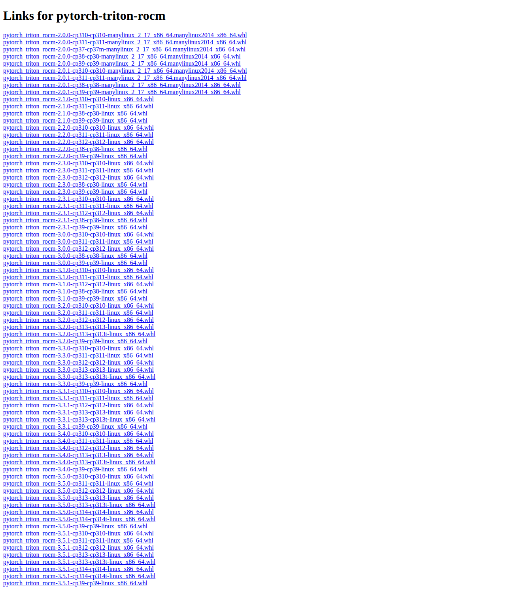

# Visited: https://download.pytorch.org/whl/cu118/pytorch-triton-rocm/
**Time:** Sun May 10 20:09:34 UTC 2026

## Screenshot

## Raw HTML
[page.html](./page.html)

## Downloaded Media (0 files)
_No media files downloaded_

## Other Links
- [https://download-r2.pytorch.org/whl/pytorch_triton_rocm-2.0.0-cp310-cp310-manylinux_2_17_x86_64.manylinux2014_x86_64.whl#sha256=25d9fe665cbc0159589a0cedc6e96a5f1fb9e94eb797be2bdb2a39aefaefbe0d](https://download-r2.pytorch.org/whl/pytorch_triton_rocm-2.0.0-cp310-cp310-manylinux_2_17_x86_64.manylinux2014_x86_64.whl#sha256=25d9fe665cbc0159589a0cedc6e96a5f1fb9e94eb797be2bdb2a39aefaefbe0d)
- [https://download-r2.pytorch.org/whl/pytorch_triton_rocm-2.0.0-cp311-cp311-manylinux_2_17_x86_64.manylinux2014_x86_64.whl#sha256=d8f1ecb238282ce60a7c8476fc2e0fa527610ce0736c8f9845004830acd2450c](https://download-r2.pytorch.org/whl/pytorch_triton_rocm-2.0.0-cp311-cp311-manylinux_2_17_x86_64.manylinux2014_x86_64.whl#sha256=d8f1ecb238282ce60a7c8476fc2e0fa527610ce0736c8f9845004830acd2450c)
- [https://download-r2.pytorch.org/whl/pytorch_triton_rocm-2.0.0-cp37-cp37m-manylinux_2_17_x86_64.manylinux2014_x86_64.whl#sha256=ae9423c6396aaca7fde3fbd9788ce4eb1e8e8a5a50ad356f11f1fc6bf2dda590](https://download-r2.pytorch.org/whl/pytorch_triton_rocm-2.0.0-cp37-cp37m-manylinux_2_17_x86_64.manylinux2014_x86_64.whl#sha256=ae9423c6396aaca7fde3fbd9788ce4eb1e8e8a5a50ad356f11f1fc6bf2dda590)
- [https://download-r2.pytorch.org/whl/pytorch_triton_rocm-2.0.0-cp38-cp38-manylinux_2_17_x86_64.manylinux2014_x86_64.whl#sha256=3f825a178b1439ec2809502201e43d89fd6277859a1c59e550a6f873626d31b2](https://download-r2.pytorch.org/whl/pytorch_triton_rocm-2.0.0-cp38-cp38-manylinux_2_17_x86_64.manylinux2014_x86_64.whl#sha256=3f825a178b1439ec2809502201e43d89fd6277859a1c59e550a6f873626d31b2)
- [https://download-r2.pytorch.org/whl/pytorch_triton_rocm-2.0.0-cp39-cp39-manylinux_2_17_x86_64.manylinux2014_x86_64.whl#sha256=e2088bb3ffffae2175a9eedc137456d0ea9e9a323b0d698b9d7f5040390cd279](https://download-r2.pytorch.org/whl/pytorch_triton_rocm-2.0.0-cp39-cp39-manylinux_2_17_x86_64.manylinux2014_x86_64.whl#sha256=e2088bb3ffffae2175a9eedc137456d0ea9e9a323b0d698b9d7f5040390cd279)
- [https://download-r2.pytorch.org/whl/pytorch_triton_rocm-2.0.1-cp310-cp310-manylinux_2_17_x86_64.manylinux2014_x86_64.whl#sha256=be62fb647975bf80ecbc0f6856c179a0c719cd05b774ca43d789b9099a94e131](https://download-r2.pytorch.org/whl/pytorch_triton_rocm-2.0.1-cp310-cp310-manylinux_2_17_x86_64.manylinux2014_x86_64.whl#sha256=be62fb647975bf80ecbc0f6856c179a0c719cd05b774ca43d789b9099a94e131)
- [https://download-r2.pytorch.org/whl/pytorch_triton_rocm-2.0.1-cp311-cp311-manylinux_2_17_x86_64.manylinux2014_x86_64.whl#sha256=197a0696b66e9a2767baf9cf8ec05f55ecb48e0fee595db9278186b5927bfa23](https://download-r2.pytorch.org/whl/pytorch_triton_rocm-2.0.1-cp311-cp311-manylinux_2_17_x86_64.manylinux2014_x86_64.whl#sha256=197a0696b66e9a2767baf9cf8ec05f55ecb48e0fee595db9278186b5927bfa23)
- [https://download-r2.pytorch.org/whl/pytorch_triton_rocm-2.0.1-cp38-cp38-manylinux_2_17_x86_64.manylinux2014_x86_64.whl#sha256=61ee5afd05d346bedbb3a6a68b05b3691f3f3f577c4ba0e9b9928d02c0c2e8e9](https://download-r2.pytorch.org/whl/pytorch_triton_rocm-2.0.1-cp38-cp38-manylinux_2_17_x86_64.manylinux2014_x86_64.whl#sha256=61ee5afd05d346bedbb3a6a68b05b3691f3f3f577c4ba0e9b9928d02c0c2e8e9)
- [https://download-r2.pytorch.org/whl/pytorch_triton_rocm-2.0.1-cp39-cp39-manylinux_2_17_x86_64.manylinux2014_x86_64.whl#sha256=5724f773d46b44bae52637baec8d31488cf8b627ceb2e33862a6c9aef22969de](https://download-r2.pytorch.org/whl/pytorch_triton_rocm-2.0.1-cp39-cp39-manylinux_2_17_x86_64.manylinux2014_x86_64.whl#sha256=5724f773d46b44bae52637baec8d31488cf8b627ceb2e33862a6c9aef22969de)
- [https://download-r2.pytorch.org/whl/pytorch_triton_rocm-2.1.0-cp310-cp310-linux_x86_64.whl#sha256=12fbf2ded4e5efcab0ff9ecc2de17f667dc4ef0a8a952ab9b549344ca4feb19e](https://download-r2.pytorch.org/whl/pytorch_triton_rocm-2.1.0-cp310-cp310-linux_x86_64.whl#sha256=12fbf2ded4e5efcab0ff9ecc2de17f667dc4ef0a8a952ab9b549344ca4feb19e)
- [https://download-r2.pytorch.org/whl/pytorch_triton_rocm-2.1.0-cp311-cp311-linux_x86_64.whl#sha256=317686e3b0b72c0c4162fe7893cbcc8ba37c1ab6bee3d0830b547dcc97c208e1](https://download-r2.pytorch.org/whl/pytorch_triton_rocm-2.1.0-cp311-cp311-linux_x86_64.whl#sha256=317686e3b0b72c0c4162fe7893cbcc8ba37c1ab6bee3d0830b547dcc97c208e1)
- [https://download-r2.pytorch.org/whl/pytorch_triton_rocm-2.1.0-cp38-cp38-linux_x86_64.whl#sha256=da6b766a562dc120c9a83dc3658e697a4e88c7cc9958499d687084558ece2ace](https://download-r2.pytorch.org/whl/pytorch_triton_rocm-2.1.0-cp38-cp38-linux_x86_64.whl#sha256=da6b766a562dc120c9a83dc3658e697a4e88c7cc9958499d687084558ece2ace)
- [https://download-r2.pytorch.org/whl/pytorch_triton_rocm-2.1.0-cp39-cp39-linux_x86_64.whl#sha256=3c803538b0adc2a8d3026338e3914c66ff18df033755a9835f8ca42654ab4340](https://download-r2.pytorch.org/whl/pytorch_triton_rocm-2.1.0-cp39-cp39-linux_x86_64.whl#sha256=3c803538b0adc2a8d3026338e3914c66ff18df033755a9835f8ca42654ab4340)
- [https://download-r2.pytorch.org/whl/pytorch_triton_rocm-2.2.0-cp310-cp310-linux_x86_64.whl#sha256=6c9667213c304650d65ffd5d0a52c4385edbc09cfe01d83a502f1c0b38465ecb](https://download-r2.pytorch.org/whl/pytorch_triton_rocm-2.2.0-cp310-cp310-linux_x86_64.whl#sha256=6c9667213c304650d65ffd5d0a52c4385edbc09cfe01d83a502f1c0b38465ecb)
- [https://download-r2.pytorch.org/whl/pytorch_triton_rocm-2.2.0-cp311-cp311-linux_x86_64.whl#sha256=f8ac03d7e4114bd37c3ed1f98d84cdb15f1b1c5b3c0ecac305ada0d683520b9d](https://download-r2.pytorch.org/whl/pytorch_triton_rocm-2.2.0-cp311-cp311-linux_x86_64.whl#sha256=f8ac03d7e4114bd37c3ed1f98d84cdb15f1b1c5b3c0ecac305ada0d683520b9d)
- [https://download-r2.pytorch.org/whl/pytorch_triton_rocm-2.2.0-cp312-cp312-linux_x86_64.whl#sha256=0a09c9a6f997b59266d4a4a0f8a29a1bc923c41996d235070a598aae3012171e](https://download-r2.pytorch.org/whl/pytorch_triton_rocm-2.2.0-cp312-cp312-linux_x86_64.whl#sha256=0a09c9a6f997b59266d4a4a0f8a29a1bc923c41996d235070a598aae3012171e)
- [https://download-r2.pytorch.org/whl/pytorch_triton_rocm-2.2.0-cp38-cp38-linux_x86_64.whl#sha256=1933571656d527916e14bf4748767ba9987230cbda94342e4ab3a991cc469703](https://download-r2.pytorch.org/whl/pytorch_triton_rocm-2.2.0-cp38-cp38-linux_x86_64.whl#sha256=1933571656d527916e14bf4748767ba9987230cbda94342e4ab3a991cc469703)
- [https://download-r2.pytorch.org/whl/pytorch_triton_rocm-2.2.0-cp39-cp39-linux_x86_64.whl#sha256=f4e8970163001c5c6f09aafd7ce194d92f1b2c30fa8c9a658bdc07698df2795a](https://download-r2.pytorch.org/whl/pytorch_triton_rocm-2.2.0-cp39-cp39-linux_x86_64.whl#sha256=f4e8970163001c5c6f09aafd7ce194d92f1b2c30fa8c9a658bdc07698df2795a)
- [https://download-r2.pytorch.org/whl/pytorch_triton_rocm-2.3.0-cp310-cp310-linux_x86_64.whl#sha256=5a9808aa0066b0bb9fa216e31e77bb9747a67f8d62ef9ba467d36a76023075f2](https://download-r2.pytorch.org/whl/pytorch_triton_rocm-2.3.0-cp310-cp310-linux_x86_64.whl#sha256=5a9808aa0066b0bb9fa216e31e77bb9747a67f8d62ef9ba467d36a76023075f2)
- [https://download-r2.pytorch.org/whl/pytorch_triton_rocm-2.3.0-cp311-cp311-linux_x86_64.whl#sha256=7436e28062a22e95d708c95b97ba7d3f63a896df4fd5145ebfc4700c4df2d186](https://download-r2.pytorch.org/whl/pytorch_triton_rocm-2.3.0-cp311-cp311-linux_x86_64.whl#sha256=7436e28062a22e95d708c95b97ba7d3f63a896df4fd5145ebfc4700c4df2d186)
- [https://download-r2.pytorch.org/whl/pytorch_triton_rocm-2.3.0-cp312-cp312-linux_x86_64.whl#sha256=5612059560af65ccb4f87c81a3b24e633fe73092a033326400e9a5e84f6b4c99](https://download-r2.pytorch.org/whl/pytorch_triton_rocm-2.3.0-cp312-cp312-linux_x86_64.whl#sha256=5612059560af65ccb4f87c81a3b24e633fe73092a033326400e9a5e84f6b4c99)
- [https://download-r2.pytorch.org/whl/pytorch_triton_rocm-2.3.0-cp38-cp38-linux_x86_64.whl#sha256=2309ef65360ee8735e0e3cc3610e8d410e005c2baadb891a088043f64b3f4535](https://download-r2.pytorch.org/whl/pytorch_triton_rocm-2.3.0-cp38-cp38-linux_x86_64.whl#sha256=2309ef65360ee8735e0e3cc3610e8d410e005c2baadb891a088043f64b3f4535)
- [https://download-r2.pytorch.org/whl/pytorch_triton_rocm-2.3.0-cp39-cp39-linux_x86_64.whl#sha256=53a1b5ac999eb923eded14300144429ebecc6bd2aff5f72a65f2840f04648f52](https://download-r2.pytorch.org/whl/pytorch_triton_rocm-2.3.0-cp39-cp39-linux_x86_64.whl#sha256=53a1b5ac999eb923eded14300144429ebecc6bd2aff5f72a65f2840f04648f52)
- [https://download-r2.pytorch.org/whl/pytorch_triton_rocm-2.3.1-cp310-cp310-linux_x86_64.whl#sha256=db52f8b5cf00e5b6cd0fe9efcdc0827979cfe06317afe825f0602930e61e4c29](https://download-r2.pytorch.org/whl/pytorch_triton_rocm-2.3.1-cp310-cp310-linux_x86_64.whl#sha256=db52f8b5cf00e5b6cd0fe9efcdc0827979cfe06317afe825f0602930e61e4c29)
- [https://download-r2.pytorch.org/whl/pytorch_triton_rocm-2.3.1-cp311-cp311-linux_x86_64.whl#sha256=e5eb578d9feb185d35886b9a7d969896d94881f710e083990c45dff19af5fa74](https://download-r2.pytorch.org/whl/pytorch_triton_rocm-2.3.1-cp311-cp311-linux_x86_64.whl#sha256=e5eb578d9feb185d35886b9a7d969896d94881f710e083990c45dff19af5fa74)
- [https://download-r2.pytorch.org/whl/pytorch_triton_rocm-2.3.1-cp312-cp312-linux_x86_64.whl#sha256=4019e239b1801d9cb2ab832ca3ca09f66da0b237f8fc8dae68805457313c21c7](https://download-r2.pytorch.org/whl/pytorch_triton_rocm-2.3.1-cp312-cp312-linux_x86_64.whl#sha256=4019e239b1801d9cb2ab832ca3ca09f66da0b237f8fc8dae68805457313c21c7)
- [https://download-r2.pytorch.org/whl/pytorch_triton_rocm-2.3.1-cp38-cp38-linux_x86_64.whl#sha256=343d587735644c9ada403fd4cbee43d09aa8e66ed58c6c94786a69f7cfc64809](https://download-r2.pytorch.org/whl/pytorch_triton_rocm-2.3.1-cp38-cp38-linux_x86_64.whl#sha256=343d587735644c9ada403fd4cbee43d09aa8e66ed58c6c94786a69f7cfc64809)
- [https://download-r2.pytorch.org/whl/pytorch_triton_rocm-2.3.1-cp39-cp39-linux_x86_64.whl#sha256=914abc55be95b6a26d89ef32505e3aff68c01e1e95dd42a3467c7876579d7988](https://download-r2.pytorch.org/whl/pytorch_triton_rocm-2.3.1-cp39-cp39-linux_x86_64.whl#sha256=914abc55be95b6a26d89ef32505e3aff68c01e1e95dd42a3467c7876579d7988)
- [https://download-r2.pytorch.org/whl/pytorch_triton_rocm-3.0.0-cp310-cp310-linux_x86_64.whl#sha256=191624e8f14e2179b9e0dae38b518465e71cb59ac40f6998c226aac19d6d616f](https://download-r2.pytorch.org/whl/pytorch_triton_rocm-3.0.0-cp310-cp310-linux_x86_64.whl#sha256=191624e8f14e2179b9e0dae38b518465e71cb59ac40f6998c226aac19d6d616f)
- [https://download-r2.pytorch.org/whl/pytorch_triton_rocm-3.0.0-cp311-cp311-linux_x86_64.whl#sha256=cf51a22a814de8a9c52c05dc00c193b55cd9dca9020da1d204a40153b97305f5](https://download-r2.pytorch.org/whl/pytorch_triton_rocm-3.0.0-cp311-cp311-linux_x86_64.whl#sha256=cf51a22a814de8a9c52c05dc00c193b55cd9dca9020da1d204a40153b97305f5)
- [https://download-r2.pytorch.org/whl/pytorch_triton_rocm-3.0.0-cp312-cp312-linux_x86_64.whl#sha256=650ce7a6624ecbbe90c30fccb472a57772c08bc6f12312246f7af584f275b7ca](https://download-r2.pytorch.org/whl/pytorch_triton_rocm-3.0.0-cp312-cp312-linux_x86_64.whl#sha256=650ce7a6624ecbbe90c30fccb472a57772c08bc6f12312246f7af584f275b7ca)
- [https://download-r2.pytorch.org/whl/pytorch_triton_rocm-3.0.0-cp38-cp38-linux_x86_64.whl#sha256=86d5401510a6d6bfd00e679aa7b5928909d86d95eddfe24edc990b02fc4ab64a](https://download-r2.pytorch.org/whl/pytorch_triton_rocm-3.0.0-cp38-cp38-linux_x86_64.whl#sha256=86d5401510a6d6bfd00e679aa7b5928909d86d95eddfe24edc990b02fc4ab64a)
- [https://download-r2.pytorch.org/whl/pytorch_triton_rocm-3.0.0-cp39-cp39-linux_x86_64.whl#sha256=5f498d86f82d0c8dca04ae675c3b05bdb68872adfff324839fb234cee0b92478](https://download-r2.pytorch.org/whl/pytorch_triton_rocm-3.0.0-cp39-cp39-linux_x86_64.whl#sha256=5f498d86f82d0c8dca04ae675c3b05bdb68872adfff324839fb234cee0b92478)
- [https://download-r2.pytorch.org/whl/pytorch_triton_rocm-3.1.0-cp310-cp310-linux_x86_64.whl#sha256=328592189d7f7bbebdfdcb806c02970977f124d756e7915ff8ff8493f2d12802](https://download-r2.pytorch.org/whl/pytorch_triton_rocm-3.1.0-cp310-cp310-linux_x86_64.whl#sha256=328592189d7f7bbebdfdcb806c02970977f124d756e7915ff8ff8493f2d12802)
- [https://download-r2.pytorch.org/whl/pytorch_triton_rocm-3.1.0-cp311-cp311-linux_x86_64.whl#sha256=4b0a563986aa591ecbbfd69d53f171447f64ba453cecaafd80d853b3f1047eca](https://download-r2.pytorch.org/whl/pytorch_triton_rocm-3.1.0-cp311-cp311-linux_x86_64.whl#sha256=4b0a563986aa591ecbbfd69d53f171447f64ba453cecaafd80d853b3f1047eca)
- [https://download-r2.pytorch.org/whl/pytorch_triton_rocm-3.1.0-cp312-cp312-linux_x86_64.whl#sha256=3b56b87886d03dcf3aeb8f78f372f5da60b29ffdffcba5cd767b4bfdec47175b](https://download-r2.pytorch.org/whl/pytorch_triton_rocm-3.1.0-cp312-cp312-linux_x86_64.whl#sha256=3b56b87886d03dcf3aeb8f78f372f5da60b29ffdffcba5cd767b4bfdec47175b)
- [https://download-r2.pytorch.org/whl/pytorch_triton_rocm-3.1.0-cp38-cp38-linux_x86_64.whl#sha256=40c1fcc9b541deb93869c317ffaa6cc2ee5ce6aa92ea4148d153df324e132c39](https://download-r2.pytorch.org/whl/pytorch_triton_rocm-3.1.0-cp38-cp38-linux_x86_64.whl#sha256=40c1fcc9b541deb93869c317ffaa6cc2ee5ce6aa92ea4148d153df324e132c39)
- [https://download-r2.pytorch.org/whl/pytorch_triton_rocm-3.1.0-cp39-cp39-linux_x86_64.whl#sha256=8e628b3e97b2a89619018fbc5adc6f8bd012673b754a26edcf23ed5e8ff056e6](https://download-r2.pytorch.org/whl/pytorch_triton_rocm-3.1.0-cp39-cp39-linux_x86_64.whl#sha256=8e628b3e97b2a89619018fbc5adc6f8bd012673b754a26edcf23ed5e8ff056e6)
- [https://download-r2.pytorch.org/whl/pytorch_triton_rocm-3.2.0-cp310-cp310-linux_x86_64.whl#sha256=24b893a8f5ec5bb770a75b34c7a67c08970193409a19dcd5de0071d22ad73278](https://download-r2.pytorch.org/whl/pytorch_triton_rocm-3.2.0-cp310-cp310-linux_x86_64.whl#sha256=24b893a8f5ec5bb770a75b34c7a67c08970193409a19dcd5de0071d22ad73278)
- [https://download-r2.pytorch.org/whl/pytorch_triton_rocm-3.2.0-cp311-cp311-linux_x86_64.whl#sha256=54d13ab44cbc9f157549cd8e46ec9b94b2ef3da3ced658497eeed206daa53d5f](https://download-r2.pytorch.org/whl/pytorch_triton_rocm-3.2.0-cp311-cp311-linux_x86_64.whl#sha256=54d13ab44cbc9f157549cd8e46ec9b94b2ef3da3ced658497eeed206daa53d5f)
- [https://download-r2.pytorch.org/whl/pytorch_triton_rocm-3.2.0-cp312-cp312-linux_x86_64.whl#sha256=76523e0e01d996ca0eeddf77e2436f696155cbb40a97f0759c00c0a1e8c2ae17](https://download-r2.pytorch.org/whl/pytorch_triton_rocm-3.2.0-cp312-cp312-linux_x86_64.whl#sha256=76523e0e01d996ca0eeddf77e2436f696155cbb40a97f0759c00c0a1e8c2ae17)
- [https://download-r2.pytorch.org/whl/pytorch_triton_rocm-3.2.0-cp313-cp313-linux_x86_64.whl#sha256=57b33cdf2063f3c1b52ce38fc12843ab8ba4383035dab4c67194b5313d83c3eb](https://download-r2.pytorch.org/whl/pytorch_triton_rocm-3.2.0-cp313-cp313-linux_x86_64.whl#sha256=57b33cdf2063f3c1b52ce38fc12843ab8ba4383035dab4c67194b5313d83c3eb)
- [https://download-r2.pytorch.org/whl/pytorch_triton_rocm-3.2.0-cp313-cp313t-linux_x86_64.whl#sha256=4f07fbb0201218e1d2892cae5ba78edf2d60f15066ae794d63c2d786d1fb137e](https://download-r2.pytorch.org/whl/pytorch_triton_rocm-3.2.0-cp313-cp313t-linux_x86_64.whl#sha256=4f07fbb0201218e1d2892cae5ba78edf2d60f15066ae794d63c2d786d1fb137e)
- [https://download-r2.pytorch.org/whl/pytorch_triton_rocm-3.2.0-cp39-cp39-linux_x86_64.whl#sha256=8bc1441409daf01e15bfc4b8332cb1a023fa16c9f3fbf1faf9f1b72a956edcfc](https://download-r2.pytorch.org/whl/pytorch_triton_rocm-3.2.0-cp39-cp39-linux_x86_64.whl#sha256=8bc1441409daf01e15bfc4b8332cb1a023fa16c9f3fbf1faf9f1b72a956edcfc)
- [https://download-r2.pytorch.org/whl/pytorch_triton_rocm-3.3.0-cp310-cp310-linux_x86_64.whl#sha256=8d6af3d5b8b43c42b33478d8817c795dd5d6fa1a2e777a154848c18c38eda84a](https://download-r2.pytorch.org/whl/pytorch_triton_rocm-3.3.0-cp310-cp310-linux_x86_64.whl#sha256=8d6af3d5b8b43c42b33478d8817c795dd5d6fa1a2e777a154848c18c38eda84a)
- [https://download-r2.pytorch.org/whl/pytorch_triton_rocm-3.3.0-cp311-cp311-linux_x86_64.whl#sha256=deab3d7270c85ddcdc39daab967434b1db8c08cf01ccc1cb9999fdaef8fc78a4](https://download-r2.pytorch.org/whl/pytorch_triton_rocm-3.3.0-cp311-cp311-linux_x86_64.whl#sha256=deab3d7270c85ddcdc39daab967434b1db8c08cf01ccc1cb9999fdaef8fc78a4)
- [https://download-r2.pytorch.org/whl/pytorch_triton_rocm-3.3.0-cp312-cp312-linux_x86_64.whl#sha256=433a71e77fc37fd77d674a8c5e6039a8d959c427d3d0972b46f186190691d26f](https://download-r2.pytorch.org/whl/pytorch_triton_rocm-3.3.0-cp312-cp312-linux_x86_64.whl#sha256=433a71e77fc37fd77d674a8c5e6039a8d959c427d3d0972b46f186190691d26f)
- [https://download-r2.pytorch.org/whl/pytorch_triton_rocm-3.3.0-cp313-cp313-linux_x86_64.whl#sha256=43f9b1b062723599bdc235234911166825be0f78ddd2360c4c29c1229e83755f](https://download-r2.pytorch.org/whl/pytorch_triton_rocm-3.3.0-cp313-cp313-linux_x86_64.whl#sha256=43f9b1b062723599bdc235234911166825be0f78ddd2360c4c29c1229e83755f)
- [https://download-r2.pytorch.org/whl/pytorch_triton_rocm-3.3.0-cp313-cp313t-linux_x86_64.whl#sha256=6bd80532d21200ddc8a35ef76ff92d5719193f43e74f905b047671934360031e](https://download-r2.pytorch.org/whl/pytorch_triton_rocm-3.3.0-cp313-cp313t-linux_x86_64.whl#sha256=6bd80532d21200ddc8a35ef76ff92d5719193f43e74f905b047671934360031e)
- [https://download-r2.pytorch.org/whl/pytorch_triton_rocm-3.3.0-cp39-cp39-linux_x86_64.whl#sha256=3d60ce5eefc60974658e963647b4384e4daf3d442952c4bad991504ce51d4b69](https://download-r2.pytorch.org/whl/pytorch_triton_rocm-3.3.0-cp39-cp39-linux_x86_64.whl#sha256=3d60ce5eefc60974658e963647b4384e4daf3d442952c4bad991504ce51d4b69)

## Stats
- Links: 78
- Media: 0
