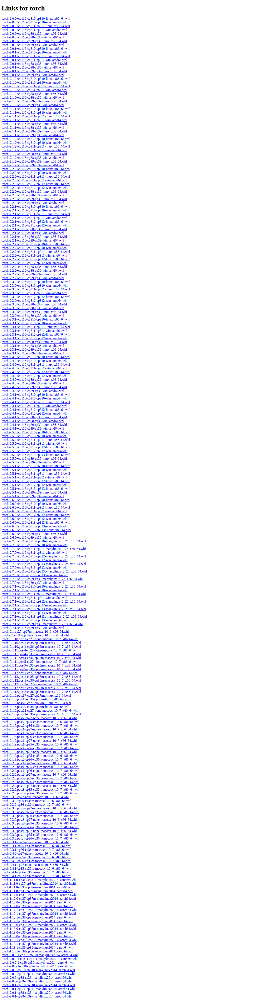

# Visited: https://download.pytorch.org/whl/cu118/torch/
**Time:** Sat May  9 23:23:05 UTC 2026

## Screenshot

## Raw HTML
[page.html](./page.html)

## Downloaded Media (0 files)
_No media files downloaded_

## Other Links
- [https://download-r2.pytorch.org/whl/cu118/torch-2.0.0%2Bcu118-cp310-cp310-linux_x86_64.whl#sha256=4b690e2b77f21073500c65d8bb9ea9656b8cb4e969f357370bbc992a3b074764](https://download-r2.pytorch.org/whl/cu118/torch-2.0.0%2Bcu118-cp310-cp310-linux_x86_64.whl#sha256=4b690e2b77f21073500c65d8bb9ea9656b8cb4e969f357370bbc992a3b074764)
- [https://download-r2.pytorch.org/whl/cu118/torch-2.0.0%2Bcu118-cp310-cp310-win_amd64.whl#sha256=5ee2b7c19265b9c869525c378fcdf350510b8f3fc08af26da1a2587a34cea8f5](https://download-r2.pytorch.org/whl/cu118/torch-2.0.0%2Bcu118-cp310-cp310-win_amd64.whl#sha256=5ee2b7c19265b9c869525c378fcdf350510b8f3fc08af26da1a2587a34cea8f5)
- [https://download-r2.pytorch.org/whl/cu118/torch-2.0.0%2Bcu118-cp311-cp311-linux_x86_64.whl#sha256=238573d362c564113451046f6708c3b8158fe6b1b7f6c03b7273327d955deb54](https://download-r2.pytorch.org/whl/cu118/torch-2.0.0%2Bcu118-cp311-cp311-linux_x86_64.whl#sha256=238573d362c564113451046f6708c3b8158fe6b1b7f6c03b7273327d955deb54)
- [https://download-r2.pytorch.org/whl/cu118/torch-2.0.0%2Bcu118-cp311-cp311-win_amd64.whl#sha256=dbba5b085722d24d617102954d9a9023ee4f7584148a9e465afb0c9696d15517](https://download-r2.pytorch.org/whl/cu118/torch-2.0.0%2Bcu118-cp311-cp311-win_amd64.whl#sha256=dbba5b085722d24d617102954d9a9023ee4f7584148a9e465afb0c9696d15517)
- [https://download-r2.pytorch.org/whl/cu118/torch-2.0.0%2Bcu118-cp38-cp38-linux_x86_64.whl#sha256=1f8efaebfcbb7ec3962fd8c7c3be02c6666eff53a12043006a749d647656163e](https://download-r2.pytorch.org/whl/cu118/torch-2.0.0%2Bcu118-cp38-cp38-linux_x86_64.whl#sha256=1f8efaebfcbb7ec3962fd8c7c3be02c6666eff53a12043006a749d647656163e)
- [https://download-r2.pytorch.org/whl/cu118/torch-2.0.0%2Bcu118-cp38-cp38-win_amd64.whl#sha256=2588926725750c9ba799c133d4f6ee8fa477f6f0d88d6c2cebfe5bcfe8d7d7c3](https://download-r2.pytorch.org/whl/cu118/torch-2.0.0%2Bcu118-cp38-cp38-win_amd64.whl#sha256=2588926725750c9ba799c133d4f6ee8fa477f6f0d88d6c2cebfe5bcfe8d7d7c3)
- [https://download-r2.pytorch.org/whl/cu118/torch-2.0.0%2Bcu118-cp39-cp39-linux_x86_64.whl#sha256=eab97a9fe59e7e31d6562b186f435e717b1df3331cadc776e6c0732239a9ed39](https://download-r2.pytorch.org/whl/cu118/torch-2.0.0%2Bcu118-cp39-cp39-linux_x86_64.whl#sha256=eab97a9fe59e7e31d6562b186f435e717b1df3331cadc776e6c0732239a9ed39)
- [https://download-r2.pytorch.org/whl/cu118/torch-2.0.0%2Bcu118-cp39-cp39-win_amd64.whl#sha256=893f6dd205316a104b04b69877bc40ab9908428274920094c17b81396a8c985c](https://download-r2.pytorch.org/whl/cu118/torch-2.0.0%2Bcu118-cp39-cp39-win_amd64.whl#sha256=893f6dd205316a104b04b69877bc40ab9908428274920094c17b81396a8c985c)
- [https://download-r2.pytorch.org/whl/cu118/torch-2.0.1%2Bcu118-cp310-cp310-linux_x86_64.whl#sha256=a7a49d459bf4862f64f7bc1a68beccf8881c2fa9f3e0569608e16ba6f85ebf7b](https://download-r2.pytorch.org/whl/cu118/torch-2.0.1%2Bcu118-cp310-cp310-linux_x86_64.whl#sha256=a7a49d459bf4862f64f7bc1a68beccf8881c2fa9f3e0569608e16ba6f85ebf7b)
- [https://download-r2.pytorch.org/whl/cu118/torch-2.0.1%2Bcu118-cp310-cp310-win_amd64.whl#sha256=f58d75619bc96e4322343c030b893613701caa2d6db8017155da226c14171335](https://download-r2.pytorch.org/whl/cu118/torch-2.0.1%2Bcu118-cp310-cp310-win_amd64.whl#sha256=f58d75619bc96e4322343c030b893613701caa2d6db8017155da226c14171335)
- [https://download-r2.pytorch.org/whl/cu118/torch-2.0.1%2Bcu118-cp311-cp311-linux_x86_64.whl#sha256=143b6c658c17d43376e2dfbaa2c106d35639d615e5e8dec4429cf1e510dd8d61](https://download-r2.pytorch.org/whl/cu118/torch-2.0.1%2Bcu118-cp311-cp311-linux_x86_64.whl#sha256=143b6c658c17d43376e2dfbaa2c106d35639d615e5e8dec4429cf1e510dd8d61)
- [https://download-r2.pytorch.org/whl/cu118/torch-2.0.1%2Bcu118-cp311-cp311-win_amd64.whl#sha256=b663a4ee744d574095dbd612644de345944247c0605692309fd9f6c7ccdea022](https://download-r2.pytorch.org/whl/cu118/torch-2.0.1%2Bcu118-cp311-cp311-win_amd64.whl#sha256=b663a4ee744d574095dbd612644de345944247c0605692309fd9f6c7ccdea022)
- [https://download-r2.pytorch.org/whl/cu118/torch-2.0.1%2Bcu118-cp38-cp38-linux_x86_64.whl#sha256=2ce38a6e4ea7c4b7f5baa51e65243a5f687f6e19ab7915ba5b2a431105f50bbe](https://download-r2.pytorch.org/whl/cu118/torch-2.0.1%2Bcu118-cp38-cp38-linux_x86_64.whl#sha256=2ce38a6e4ea7c4b7f5baa51e65243a5f687f6e19ab7915ba5b2a431105f50bbe)
- [https://download-r2.pytorch.org/whl/cu118/torch-2.0.1%2Bcu118-cp38-cp38-win_amd64.whl#sha256=e58d26a11bd57ac19761c018c3151c15bc71d068afc8ec409bfd9b4cfcc63a52](https://download-r2.pytorch.org/whl/cu118/torch-2.0.1%2Bcu118-cp38-cp38-win_amd64.whl#sha256=e58d26a11bd57ac19761c018c3151c15bc71d068afc8ec409bfd9b4cfcc63a52)
- [https://download-r2.pytorch.org/whl/cu118/torch-2.0.1%2Bcu118-cp39-cp39-linux_x86_64.whl#sha256=eb55f29db5744eda8a96f5594e637daed0d52278273005de759970e67cfa6a5a](https://download-r2.pytorch.org/whl/cu118/torch-2.0.1%2Bcu118-cp39-cp39-linux_x86_64.whl#sha256=eb55f29db5744eda8a96f5594e637daed0d52278273005de759970e67cfa6a5a)
- [https://download-r2.pytorch.org/whl/cu118/torch-2.0.1%2Bcu118-cp39-cp39-win_amd64.whl#sha256=fa225b6f941ee0e78978ac85ed7744d3c19fff462473821f8060c14faa60043e](https://download-r2.pytorch.org/whl/cu118/torch-2.0.1%2Bcu118-cp39-cp39-win_amd64.whl#sha256=fa225b6f941ee0e78978ac85ed7744d3c19fff462473821f8060c14faa60043e)
- [https://download-r2.pytorch.org/whl/cu118/torch-2.1.0%2Bcu118-cp310-cp310-linux_x86_64.whl#sha256=a81b554184492005543ddc32e96469f9369d778dedd195d73bda9bed407d6589](https://download-r2.pytorch.org/whl/cu118/torch-2.1.0%2Bcu118-cp310-cp310-linux_x86_64.whl#sha256=a81b554184492005543ddc32e96469f9369d778dedd195d73bda9bed407d6589)
- [https://download-r2.pytorch.org/whl/cu118/torch-2.1.0%2Bcu118-cp310-cp310-win_amd64.whl#sha256=eb512249df3083bce7bd3d89d9d1289fa82fe807e714a02b754e66971d358da3](https://download-r2.pytorch.org/whl/cu118/torch-2.1.0%2Bcu118-cp310-cp310-win_amd64.whl#sha256=eb512249df3083bce7bd3d89d9d1289fa82fe807e714a02b754e66971d358da3)
- [https://download-r2.pytorch.org/whl/cu118/torch-2.1.0%2Bcu118-cp311-cp311-linux_x86_64.whl#sha256=bcb17e2de6ca634d326203694d0bfb552587335e536c1917be3f28c5664b5506](https://download-r2.pytorch.org/whl/cu118/torch-2.1.0%2Bcu118-cp311-cp311-linux_x86_64.whl#sha256=bcb17e2de6ca634d326203694d0bfb552587335e536c1917be3f28c5664b5506)
- [https://download-r2.pytorch.org/whl/cu118/torch-2.1.0%2Bcu118-cp311-cp311-win_amd64.whl#sha256=e200aba94307b7a2926f36274b92d76391f36694a1c0ca0e2c341db1fa4eca99](https://download-r2.pytorch.org/whl/cu118/torch-2.1.0%2Bcu118-cp311-cp311-win_amd64.whl#sha256=e200aba94307b7a2926f36274b92d76391f36694a1c0ca0e2c341db1fa4eca99)
- [https://download-r2.pytorch.org/whl/cu118/torch-2.1.0%2Bcu118-cp38-cp38-linux_x86_64.whl#sha256=02cd2c312501ebd9faf65bedb48ffbff77312ffef04cf7125ed4caa1738fd8df](https://download-r2.pytorch.org/whl/cu118/torch-2.1.0%2Bcu118-cp38-cp38-linux_x86_64.whl#sha256=02cd2c312501ebd9faf65bedb48ffbff77312ffef04cf7125ed4caa1738fd8df)
- [https://download-r2.pytorch.org/whl/cu118/torch-2.1.0%2Bcu118-cp38-cp38-win_amd64.whl#sha256=92bbfcd15b6a34d3b404d4156629ba9ce9e1299924bac18ed6cfbab41c80eee1](https://download-r2.pytorch.org/whl/cu118/torch-2.1.0%2Bcu118-cp38-cp38-win_amd64.whl#sha256=92bbfcd15b6a34d3b404d4156629ba9ce9e1299924bac18ed6cfbab41c80eee1)
- [https://download-r2.pytorch.org/whl/cu118/torch-2.1.0%2Bcu118-cp39-cp39-linux_x86_64.whl#sha256=8ecf52ba49cfd3b7303d4e57e7b5c2106b77dbc9bdeaf880870162138bc70e18](https://download-r2.pytorch.org/whl/cu118/torch-2.1.0%2Bcu118-cp39-cp39-linux_x86_64.whl#sha256=8ecf52ba49cfd3b7303d4e57e7b5c2106b77dbc9bdeaf880870162138bc70e18)
- [https://download-r2.pytorch.org/whl/cu118/torch-2.1.0%2Bcu118-cp39-cp39-win_amd64.whl#sha256=9ac895a48dfb3fd0fc0693fa9170d01631f5379706ef44843bd72b84dbfc3d33](https://download-r2.pytorch.org/whl/cu118/torch-2.1.0%2Bcu118-cp39-cp39-win_amd64.whl#sha256=9ac895a48dfb3fd0fc0693fa9170d01631f5379706ef44843bd72b84dbfc3d33)
- [https://download-r2.pytorch.org/whl/cu118/torch-2.1.1%2Bcu118-cp310-cp310-linux_x86_64.whl#sha256=8e2914484e74aeba08570a52c8057cc5d59c19b72a623a6ded29dc9b988151c0](https://download-r2.pytorch.org/whl/cu118/torch-2.1.1%2Bcu118-cp310-cp310-linux_x86_64.whl#sha256=8e2914484e74aeba08570a52c8057cc5d59c19b72a623a6ded29dc9b988151c0)
- [https://download-r2.pytorch.org/whl/cu118/torch-2.1.1%2Bcu118-cp310-cp310-win_amd64.whl#sha256=765e93911984c813ddf74427eecd70c1efc785af7c231777632954b1bd1429d3](https://download-r2.pytorch.org/whl/cu118/torch-2.1.1%2Bcu118-cp310-cp310-win_amd64.whl#sha256=765e93911984c813ddf74427eecd70c1efc785af7c231777632954b1bd1429d3)
- [https://download-r2.pytorch.org/whl/cu118/torch-2.1.1%2Bcu118-cp311-cp311-linux_x86_64.whl#sha256=f3c0ba02b50d0021ff26f030e22d4c45965537cf91f322e52a65b8c58396f81c](https://download-r2.pytorch.org/whl/cu118/torch-2.1.1%2Bcu118-cp311-cp311-linux_x86_64.whl#sha256=f3c0ba02b50d0021ff26f030e22d4c45965537cf91f322e52a65b8c58396f81c)
- [https://download-r2.pytorch.org/whl/cu118/torch-2.1.1%2Bcu118-cp311-cp311-win_amd64.whl#sha256=d99be44487d3ed0f7e6ef5d6689a37fb4a2f2821a9e7b59e7e04002a876a667a](https://download-r2.pytorch.org/whl/cu118/torch-2.1.1%2Bcu118-cp311-cp311-win_amd64.whl#sha256=d99be44487d3ed0f7e6ef5d6689a37fb4a2f2821a9e7b59e7e04002a876a667a)
- [https://download-r2.pytorch.org/whl/cu118/torch-2.1.1%2Bcu118-cp38-cp38-linux_x86_64.whl#sha256=686e94d9b1ce1e18766ee2ec4b35fbd3912124cfbd4207cb757cf9eedb39f3f7](https://download-r2.pytorch.org/whl/cu118/torch-2.1.1%2Bcu118-cp38-cp38-linux_x86_64.whl#sha256=686e94d9b1ce1e18766ee2ec4b35fbd3912124cfbd4207cb757cf9eedb39f3f7)
- [https://download-r2.pytorch.org/whl/cu118/torch-2.1.1%2Bcu118-cp38-cp38-win_amd64.whl#sha256=43e72fc0043f47dfd85ba5326653a9d3dc173e1348108d75beb09d9483537233](https://download-r2.pytorch.org/whl/cu118/torch-2.1.1%2Bcu118-cp38-cp38-win_amd64.whl#sha256=43e72fc0043f47dfd85ba5326653a9d3dc173e1348108d75beb09d9483537233)
- [https://download-r2.pytorch.org/whl/cu118/torch-2.1.1%2Bcu118-cp39-cp39-linux_x86_64.whl#sha256=ef6b03bd3ec6a12c5baf50b6c178f94ed48cbcbaafee66e8273f65f41a773e7c](https://download-r2.pytorch.org/whl/cu118/torch-2.1.1%2Bcu118-cp39-cp39-linux_x86_64.whl#sha256=ef6b03bd3ec6a12c5baf50b6c178f94ed48cbcbaafee66e8273f65f41a773e7c)
- [https://download-r2.pytorch.org/whl/cu118/torch-2.1.1%2Bcu118-cp39-cp39-win_amd64.whl#sha256=c883a237149b3435af3b4f544f990dc946c428fd531a9d14be0407ee2112b581](https://download-r2.pytorch.org/whl/cu118/torch-2.1.1%2Bcu118-cp39-cp39-win_amd64.whl#sha256=c883a237149b3435af3b4f544f990dc946c428fd531a9d14be0407ee2112b581)
- [https://download-r2.pytorch.org/whl/cu118/torch-2.1.2%2Bcu118-cp310-cp310-linux_x86_64.whl#sha256=60396358193f238888540f4a38d78485f161e28ec17fa445f0373b5350ef21f0](https://download-r2.pytorch.org/whl/cu118/torch-2.1.2%2Bcu118-cp310-cp310-linux_x86_64.whl#sha256=60396358193f238888540f4a38d78485f161e28ec17fa445f0373b5350ef21f0)
- [https://download-r2.pytorch.org/whl/cu118/torch-2.1.2%2Bcu118-cp310-cp310-win_amd64.whl#sha256=0ddfa0336d678316ff4c35172d85cddab5aa5ded4f781158e725096926491db9](https://download-r2.pytorch.org/whl/cu118/torch-2.1.2%2Bcu118-cp310-cp310-win_amd64.whl#sha256=0ddfa0336d678316ff4c35172d85cddab5aa5ded4f781158e725096926491db9)
- [https://download-r2.pytorch.org/whl/cu118/torch-2.1.2%2Bcu118-cp311-cp311-linux_x86_64.whl#sha256=051833f6174e672eb313ee1c70dbcaf97e558dc46237215407933d28f40bca85](https://download-r2.pytorch.org/whl/cu118/torch-2.1.2%2Bcu118-cp311-cp311-linux_x86_64.whl#sha256=051833f6174e672eb313ee1c70dbcaf97e558dc46237215407933d28f40bca85)
- [https://download-r2.pytorch.org/whl/cu118/torch-2.1.2%2Bcu118-cp311-cp311-win_amd64.whl#sha256=623af3c2b94c58951b71e247f39b1b7377cc94d13162a548c59ed9cf81b2b0b2](https://download-r2.pytorch.org/whl/cu118/torch-2.1.2%2Bcu118-cp311-cp311-win_amd64.whl#sha256=623af3c2b94c58951b71e247f39b1b7377cc94d13162a548c59ed9cf81b2b0b2)
- [https://download-r2.pytorch.org/whl/cu118/torch-2.1.2%2Bcu118-cp38-cp38-linux_x86_64.whl#sha256=5f0a8085343b55935052f85447f4649641b45cd07fe940023aef4d8f6a7c4c65](https://download-r2.pytorch.org/whl/cu118/torch-2.1.2%2Bcu118-cp38-cp38-linux_x86_64.whl#sha256=5f0a8085343b55935052f85447f4649641b45cd07fe940023aef4d8f6a7c4c65)
- [https://download-r2.pytorch.org/whl/cu118/torch-2.1.2%2Bcu118-cp38-cp38-win_amd64.whl#sha256=0fb6318c4895d0700c6479b9c89309ffff62bd86c4fc0ee8673319945c78b275](https://download-r2.pytorch.org/whl/cu118/torch-2.1.2%2Bcu118-cp38-cp38-win_amd64.whl#sha256=0fb6318c4895d0700c6479b9c89309ffff62bd86c4fc0ee8673319945c78b275)
- [https://download-r2.pytorch.org/whl/cu118/torch-2.1.2%2Bcu118-cp39-cp39-linux_x86_64.whl#sha256=9a36473dd38eeae4e54b2235d06b92d5e63cedbcc15877eab4a15f152fd90b4a](https://download-r2.pytorch.org/whl/cu118/torch-2.1.2%2Bcu118-cp39-cp39-linux_x86_64.whl#sha256=9a36473dd38eeae4e54b2235d06b92d5e63cedbcc15877eab4a15f152fd90b4a)
- [https://download-r2.pytorch.org/whl/cu118/torch-2.1.2%2Bcu118-cp39-cp39-win_amd64.whl#sha256=256589349b9611195fe585a5aaf616945477f73a22c481311e3dadf12fbc5cb2](https://download-r2.pytorch.org/whl/cu118/torch-2.1.2%2Bcu118-cp39-cp39-win_amd64.whl#sha256=256589349b9611195fe585a5aaf616945477f73a22c481311e3dadf12fbc5cb2)
- [https://download-r2.pytorch.org/whl/cu118/torch-2.2.0%2Bcu118-cp310-cp310-linux_x86_64.whl#sha256=4377e0a7fe8ff8ffc4f7c9c6130c1dcd3874050ae4fc28b7ff1d35234fbca423](https://download-r2.pytorch.org/whl/cu118/torch-2.2.0%2Bcu118-cp310-cp310-linux_x86_64.whl#sha256=4377e0a7fe8ff8ffc4f7c9c6130c1dcd3874050ae4fc28b7ff1d35234fbca423)
- [https://download-r2.pytorch.org/whl/cu118/torch-2.2.0%2Bcu118-cp310-cp310-win_amd64.whl#sha256=fa305dc0e5a20d450cd4d288c7f5045ce788f9c65e0f7a159477f9d835f18c9b](https://download-r2.pytorch.org/whl/cu118/torch-2.2.0%2Bcu118-cp310-cp310-win_amd64.whl#sha256=fa305dc0e5a20d450cd4d288c7f5045ce788f9c65e0f7a159477f9d835f18c9b)
- [https://download-r2.pytorch.org/whl/cu118/torch-2.2.0%2Bcu118-cp311-cp311-linux_x86_64.whl#sha256=01f947d4dbae6631f33040521c2a7c32fd835d67d190083db154c54e53d6e34f](https://download-r2.pytorch.org/whl/cu118/torch-2.2.0%2Bcu118-cp311-cp311-linux_x86_64.whl#sha256=01f947d4dbae6631f33040521c2a7c32fd835d67d190083db154c54e53d6e34f)
- [https://download-r2.pytorch.org/whl/cu118/torch-2.2.0%2Bcu118-cp311-cp311-win_amd64.whl#sha256=a8eda58ee69e6b0eeab2c25674da6a99d8bbf1e6bf4fda96761f953031097b08](https://download-r2.pytorch.org/whl/cu118/torch-2.2.0%2Bcu118-cp311-cp311-win_amd64.whl#sha256=a8eda58ee69e6b0eeab2c25674da6a99d8bbf1e6bf4fda96761f953031097b08)
- [https://download-r2.pytorch.org/whl/cu118/torch-2.2.0%2Bcu118-cp312-cp312-linux_x86_64.whl#sha256=e46a40d6a1055a4a4ee8c8ac5a8dfb2c70b7382a00c411b0e9f2c86029b6efc4](https://download-r2.pytorch.org/whl/cu118/torch-2.2.0%2Bcu118-cp312-cp312-linux_x86_64.whl#sha256=e46a40d6a1055a4a4ee8c8ac5a8dfb2c70b7382a00c411b0e9f2c86029b6efc4)
- [https://download-r2.pytorch.org/whl/cu118/torch-2.2.0%2Bcu118-cp312-cp312-win_amd64.whl#sha256=183b17fced6d344cd93a385a0c5f98e3f31abd254b0aed4741e921115d8de7a8](https://download-r2.pytorch.org/whl/cu118/torch-2.2.0%2Bcu118-cp312-cp312-win_amd64.whl#sha256=183b17fced6d344cd93a385a0c5f98e3f31abd254b0aed4741e921115d8de7a8)
- [https://download-r2.pytorch.org/whl/cu118/torch-2.2.0%2Bcu118-cp38-cp38-linux_x86_64.whl#sha256=d586b01aaa4ba15ffc3892b87d44803a1138d6372a6eea4d0290ef68f9c809cb](https://download-r2.pytorch.org/whl/cu118/torch-2.2.0%2Bcu118-cp38-cp38-linux_x86_64.whl#sha256=d586b01aaa4ba15ffc3892b87d44803a1138d6372a6eea4d0290ef68f9c809cb)
- [https://download-r2.pytorch.org/whl/cu118/torch-2.2.0%2Bcu118-cp38-cp38-win_amd64.whl#sha256=71801c8c77d2d42f81b220fa15769d4ba48f8f977ca89e7ba928af0c33bcdce3](https://download-r2.pytorch.org/whl/cu118/torch-2.2.0%2Bcu118-cp38-cp38-win_amd64.whl#sha256=71801c8c77d2d42f81b220fa15769d4ba48f8f977ca89e7ba928af0c33bcdce3)
- [https://download-r2.pytorch.org/whl/cu118/torch-2.2.0%2Bcu118-cp39-cp39-linux_x86_64.whl#sha256=565c16fb26b035f3845a019732d292d7a167ef15b9732dc8e26ba32dc163436d](https://download-r2.pytorch.org/whl/cu118/torch-2.2.0%2Bcu118-cp39-cp39-linux_x86_64.whl#sha256=565c16fb26b035f3845a019732d292d7a167ef15b9732dc8e26ba32dc163436d)
- [https://download-r2.pytorch.org/whl/cu118/torch-2.2.0%2Bcu118-cp39-cp39-win_amd64.whl#sha256=796ce23ee21da57157f10baee7ee5244c6cddb13186408b7bdd9b5f8dea2ae19](https://download-r2.pytorch.org/whl/cu118/torch-2.2.0%2Bcu118-cp39-cp39-win_amd64.whl#sha256=796ce23ee21da57157f10baee7ee5244c6cddb13186408b7bdd9b5f8dea2ae19)

## Stats
- Links: 261
- Media: 0
