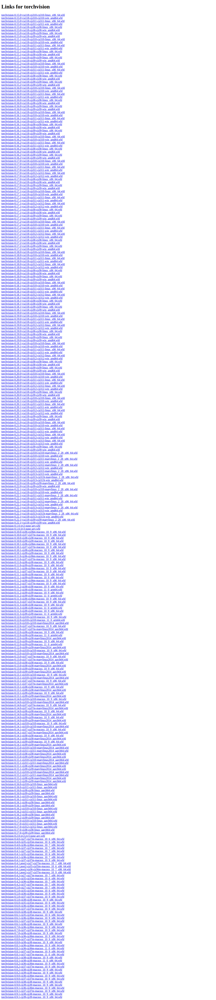

# Visited: https://download.pytorch.org/whl/cu118/torchvision/
**Time:** Sun May 10 20:10:17 UTC 2026

## Screenshot

## Raw HTML
[page.html](./page.html)

## Downloaded Media (0 files)
_No media files downloaded_

## Other Links
- [https://download-r2.pytorch.org/whl/cu118/torchvision-0.15.0%2Bcu118-cp310-cp310-linux_x86_64.whl#sha256=5a9614b080d31c1c7b23574a301114b28cb25d86b25b60ab85b2eaedd0b3e6e9](https://download-r2.pytorch.org/whl/cu118/torchvision-0.15.0%2Bcu118-cp310-cp310-linux_x86_64.whl#sha256=5a9614b080d31c1c7b23574a301114b28cb25d86b25b60ab85b2eaedd0b3e6e9)
- [https://download-r2.pytorch.org/whl/cu118/torchvision-0.15.0%2Bcu118-cp310-cp310-win_amd64.whl#sha256=ed39692f6b1559930fb37a370048e97b884259ac94e602eacd68aeabe71b0810](https://download-r2.pytorch.org/whl/cu118/torchvision-0.15.0%2Bcu118-cp310-cp310-win_amd64.whl#sha256=ed39692f6b1559930fb37a370048e97b884259ac94e602eacd68aeabe71b0810)
- [https://download-r2.pytorch.org/whl/cu118/torchvision-0.15.0%2Bcu118-cp311-cp311-linux_x86_64.whl#sha256=dc9cf01bb7a159dd91d75c4095f53d9e040f6a1435147ff3ebe176cecf5bf602](https://download-r2.pytorch.org/whl/cu118/torchvision-0.15.0%2Bcu118-cp311-cp311-linux_x86_64.whl#sha256=dc9cf01bb7a159dd91d75c4095f53d9e040f6a1435147ff3ebe176cecf5bf602)
- [https://download-r2.pytorch.org/whl/cu118/torchvision-0.15.0%2Bcu118-cp311-cp311-win_amd64.whl#sha256=c4eb3aa7135d32635cd980019a2107b87b6ade3ca8ad9a71f6aa5688c4b3cb19](https://download-r2.pytorch.org/whl/cu118/torchvision-0.15.0%2Bcu118-cp311-cp311-win_amd64.whl#sha256=c4eb3aa7135d32635cd980019a2107b87b6ade3ca8ad9a71f6aa5688c4b3cb19)
- [https://download-r2.pytorch.org/whl/cu118/torchvision-0.15.0%2Bcu118-cp38-cp38-linux_x86_64.whl#sha256=03a67002cdae2f4cc8316358f0627d35e8aa1d61be4595e7c9fbea3ac16b7c00](https://download-r2.pytorch.org/whl/cu118/torchvision-0.15.0%2Bcu118-cp38-cp38-linux_x86_64.whl#sha256=03a67002cdae2f4cc8316358f0627d35e8aa1d61be4595e7c9fbea3ac16b7c00)
- [https://download-r2.pytorch.org/whl/cu118/torchvision-0.15.0%2Bcu118-cp38-cp38-win_amd64.whl#sha256=a43a77f457eb8ccdd006edffe0aaacbde063248981fcffcdfd8962730d581ce6](https://download-r2.pytorch.org/whl/cu118/torchvision-0.15.0%2Bcu118-cp38-cp38-win_amd64.whl#sha256=a43a77f457eb8ccdd006edffe0aaacbde063248981fcffcdfd8962730d581ce6)
- [https://download-r2.pytorch.org/whl/cu118/torchvision-0.15.0%2Bcu118-cp39-cp39-linux_x86_64.whl#sha256=1192e110f6a62ef9476e497ef03c8599e9aeecfff94a5427eaffca489fddc425](https://download-r2.pytorch.org/whl/cu118/torchvision-0.15.0%2Bcu118-cp39-cp39-linux_x86_64.whl#sha256=1192e110f6a62ef9476e497ef03c8599e9aeecfff94a5427eaffca489fddc425)
- [https://download-r2.pytorch.org/whl/cu118/torchvision-0.15.0%2Bcu118-cp39-cp39-win_amd64.whl#sha256=6010bb5cf9affbbf3e0a05c6dc91554d5047abeff9267ee36467b4d591229074](https://download-r2.pytorch.org/whl/cu118/torchvision-0.15.0%2Bcu118-cp39-cp39-win_amd64.whl#sha256=6010bb5cf9affbbf3e0a05c6dc91554d5047abeff9267ee36467b4d591229074)
- [https://download-r2.pytorch.org/whl/cu118/torchvision-0.15.1%2Bcu118-cp310-cp310-linux_x86_64.whl#sha256=9a679fa37a741018c804234693bbac3d487fb3dd55ee73f6b33677b177c8c07a](https://download-r2.pytorch.org/whl/cu118/torchvision-0.15.1%2Bcu118-cp310-cp310-linux_x86_64.whl#sha256=9a679fa37a741018c804234693bbac3d487fb3dd55ee73f6b33677b177c8c07a)
- [https://download-r2.pytorch.org/whl/cu118/torchvision-0.15.1%2Bcu118-cp310-cp310-win_amd64.whl#sha256=473ea5fba33c0e8fc482cf70ced986521f2a3d79497b0bdaa435353ca8752e5e](https://download-r2.pytorch.org/whl/cu118/torchvision-0.15.1%2Bcu118-cp310-cp310-win_amd64.whl#sha256=473ea5fba33c0e8fc482cf70ced986521f2a3d79497b0bdaa435353ca8752e5e)
- [https://download-r2.pytorch.org/whl/cu118/torchvision-0.15.1%2Bcu118-cp311-cp311-linux_x86_64.whl#sha256=9ced2c90ee782bbb415b0de65bcc10d4fe811131864679b707442c9d9e8aaafd](https://download-r2.pytorch.org/whl/cu118/torchvision-0.15.1%2Bcu118-cp311-cp311-linux_x86_64.whl#sha256=9ced2c90ee782bbb415b0de65bcc10d4fe811131864679b707442c9d9e8aaafd)
- [https://download-r2.pytorch.org/whl/cu118/torchvision-0.15.1%2Bcu118-cp311-cp311-win_amd64.whl#sha256=9ff719de1c09f1825492e3e39f4e49c42782e559298529e4b47d3f1404c45d1f](https://download-r2.pytorch.org/whl/cu118/torchvision-0.15.1%2Bcu118-cp311-cp311-win_amd64.whl#sha256=9ff719de1c09f1825492e3e39f4e49c42782e559298529e4b47d3f1404c45d1f)
- [https://download-r2.pytorch.org/whl/cu118/torchvision-0.15.1%2Bcu118-cp38-cp38-linux_x86_64.whl#sha256=9104730d655abf282c2845d4cd472bb08936f3c85083a28aefd76ad9eeaff261](https://download-r2.pytorch.org/whl/cu118/torchvision-0.15.1%2Bcu118-cp38-cp38-linux_x86_64.whl#sha256=9104730d655abf282c2845d4cd472bb08936f3c85083a28aefd76ad9eeaff261)
- [https://download-r2.pytorch.org/whl/cu118/torchvision-0.15.1%2Bcu118-cp38-cp38-win_amd64.whl#sha256=22fe045677a74afecf7cd2f4146dca93dc926f40d0a658aa1bed3275f87dc7de](https://download-r2.pytorch.org/whl/cu118/torchvision-0.15.1%2Bcu118-cp38-cp38-win_amd64.whl#sha256=22fe045677a74afecf7cd2f4146dca93dc926f40d0a658aa1bed3275f87dc7de)
- [https://download-r2.pytorch.org/whl/cu118/torchvision-0.15.1%2Bcu118-cp39-cp39-linux_x86_64.whl#sha256=5ece279c8f521f8f6373bf971f2adc63a961d694c4aced538df81294210ee4ba](https://download-r2.pytorch.org/whl/cu118/torchvision-0.15.1%2Bcu118-cp39-cp39-linux_x86_64.whl#sha256=5ece279c8f521f8f6373bf971f2adc63a961d694c4aced538df81294210ee4ba)
- [https://download-r2.pytorch.org/whl/cu118/torchvision-0.15.1%2Bcu118-cp39-cp39-win_amd64.whl#sha256=4008dee965103030a196d385ca8d84a9c20fc52585f5753fc8360219a7a06c4e](https://download-r2.pytorch.org/whl/cu118/torchvision-0.15.1%2Bcu118-cp39-cp39-win_amd64.whl#sha256=4008dee965103030a196d385ca8d84a9c20fc52585f5753fc8360219a7a06c4e)
- [https://download-r2.pytorch.org/whl/cu118/torchvision-0.15.2%2Bcu118-cp310-cp310-linux_x86_64.whl#sha256=19ca4ab5d6179bbe53cff79df1a855ee6533c2861ddc7389f68349d8b9f8302a](https://download-r2.pytorch.org/whl/cu118/torchvision-0.15.2%2Bcu118-cp310-cp310-linux_x86_64.whl#sha256=19ca4ab5d6179bbe53cff79df1a855ee6533c2861ddc7389f68349d8b9f8302a)
- [https://download-r2.pytorch.org/whl/cu118/torchvision-0.15.2%2Bcu118-cp310-cp310-win_amd64.whl#sha256=bfd2435d681418bea8dacde2b2cb6e5dd40a0e0243d3631e2b71c10bf9831f39](https://download-r2.pytorch.org/whl/cu118/torchvision-0.15.2%2Bcu118-cp310-cp310-win_amd64.whl#sha256=bfd2435d681418bea8dacde2b2cb6e5dd40a0e0243d3631e2b71c10bf9831f39)
- [https://download-r2.pytorch.org/whl/cu118/torchvision-0.15.2%2Bcu118-cp311-cp311-linux_x86_64.whl#sha256=def9af47ebc2cad55c5aa2dad1230dcf4261833ed6df8a73e839bc233764f09e](https://download-r2.pytorch.org/whl/cu118/torchvision-0.15.2%2Bcu118-cp311-cp311-linux_x86_64.whl#sha256=def9af47ebc2cad55c5aa2dad1230dcf4261833ed6df8a73e839bc233764f09e)
- [https://download-r2.pytorch.org/whl/cu118/torchvision-0.15.2%2Bcu118-cp311-cp311-win_amd64.whl#sha256=ee36a68bb369d4173eb74ddf457751f6be1531d883f456eaf9b337a06f31c8fb](https://download-r2.pytorch.org/whl/cu118/torchvision-0.15.2%2Bcu118-cp311-cp311-win_amd64.whl#sha256=ee36a68bb369d4173eb74ddf457751f6be1531d883f456eaf9b337a06f31c8fb)
- [https://download-r2.pytorch.org/whl/cu118/torchvision-0.15.2%2Bcu118-cp38-cp38-linux_x86_64.whl#sha256=af6807d5e599fe5381c916235a5581407e850eb77c3d43899f37a1511ff81cc0](https://download-r2.pytorch.org/whl/cu118/torchvision-0.15.2%2Bcu118-cp38-cp38-linux_x86_64.whl#sha256=af6807d5e599fe5381c916235a5581407e850eb77c3d43899f37a1511ff81cc0)
- [https://download-r2.pytorch.org/whl/cu118/torchvision-0.15.2%2Bcu118-cp38-cp38-win_amd64.whl#sha256=406ed3d8bc5b66a99b692d4c742de39a3a515a399e6bfd1c24fbb688fbb31968](https://download-r2.pytorch.org/whl/cu118/torchvision-0.15.2%2Bcu118-cp38-cp38-win_amd64.whl#sha256=406ed3d8bc5b66a99b692d4c742de39a3a515a399e6bfd1c24fbb688fbb31968)
- [https://download-r2.pytorch.org/whl/cu118/torchvision-0.15.2%2Bcu118-cp39-cp39-linux_x86_64.whl#sha256=f2c6f5a100bcf9020b82f5d4c87cd7e26af0409cf33b90fb797b1127dcd42de6](https://download-r2.pytorch.org/whl/cu118/torchvision-0.15.2%2Bcu118-cp39-cp39-linux_x86_64.whl#sha256=f2c6f5a100bcf9020b82f5d4c87cd7e26af0409cf33b90fb797b1127dcd42de6)
- [https://download-r2.pytorch.org/whl/cu118/torchvision-0.15.2%2Bcu118-cp39-cp39-win_amd64.whl#sha256=27be62ec887ab9a7b86612eac55ba80f8c23978c8afd5e4339669a1bbc4925ea](https://download-r2.pytorch.org/whl/cu118/torchvision-0.15.2%2Bcu118-cp39-cp39-win_amd64.whl#sha256=27be62ec887ab9a7b86612eac55ba80f8c23978c8afd5e4339669a1bbc4925ea)
- [https://download-r2.pytorch.org/whl/cu118/torchvision-0.16.0%2Bcu118-cp310-cp310-linux_x86_64.whl#sha256=033712f65d45afe806676c4129dfe601ad1321d9e092df62b15847c02d4061dc](https://download-r2.pytorch.org/whl/cu118/torchvision-0.16.0%2Bcu118-cp310-cp310-linux_x86_64.whl#sha256=033712f65d45afe806676c4129dfe601ad1321d9e092df62b15847c02d4061dc)
- [https://download-r2.pytorch.org/whl/cu118/torchvision-0.16.0%2Bcu118-cp310-cp310-win_amd64.whl#sha256=1042597e3ae225921099129cfc125c1d49e1f932b6fce02921fbe36653dac58c](https://download-r2.pytorch.org/whl/cu118/torchvision-0.16.0%2Bcu118-cp310-cp310-win_amd64.whl#sha256=1042597e3ae225921099129cfc125c1d49e1f932b6fce02921fbe36653dac58c)
- [https://download-r2.pytorch.org/whl/cu118/torchvision-0.16.0%2Bcu118-cp311-cp311-linux_x86_64.whl#sha256=b168e55b1aff3e0270d9bd9af5d12a839093b15a9b0f8814265b7f1075a9a010](https://download-r2.pytorch.org/whl/cu118/torchvision-0.16.0%2Bcu118-cp311-cp311-linux_x86_64.whl#sha256=b168e55b1aff3e0270d9bd9af5d12a839093b15a9b0f8814265b7f1075a9a010)
- [https://download-r2.pytorch.org/whl/cu118/torchvision-0.16.0%2Bcu118-cp311-cp311-win_amd64.whl#sha256=6e5cfaa6c8c7b407403a625bb366fdcbadea9e64e55bedb55204983cb5e518b5](https://download-r2.pytorch.org/whl/cu118/torchvision-0.16.0%2Bcu118-cp311-cp311-win_amd64.whl#sha256=6e5cfaa6c8c7b407403a625bb366fdcbadea9e64e55bedb55204983cb5e518b5)
- [https://download-r2.pytorch.org/whl/cu118/torchvision-0.16.0%2Bcu118-cp38-cp38-linux_x86_64.whl#sha256=682ae598fccef9cd1935e5d1546138b1a23c8d78adc8f96c899385dee7c7db90](https://download-r2.pytorch.org/whl/cu118/torchvision-0.16.0%2Bcu118-cp38-cp38-linux_x86_64.whl#sha256=682ae598fccef9cd1935e5d1546138b1a23c8d78adc8f96c899385dee7c7db90)
- [https://download-r2.pytorch.org/whl/cu118/torchvision-0.16.0%2Bcu118-cp38-cp38-win_amd64.whl#sha256=9030032fe4f68e27ea6ad0b844f78be04a88efea209f0515587e59f36dc57064](https://download-r2.pytorch.org/whl/cu118/torchvision-0.16.0%2Bcu118-cp38-cp38-win_amd64.whl#sha256=9030032fe4f68e27ea6ad0b844f78be04a88efea209f0515587e59f36dc57064)
- [https://download-r2.pytorch.org/whl/cu118/torchvision-0.16.0%2Bcu118-cp39-cp39-linux_x86_64.whl#sha256=e131aa4fa7f46a37f93a97c659b2b23292754274ff51bea757c7a41cddae8d03](https://download-r2.pytorch.org/whl/cu118/torchvision-0.16.0%2Bcu118-cp39-cp39-linux_x86_64.whl#sha256=e131aa4fa7f46a37f93a97c659b2b23292754274ff51bea757c7a41cddae8d03)
- [https://download-r2.pytorch.org/whl/cu118/torchvision-0.16.0%2Bcu118-cp39-cp39-win_amd64.whl#sha256=d1185fd2078183d6b4e00efcb89fa1b22cfca84f9495937811004b456a442d38](https://download-r2.pytorch.org/whl/cu118/torchvision-0.16.0%2Bcu118-cp39-cp39-win_amd64.whl#sha256=d1185fd2078183d6b4e00efcb89fa1b22cfca84f9495937811004b456a442d38)
- [https://download-r2.pytorch.org/whl/cu118/torchvision-0.16.1%2Bcu118-cp310-cp310-linux_x86_64.whl#sha256=17662e70126711b80464d0f1d9255265055f450e600607637715beb244fbe0a4](https://download-r2.pytorch.org/whl/cu118/torchvision-0.16.1%2Bcu118-cp310-cp310-linux_x86_64.whl#sha256=17662e70126711b80464d0f1d9255265055f450e600607637715beb244fbe0a4)
- [https://download-r2.pytorch.org/whl/cu118/torchvision-0.16.1%2Bcu118-cp310-cp310-win_amd64.whl#sha256=4904755d361040ef41a79e15d6b1ca62a760f640670629fd53cb4d53e84decda](https://download-r2.pytorch.org/whl/cu118/torchvision-0.16.1%2Bcu118-cp310-cp310-win_amd64.whl#sha256=4904755d361040ef41a79e15d6b1ca62a760f640670629fd53cb4d53e84decda)
- [https://download-r2.pytorch.org/whl/cu118/torchvision-0.16.1%2Bcu118-cp311-cp311-linux_x86_64.whl#sha256=71cb97588f5bb4ec8937c98dc1bb7909095705790eeaafc460497a3cacb8deeb](https://download-r2.pytorch.org/whl/cu118/torchvision-0.16.1%2Bcu118-cp311-cp311-linux_x86_64.whl#sha256=71cb97588f5bb4ec8937c98dc1bb7909095705790eeaafc460497a3cacb8deeb)
- [https://download-r2.pytorch.org/whl/cu118/torchvision-0.16.1%2Bcu118-cp311-cp311-win_amd64.whl#sha256=bfd85e941d286c09c49df972db156dbab565371be4add105f290dbc6e8029b20](https://download-r2.pytorch.org/whl/cu118/torchvision-0.16.1%2Bcu118-cp311-cp311-win_amd64.whl#sha256=bfd85e941d286c09c49df972db156dbab565371be4add105f290dbc6e8029b20)
- [https://download-r2.pytorch.org/whl/cu118/torchvision-0.16.1%2Bcu118-cp38-cp38-linux_x86_64.whl#sha256=3c6c078bc08341e007b5ab45345eaf8260448d87bf73748bde706611e6ce92bc](https://download-r2.pytorch.org/whl/cu118/torchvision-0.16.1%2Bcu118-cp38-cp38-linux_x86_64.whl#sha256=3c6c078bc08341e007b5ab45345eaf8260448d87bf73748bde706611e6ce92bc)
- [https://download-r2.pytorch.org/whl/cu118/torchvision-0.16.1%2Bcu118-cp38-cp38-win_amd64.whl#sha256=88e68a7f5b705688553d7c73f2acf7b6e4ebcca6ecba3883fe3f173980a89f0e](https://download-r2.pytorch.org/whl/cu118/torchvision-0.16.1%2Bcu118-cp38-cp38-win_amd64.whl#sha256=88e68a7f5b705688553d7c73f2acf7b6e4ebcca6ecba3883fe3f173980a89f0e)
- [https://download-r2.pytorch.org/whl/cu118/torchvision-0.16.1%2Bcu118-cp39-cp39-linux_x86_64.whl#sha256=99a2e22eccf4b56866b9e4b01fd1a3ad4d1a7373c5f37ac9366d783441e588b0](https://download-r2.pytorch.org/whl/cu118/torchvision-0.16.1%2Bcu118-cp39-cp39-linux_x86_64.whl#sha256=99a2e22eccf4b56866b9e4b01fd1a3ad4d1a7373c5f37ac9366d783441e588b0)
- [https://download-r2.pytorch.org/whl/cu118/torchvision-0.16.1%2Bcu118-cp39-cp39-win_amd64.whl#sha256=84f97feb1bd0e5256d40313b0cfc16c2d25b6fb14934f512a5ab048def648340](https://download-r2.pytorch.org/whl/cu118/torchvision-0.16.1%2Bcu118-cp39-cp39-win_amd64.whl#sha256=84f97feb1bd0e5256d40313b0cfc16c2d25b6fb14934f512a5ab048def648340)
- [https://download-r2.pytorch.org/whl/cu118/torchvision-0.16.2%2Bcu118-cp310-cp310-linux_x86_64.whl#sha256=18470aef0bbde73f5a6a96135cd457f4d8be31f60be7ceae4ef5174f02f73add](https://download-r2.pytorch.org/whl/cu118/torchvision-0.16.2%2Bcu118-cp310-cp310-linux_x86_64.whl#sha256=18470aef0bbde73f5a6a96135cd457f4d8be31f60be7ceae4ef5174f02f73add)
- [https://download-r2.pytorch.org/whl/cu118/torchvision-0.16.2%2Bcu118-cp310-cp310-win_amd64.whl#sha256=689f2458e8924c47b7ba9f50dca353423b75214184b905d540f69d9b962b2fdf](https://download-r2.pytorch.org/whl/cu118/torchvision-0.16.2%2Bcu118-cp310-cp310-win_amd64.whl#sha256=689f2458e8924c47b7ba9f50dca353423b75214184b905d540f69d9b962b2fdf)
- [https://download-r2.pytorch.org/whl/cu118/torchvision-0.16.2%2Bcu118-cp311-cp311-linux_x86_64.whl#sha256=9a784073e801c04066a5e4453306010b67bacfbff12bd57e5d65c1a638584a89](https://download-r2.pytorch.org/whl/cu118/torchvision-0.16.2%2Bcu118-cp311-cp311-linux_x86_64.whl#sha256=9a784073e801c04066a5e4453306010b67bacfbff12bd57e5d65c1a638584a89)
- [https://download-r2.pytorch.org/whl/cu118/torchvision-0.16.2%2Bcu118-cp311-cp311-win_amd64.whl#sha256=036391a65f3c2ac6dbe4b73ea0acc303dd1c0a667e2a3592a194b2d2db377da1](https://download-r2.pytorch.org/whl/cu118/torchvision-0.16.2%2Bcu118-cp311-cp311-win_amd64.whl#sha256=036391a65f3c2ac6dbe4b73ea0acc303dd1c0a667e2a3592a194b2d2db377da1)
- [https://download-r2.pytorch.org/whl/cu118/torchvision-0.16.2%2Bcu118-cp38-cp38-linux_x86_64.whl#sha256=5e4c9f43f3b379c8ce9bc75da0378606fd5ca01c8a82493cc25639bffbd66c74](https://download-r2.pytorch.org/whl/cu118/torchvision-0.16.2%2Bcu118-cp38-cp38-linux_x86_64.whl#sha256=5e4c9f43f3b379c8ce9bc75da0378606fd5ca01c8a82493cc25639bffbd66c74)
- [https://download-r2.pytorch.org/whl/cu118/torchvision-0.16.2%2Bcu118-cp38-cp38-win_amd64.whl#sha256=d3c207437b8be6f451218aa0bcc50ed949b072813bc7f36aa1debdb17f71768e](https://download-r2.pytorch.org/whl/cu118/torchvision-0.16.2%2Bcu118-cp38-cp38-win_amd64.whl#sha256=d3c207437b8be6f451218aa0bcc50ed949b072813bc7f36aa1debdb17f71768e)
- [https://download-r2.pytorch.org/whl/cu118/torchvision-0.16.2%2Bcu118-cp39-cp39-linux_x86_64.whl#sha256=88999dceabb6652b6ede49509722a29753c9206df09ccaa69754f21b58fbdb63](https://download-r2.pytorch.org/whl/cu118/torchvision-0.16.2%2Bcu118-cp39-cp39-linux_x86_64.whl#sha256=88999dceabb6652b6ede49509722a29753c9206df09ccaa69754f21b58fbdb63)
- [https://download-r2.pytorch.org/whl/cu118/torchvision-0.16.2%2Bcu118-cp39-cp39-win_amd64.whl#sha256=63c70ba3b83915bc165e539103e2e03a69dc63e9660de9adb12bd460428fbffa](https://download-r2.pytorch.org/whl/cu118/torchvision-0.16.2%2Bcu118-cp39-cp39-win_amd64.whl#sha256=63c70ba3b83915bc165e539103e2e03a69dc63e9660de9adb12bd460428fbffa)
- [https://download-r2.pytorch.org/whl/cu118/torchvision-0.17.0%2Bcu118-cp310-cp310-linux_x86_64.whl#sha256=2e63d62e09d9b48b407d3e1b30eb8ae4e3abad6968e8d33093b60d0657542428](https://download-r2.pytorch.org/whl/cu118/torchvision-0.17.0%2Bcu118-cp310-cp310-linux_x86_64.whl#sha256=2e63d62e09d9b48b407d3e1b30eb8ae4e3abad6968e8d33093b60d0657542428)
- [https://download-r2.pytorch.org/whl/cu118/torchvision-0.17.0%2Bcu118-cp310-cp310-win_amd64.whl#sha256=739fb1cedfad4a62f82306c6d819046c6bfa8825857784c7565636d4b92ea104](https://download-r2.pytorch.org/whl/cu118/torchvision-0.17.0%2Bcu118-cp310-cp310-win_amd64.whl#sha256=739fb1cedfad4a62f82306c6d819046c6bfa8825857784c7565636d4b92ea104)

## Stats
- Links: 324
- Media: 0
