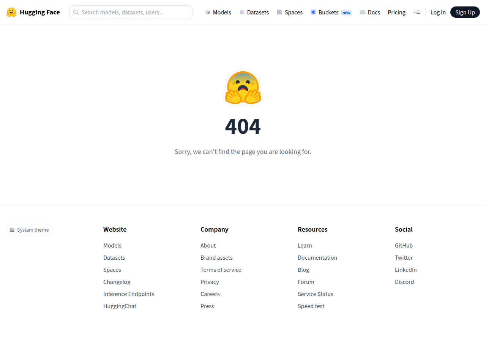

# Visited: https://huggingface.co/DeepBeepMeep/Wan2.1/blob/main
**Time:** Tue May 12 21:47:15 UTC 2026

## Screenshot

## Raw HTML
[page.html](./page.html)

## Downloaded Media (0 files)
_No media files downloaded_

## Other Links
- [/](/)
- [/blog](/blog)
- [/brand](/brand)
- [/changelog](/changelog)
- [/chat](/chat)
- [/datasets](/datasets)
- [/docs](/docs)
- [/enterprise](/enterprise)
- [/front/build/kube-bb87a22/style.css](/front/build/kube-bb87a22/style.css)
- [/huggingface](/huggingface)
- [/join](/join)
- [/join/discord](/join/discord)
- [/js/script.js](/js/script.js)
- [/learn](/learn)
- [/login](/login)
- [/models](/models)
- [/pricing](/pricing)
- [/privacy](/privacy)
- [/spaces](/spaces)
- [/storage](/storage)
- [/terms-of-service](/terms-of-service)
- [https://apply.workable.com/huggingface/](https://apply.workable.com/huggingface/)
- [https://cdnjs.cloudflare.com/ajax/libs/KaTeX/0.12.0/katex.min.css](https://cdnjs.cloudflare.com/ajax/libs/KaTeX/0.12.0/katex.min.css)
- [https://de5282c3ca0c.edge.sdk.awswaf.com/de5282c3ca0c/526cf06acb0d/challenge.js](https://de5282c3ca0c.edge.sdk.awswaf.com/de5282c3ca0c/526cf06acb0d/challenge.js)
- [https://discuss.huggingface.co](https://discuss.huggingface.co)
- [https://endpoints.huggingface.co](https://endpoints.huggingface.co)
- [https://fast.hf.co](https://fast.hf.co)
- [https://fonts.googleapis.com/css2?family=IBM+Plex+Mono:wght@400;600;700&display=swap](https://fonts.googleapis.com/css2?family=IBM+Plex+Mono:wght@400;600;700&display=swap)
- [https://fonts.googleapis.com/css2?family=Source+Sans+Pro:ital,wght@0,200;0,300;0,400;0,600;0,700;1,200;1,300;1,400;1,600;1,700&display=swap](https://fonts.googleapis.com/css2?family=Source+Sans+Pro:ital,wght@0,200;0,300;0,400;0,600;0,700;1,200;1,300;1,400;1,600;1,700&display=swap)
- [https://fonts.gstatic.com](https://fonts.gstatic.com)
- [https://github.com/huggingface](https://github.com/huggingface)
- [https://huggingface.co/DeepBeepMeep/Wan2.1/blob/main](https://huggingface.co/DeepBeepMeep/Wan2.1/blob/main)
- [https://status.huggingface.co/](https://status.huggingface.co/)
- [https://twitter.com/huggingface](https://twitter.com/huggingface)
- [https://www.linkedin.com/company/huggingface/](https://www.linkedin.com/company/huggingface/)
- [mailto:press@huggingface.co](mailto:press@huggingface.co)

## Stats
- Links: 38
- Media: 0
