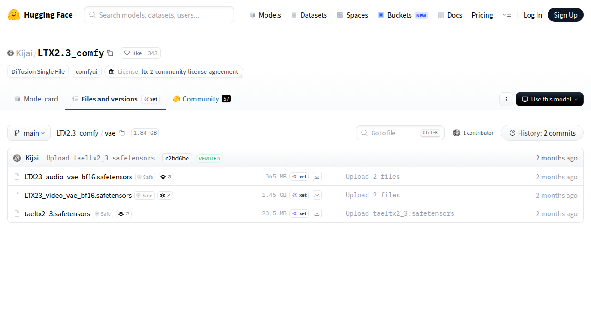

# Visited: https://huggingface.co/Kijai/LTX2.3_comfy/tree/main/vae
**Time:** Wed May 13 16:35:43 UTC 2026

## Screenshot

## Raw HTML
[page.html](./page.html)

## Downloaded Media (1 files)
## Downloaded Media Files

## Other Links
- [/](/)
- [/Kijai](/Kijai)
- [/Kijai/LTX2.3_comfy](/Kijai/LTX2.3_comfy)
- [/Kijai/LTX2.3_comfy/blob/main/vae/LTX23_audio_vae_bf16.safetensors](/Kijai/LTX2.3_comfy/blob/main/vae/LTX23_audio_vae_bf16.safetensors)
- [/Kijai/LTX2.3_comfy/blob/main/vae/LTX23_video_vae_bf16.safetensors](/Kijai/LTX2.3_comfy/blob/main/vae/LTX23_video_vae_bf16.safetensors)
- [/Kijai/LTX2.3_comfy/blob/main/vae/taeltx2_3.safetensors](/Kijai/LTX2.3_comfy/blob/main/vae/taeltx2_3.safetensors)
- [/Kijai/LTX2.3_comfy/colab](/Kijai/LTX2.3_comfy/colab)
- [/Kijai/LTX2.3_comfy/commit/a422e5661a18bde257c0ef1c3761d8b9ce1eb645](/Kijai/LTX2.3_comfy/commit/a422e5661a18bde257c0ef1c3761d8b9ce1eb645)
- [/Kijai/LTX2.3_comfy/commit/c2bd6be6d52e2b1beb2117171adff45a2feb9c66](/Kijai/LTX2.3_comfy/commit/c2bd6be6d52e2b1beb2117171adff45a2feb9c66)
- [/Kijai/LTX2.3_comfy/commits/main/vae](/Kijai/LTX2.3_comfy/commits/main/vae)
- [/Kijai/LTX2.3_comfy/discussions](/Kijai/LTX2.3_comfy/discussions)
- [/Kijai/LTX2.3_comfy/kaggle](/Kijai/LTX2.3_comfy/kaggle)
- [/Kijai/LTX2.3_comfy/resolve/main/vae/LTX23_audio_vae_bf16.safetensors?download=true](/Kijai/LTX2.3_comfy/resolve/main/vae/LTX23_audio_vae_bf16.safetensors?download=true)
- [/Kijai/LTX2.3_comfy/resolve/main/vae/LTX23_video_vae_bf16.safetensors?download=true](/Kijai/LTX2.3_comfy/resolve/main/vae/LTX23_video_vae_bf16.safetensors?download=true)
- [/Kijai/LTX2.3_comfy/resolve/main/vae/taeltx2_3.safetensors?download=true](/Kijai/LTX2.3_comfy/resolve/main/vae/taeltx2_3.safetensors?download=true)
- [/Kijai/LTX2.3_comfy/tree/main](/Kijai/LTX2.3_comfy/tree/main)
- [/Kijai/LTX2.3_comfy?library=diffusion-single-file](/Kijai/LTX2.3_comfy?library=diffusion-single-file)
- [/datasets](/datasets)
- [/docs](/docs)
- [/enterprise](/enterprise)
- [/front/build/kube-1daa235/style.css](/front/build/kube-1daa235/style.css)
- [/join](/join)
- [/js/script.js](/js/script.js)
- [/login](/login)
- [/models](/models)
- [/models?library=diffusion-single-file](/models?library=diffusion-single-file)
- [/models?other=comfyui](/models?other=comfyui)
- [/pricing](/pricing)
- [/spaces](/spaces)
- [/storage](/storage)
- [https://cdnjs.cloudflare.com/ajax/libs/KaTeX/0.12.0/katex.min.css](https://cdnjs.cloudflare.com/ajax/libs/KaTeX/0.12.0/katex.min.css)
- [https://de5282c3ca0c.edge.sdk.awswaf.com/de5282c3ca0c/526cf06acb0d/challenge.js](https://de5282c3ca0c.edge.sdk.awswaf.com/de5282c3ca0c/526cf06acb0d/challenge.js)
- [https://fonts.googleapis.com/css2?family=IBM+Plex+Mono:wght@400;600;700&display=swap](https://fonts.googleapis.com/css2?family=IBM+Plex+Mono:wght@400;600;700&display=swap)
- [https://fonts.googleapis.com/css2?family=Source+Sans+Pro:ital,wght@0,200;0,300;0,400;0,600;0,700;1,200;1,300;1,400;1,600;1,700&display=swap](https://fonts.googleapis.com/css2?family=Source+Sans+Pro:ital,wght@0,200;0,300;0,400;0,600;0,700;1,200;1,300;1,400;1,600;1,700&display=swap)
- [https://fonts.gstatic.com](https://fonts.gstatic.com)
- [https://huggingface.co/Kijai/LTX2.3_comfy/tree/main/vae](https://huggingface.co/Kijai/LTX2.3_comfy/tree/main/vae)

## Stats
- Links: 38
- Media: 1
