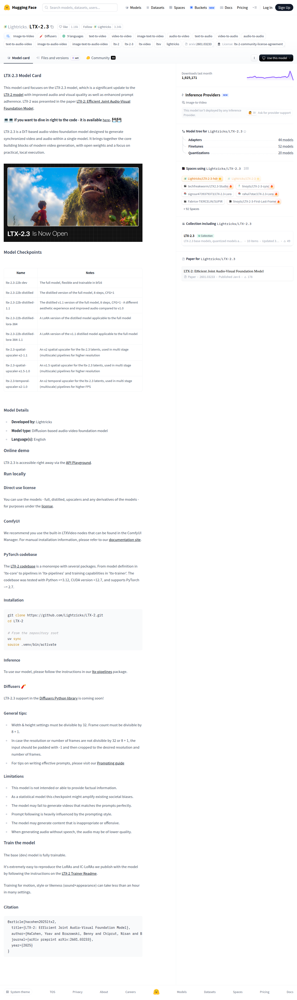

# Visited: https://huggingface.co/Lightricks/LTX-2.3
**Time:** Thu May 14 16:08:18 UTC 2026

## Screenshot

## Raw HTML
[page.html](./page.html)

## Downloaded Media (1 files)
## Downloaded Media Files

## Other Links
- [#citation](#citation)
- [#comfyui](#comfyui)
- [#diffusers-🧨](#diffusers-🧨)
- [#direct-use-license](#direct-use-license)
- [#general-tips](#general-tips)
- [#inference](#inference)
- [#installation](#installation)
- [#limitations](#limitations)
- [#ltx-23-model-card](#ltx-23-model-card)
- [#model-checkpoints](#model-checkpoints)
- [#model-details](#model-details)
- [#online-demo](#online-demo)
- [#pytorch-codebase](#pytorch-codebase)
- [#run-locally](#run-locally)
- [#train-the-model](#train-the-model)
- [/](/)
- [/Lightricks](/Lightricks)
- [/Lightricks/LTX-2.3](/Lightricks/LTX-2.3)
- [/Lightricks/LTX-2.3/blob/main/./LICENSE](/Lightricks/LTX-2.3/blob/main/./LICENSE)
- [/Lightricks/LTX-2.3/colab](/Lightricks/LTX-2.3/colab)
- [/Lightricks/LTX-2.3/discussions](/Lightricks/LTX-2.3/discussions)
- [/Lightricks/LTX-2.3/kaggle](/Lightricks/LTX-2.3/kaggle)
- [/Lightricks/LTX-2.3/tree/main](/Lightricks/LTX-2.3/tree/main)
- [/Lightricks/LTX-2.3?library=diffusers](/Lightricks/LTX-2.3?library=diffusers)
- [/collections/Lightricks/ltx-23](/collections/Lightricks/ltx-23)
- [/datasets](/datasets)
- [/docs](/docs)
- [/docs/hub/model-cards#specifying-a-base-model](/docs/hub/model-cards#specifying-a-base-model)
- [/enterprise](/enterprise)
- [/front/build/kube-1daa235/style.css](/front/build/kube-1daa235/style.css)
- [/huggingface](/huggingface)
- [/join](/join)
- [/js/script.js](/js/script.js)
- [/login](/login)
- [/models](/models)
- [/models?library=diffusers](/models?library=diffusers)
- [/models?other=audio-to-audio](/models?other=audio-to-audio)
- [/models?other=audio-to-video](/models?other=audio-to-video)
- [/models?other=base_model:adapter:Lightricks/LTX-2.3](/models?other=base_model:adapter:Lightricks/LTX-2.3)
- [/models?other=base_model:finetune:Lightricks/LTX-2.3](/models?other=base_model:finetune:Lightricks/LTX-2.3)
- [/models?other=base_model:quantized:Lightricks/LTX-2.3](/models?other=base_model:quantized:Lightricks/LTX-2.3)
- [/models?other=image-text-to-audio-video](/models?other=image-text-to-audio-video)
- [/models?other=image-text-to-video](/models?other=image-text-to-video)
- [/models?other=image-to-audio-video](/models?other=image-to-audio-video)
- [/models?other=lightricks](/models?other=lightricks)
- [/models?other=ltx-2](/models?other=ltx-2)
- [/models?other=ltx-2-3](/models?other=ltx-2-3)
- [/models?other=ltx-video](/models?other=ltx-video)
- [/models?other=ltxv](/models?other=ltxv)
- [/models?other=text-to-audio](/models?other=text-to-audio)

## Stats
- Links: 92
- Media: 1
