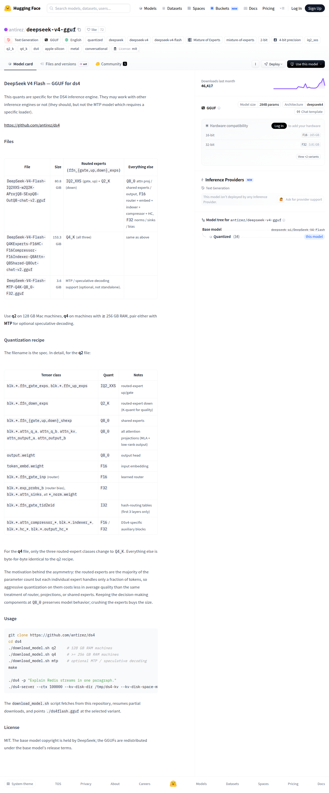

# Visited: https://huggingface.co/antirez/deepseek-v4-gguf
**Time:** Mon May 11 14:45:38 UTC 2026

## Screenshot

## Raw HTML
[page.html](./page.html)

## Downloaded Media (0 files)
_No media files downloaded_

## Other Links
- [#deepseek-v4-flash--gguf-for-ds4](#deepseek-v4-flash--gguf-for-ds4)
- [#files](#files)
- [#license](#license)
- [#quantization-recipe](#quantization-recipe)
- [#usage](#usage)
- [/](/)
- [/antirez](/antirez)
- [/antirez/deepseek-v4-gguf](/antirez/deepseek-v4-gguf)
- [/antirez/deepseek-v4-gguf/colab](/antirez/deepseek-v4-gguf/colab)
- [/antirez/deepseek-v4-gguf/discussions](/antirez/deepseek-v4-gguf/discussions)
- [/antirez/deepseek-v4-gguf/kaggle](/antirez/deepseek-v4-gguf/kaggle)
- [/antirez/deepseek-v4-gguf/tree/main](/antirez/deepseek-v4-gguf/tree/main)
- [/antirez/deepseek-v4-gguf?library=llama-cpp-python](/antirez/deepseek-v4-gguf?library=llama-cpp-python)
- [/antirez/deepseek-v4-gguf?local-app=docker-model-runner](/antirez/deepseek-v4-gguf?local-app=docker-model-runner)
- [/antirez/deepseek-v4-gguf?local-app=hermes-agent](/antirez/deepseek-v4-gguf?local-app=hermes-agent)
- [/antirez/deepseek-v4-gguf?local-app=lemonade](/antirez/deepseek-v4-gguf?local-app=lemonade)
- [/antirez/deepseek-v4-gguf?local-app=llama.cpp](/antirez/deepseek-v4-gguf?local-app=llama.cpp)
- [/antirez/deepseek-v4-gguf?local-app=ollama](/antirez/deepseek-v4-gguf?local-app=ollama)
- [/antirez/deepseek-v4-gguf?local-app=pi](/antirez/deepseek-v4-gguf?local-app=pi)
- [/antirez/deepseek-v4-gguf?local-app=unsloth](/antirez/deepseek-v4-gguf?local-app=unsloth)
- [/antirez/deepseek-v4-gguf?local-app=vllm](/antirez/deepseek-v4-gguf?local-app=vllm)
- [/datasets](/datasets)
- [/deepseek-ai/DeepSeek-V4-Flash](/deepseek-ai/DeepSeek-V4-Flash)
- [/docs](/docs)
- [/docs/hub/model-cards#specifying-a-base-model](/docs/hub/model-cards#specifying-a-base-model)
- [/enterprise](/enterprise)
- [/front/build/kube-0f8a04c/style.css](/front/build/kube-0f8a04c/style.css)
- [/huggingface](/huggingface)
- [/join](/join)
- [/js/script.js](/js/script.js)
- [/login](/login)
- [/models](/models)
- [/models?language=en](/models?language=en)
- [/models?library=gguf](/models?library=gguf)
- [/models?other=2-bit](/models?other=2-bit)
- [/models?other=4-bit](/models?other=4-bit)
- [/models?other=apple-silicon](/models?other=apple-silicon)
- [/models?other=base_model:quantized:deepseek-ai/DeepSeek-V4-Flash](/models?other=base_model:quantized:deepseek-ai/DeepSeek-V4-Flash)
- [/models?other=conversational](/models?other=conversational)
- [/models?other=deepseek](/models?other=deepseek)
- [/models?other=deepseek-v4](/models?other=deepseek-v4)
- [/models?other=deepseek-v4-flash](/models?other=deepseek-v4-flash)
- [/models?other=ds4](/models?other=ds4)
- [/models?other=iq2_xxs](/models?other=iq2_xxs)
- [/models?other=metal](/models?other=metal)
- [/models?other=mixture-of-experts](/models?other=mixture-of-experts)
- [/models?other=moe](/models?other=moe)
- [/models?other=q2_k](/models?other=q2_k)
- [/models?other=q4_k](/models?other=q4_k)
- [/models?other=quantized](/models?other=quantized)

## Stats
- Links: 73
- Media: 0
