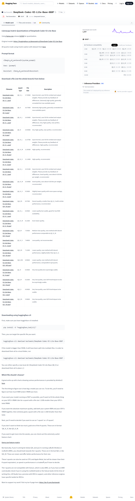

# Visited: https://huggingface.co/bartowski/DeepSeek-Coder-V2-Lite-Base-GGUF
**Time:** Mon May 11 14:39:07 UTC 2026

## Screenshot

## Raw HTML
[page.html](./page.html)

## Downloaded Media (1 files)
## Downloaded Media Files

## Other Links
- [#download-a-file-not-the-whole-branch-from-below](#download-a-file-not-the-whole-branch-from-below)
- [#downloading-using-huggingface-cli](#downloading-using-huggingface-cli)
- [#llamacpp-imatrix-quantizations-of-deepseek-coder-v2-lite-base](#llamacpp-imatrix-quantizations-of-deepseek-coder-v2-lite-base)
- [#prompt-format](#prompt-format)
- [#which-file-should-i-choose](#which-file-should-i-choose)
- [/](/)
- [/bartowski](/bartowski)
- [/bartowski/DeepSeek-Coder-V2-Lite-Base-GGUF](/bartowski/DeepSeek-Coder-V2-Lite-Base-GGUF)
- [/bartowski/DeepSeek-Coder-V2-Lite-Base-GGUF/discussions](/bartowski/DeepSeek-Coder-V2-Lite-Base-GGUF/discussions)
- [/bartowski/DeepSeek-Coder-V2-Lite-Base-GGUF/tree/main](/bartowski/DeepSeek-Coder-V2-Lite-Base-GGUF/tree/main)
- [/datasets](/datasets)
- [/docs](/docs)
- [/enterprise](/enterprise)
- [/front/build/kube-0f8a04c/style.css](/front/build/kube-0f8a04c/style.css)
- [/huggingface](/huggingface)
- [/join](/join)
- [/js/script.js](/js/script.js)
- [/login](/login)
- [/models](/models)
- [/models?library=gguf](/models?library=gguf)
- [/models?pipeline_tag=text-generation](/models?pipeline_tag=text-generation)
- [/pricing](/pricing)
- [/privacy](/privacy)
- [/spaces](/spaces)
- [/spaces/huggingface/InferenceSupport/discussions/new?title=bartowski/DeepSeek-Coder-V2-Lite-Base-GGUF&amp;description=React%20to%20this%20comment%20with%20an%20emoji%20to%20vote%20for%20%5Bbartowski%2FDeepSeek-Coder-V2-Lite-Base-GGUF%5D(%2Fbartowski%2FDeepSeek-Coder-V2-Lite-Base-GGUF)%20to%20be%20supported%20by%20Inference%20Providers.%0A%0A(optional)%20Which%20providers%20are%20you%20interested%20in%3F%20(Novita%2C%20Hyperbolic%2C%20Together%E2%80%A6)%0A](/spaces/huggingface/InferenceSupport/discussions/new?title=bartowski/DeepSeek-Coder-V2-Lite-Base-GGUF&amp;description=React%20to%20this%20comment%20with%20an%20emoji%20to%20vote%20for%20%5Bbartowski%2FDeepSeek-Coder-V2-Lite-Base-GGUF%5D(%2Fbartowski%2FDeepSeek-Coder-V2-Lite-Base-GGUF)%20to%20be%20supported%20by%20Inference%20Providers.%0A%0A(optional)%20Which%20providers%20are%20you%20interested%20in%3F%20(Novita%2C%20Hyperbolic%2C%20Together%E2%80%A6)%0A)
- [/storage](/storage)
- [/tasks/text-generation](/tasks/text-generation)
- [/terms-of-service](/terms-of-service)
- [https://apply.workable.com/huggingface/](https://apply.workable.com/huggingface/)
- [https://cdnjs.cloudflare.com/ajax/libs/KaTeX/0.12.0/katex.min.css](https://cdnjs.cloudflare.com/ajax/libs/KaTeX/0.12.0/katex.min.css)
- [https://de5282c3ca0c.edge.sdk.awswaf.com/de5282c3ca0c/526cf06acb0d/challenge.js](https://de5282c3ca0c.edge.sdk.awswaf.com/de5282c3ca0c/526cf06acb0d/challenge.js)
- [https://fonts.googleapis.com/css2?family=IBM+Plex+Mono:wght@400;600;700&display=swap](https://fonts.googleapis.com/css2?family=IBM+Plex+Mono:wght@400;600;700&display=swap)
- [https://fonts.googleapis.com/css2?family=Source+Sans+Pro:ital,wght@0,200;0,300;0,400;0,600;0,700;1,200;1,300;1,400;1,600;1,700&display=swap](https://fonts.googleapis.com/css2?family=Source+Sans+Pro:ital,wght@0,200;0,300;0,400;0,600;0,700;1,200;1,300;1,400;1,600;1,700&display=swap)
- [https://fonts.gstatic.com](https://fonts.gstatic.com)
- [https://gist.github.com/Artefact2/b5f810600771265fc1e39442288e8ec9](https://gist.github.com/Artefact2/b5f810600771265fc1e39442288e8ec9)
- [https://gist.github.com/bartowski1182/eb213dccb3571f863da82e99418f81e8](https://gist.github.com/bartowski1182/eb213dccb3571f863da82e99418f81e8)
- [https://github.com/ggerganov/llama.cpp/](https://github.com/ggerganov/llama.cpp/)
- [https://github.com/ggerganov/llama.cpp/releases/tag/b3166](https://github.com/ggerganov/llama.cpp/releases/tag/b3166)
- [https://github.com/ggerganov/llama.cpp/wiki/Feature-matrix](https://github.com/ggerganov/llama.cpp/wiki/Feature-matrix)
- [https://huggingface.co/bartowski/DeepSeek-Coder-V2-Lite-Base-GGUF](https://huggingface.co/bartowski/DeepSeek-Coder-V2-Lite-Base-GGUF)
- [https://huggingface.co/bartowski/DeepSeek-Coder-V2-Lite-Base-GGUF/blob/main/DeepSeek-Coder-V2-Lite-Base-IQ2_M.gguf](https://huggingface.co/bartowski/DeepSeek-Coder-V2-Lite-Base-GGUF/blob/main/DeepSeek-Coder-V2-Lite-Base-IQ2_M.gguf)
- [https://huggingface.co/bartowski/DeepSeek-Coder-V2-Lite-Base-GGUF/blob/main/DeepSeek-Coder-V2-Lite-Base-IQ2_S.gguf](https://huggingface.co/bartowski/DeepSeek-Coder-V2-Lite-Base-GGUF/blob/main/DeepSeek-Coder-V2-Lite-Base-IQ2_S.gguf)
- [https://huggingface.co/bartowski/DeepSeek-Coder-V2-Lite-Base-GGUF/blob/main/DeepSeek-Coder-V2-Lite-Base-IQ2_XS.gguf](https://huggingface.co/bartowski/DeepSeek-Coder-V2-Lite-Base-GGUF/blob/main/DeepSeek-Coder-V2-Lite-Base-IQ2_XS.gguf)
- [https://huggingface.co/bartowski/DeepSeek-Coder-V2-Lite-Base-GGUF/blob/main/DeepSeek-Coder-V2-Lite-Base-IQ3_M.gguf](https://huggingface.co/bartowski/DeepSeek-Coder-V2-Lite-Base-GGUF/blob/main/DeepSeek-Coder-V2-Lite-Base-IQ3_M.gguf)
- [https://huggingface.co/bartowski/DeepSeek-Coder-V2-Lite-Base-GGUF/blob/main/DeepSeek-Coder-V2-Lite-Base-IQ3_XS.gguf](https://huggingface.co/bartowski/DeepSeek-Coder-V2-Lite-Base-GGUF/blob/main/DeepSeek-Coder-V2-Lite-Base-IQ3_XS.gguf)
- [https://huggingface.co/bartowski/DeepSeek-Coder-V2-Lite-Base-GGUF/blob/main/DeepSeek-Coder-V2-Lite-Base-IQ3_XXS.gguf](https://huggingface.co/bartowski/DeepSeek-Coder-V2-Lite-Base-GGUF/blob/main/DeepSeek-Coder-V2-Lite-Base-IQ3_XXS.gguf)
- [https://huggingface.co/bartowski/DeepSeek-Coder-V2-Lite-Base-GGUF/blob/main/DeepSeek-Coder-V2-Lite-Base-IQ4_XS.gguf](https://huggingface.co/bartowski/DeepSeek-Coder-V2-Lite-Base-GGUF/blob/main/DeepSeek-Coder-V2-Lite-Base-IQ4_XS.gguf)
- [https://huggingface.co/bartowski/DeepSeek-Coder-V2-Lite-Base-GGUF/blob/main/DeepSeek-Coder-V2-Lite-Base-Q2_K.gguf](https://huggingface.co/bartowski/DeepSeek-Coder-V2-Lite-Base-GGUF/blob/main/DeepSeek-Coder-V2-Lite-Base-Q2_K.gguf)
- [https://huggingface.co/bartowski/DeepSeek-Coder-V2-Lite-Base-GGUF/blob/main/DeepSeek-Coder-V2-Lite-Base-Q3_K_L.gguf](https://huggingface.co/bartowski/DeepSeek-Coder-V2-Lite-Base-GGUF/blob/main/DeepSeek-Coder-V2-Lite-Base-Q3_K_L.gguf)
- [https://huggingface.co/bartowski/DeepSeek-Coder-V2-Lite-Base-GGUF/blob/main/DeepSeek-Coder-V2-Lite-Base-Q3_K_M.gguf](https://huggingface.co/bartowski/DeepSeek-Coder-V2-Lite-Base-GGUF/blob/main/DeepSeek-Coder-V2-Lite-Base-Q3_K_M.gguf)

## Stats
- Links: 67
- Media: 1
