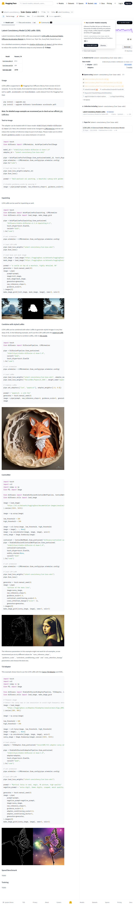
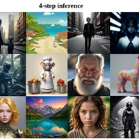
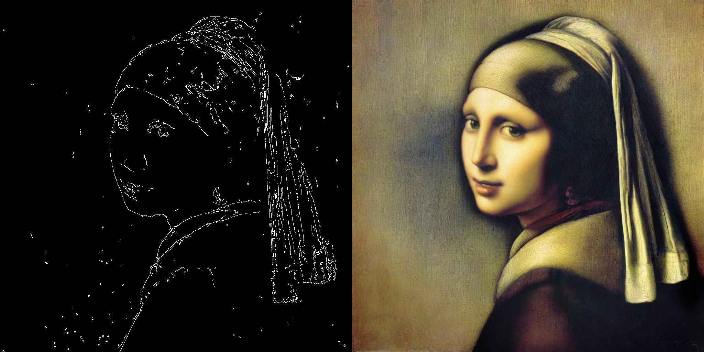
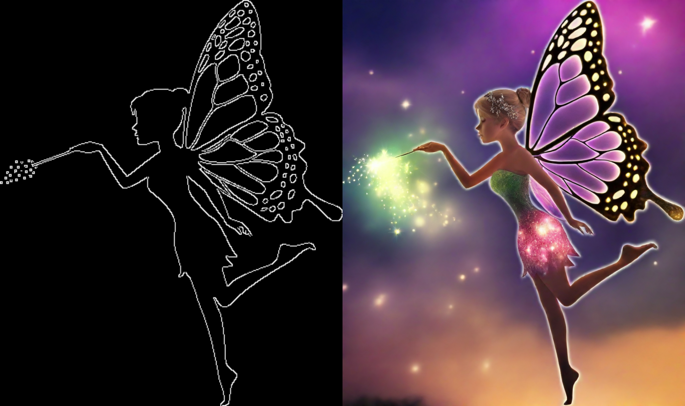

# Visited: https://huggingface.co/latent-consistency/lcm-lora-sdxl
**Time:** Tue May 12 22:40:06 UTC 2026

## Screenshot

## Raw HTML
[page.html](./page.html)

## Downloaded Media (5 files)
## Downloaded Media Files

## Other Links
- [#combine-with-styled-loras](#combine-with-styled-loras)
- [#controlnet](#controlnet)
- [#icon-drawthings-b](#icon-drawthings-b)
- [#inpainting](#inpainting)
- [#latent-consistency-model-lcm-lora-sdxl](#latent-consistency-model-lcm-lora-sdxl)
- [#speed-benchmark](#speed-benchmark)
- [#t2i-adapter](#t2i-adapter)
- [#text-to-image](#text-to-image)
- [#training](#training)
- [#usage](#usage)
- [/](/)
- [/collections/latent-consistency/latent-consistency-models-loras](/collections/latent-consistency/latent-consistency-models-loras)
- [/datasets](/datasets)
- [/docs](/docs)
- [/docs/hub/model-cards#specifying-a-base-model](/docs/hub/model-cards#specifying-a-base-model)
- [/enterprise](/enterprise)
- [/front/build/kube-bb87a22/style.css](/front/build/kube-bb87a22/style.css)
- [/huggingface](/huggingface)
- [/join](/join)
- [/js/script.js](/js/script.js)
- [/latent-consistency](/latent-consistency)
- [/latent-consistency/lcm-lora-sdxl](/latent-consistency/lcm-lora-sdxl)
- [/latent-consistency/lcm-lora-sdxl/blob/main/TencentARC/t2i-adapter-canny-sdxl-1.0](/latent-consistency/lcm-lora-sdxl/blob/main/TencentARC/t2i-adapter-canny-sdxl-1.0)
- [/latent-consistency/lcm-lora-sdxl/blob/main/TheLastBen/Papercut_SDXL](/latent-consistency/lcm-lora-sdxl/blob/main/TheLastBen/Papercut_SDXL)
- [/latent-consistency/lcm-lora-sdxl/colab](/latent-consistency/lcm-lora-sdxl/colab)
- [/latent-consistency/lcm-lora-sdxl/discussions](/latent-consistency/lcm-lora-sdxl/discussions)
- [/latent-consistency/lcm-lora-sdxl/kaggle](/latent-consistency/lcm-lora-sdxl/kaggle)
- [/latent-consistency/lcm-lora-sdxl/tree/main](/latent-consistency/lcm-lora-sdxl/tree/main)
- [/latent-consistency/lcm-lora-sdxl?library=diffusers](/latent-consistency/lcm-lora-sdxl?library=diffusers)
- [/login](/login)
- [/models](/models)
- [/models?library=diffusers](/models?library=diffusers)
- [/models?other=base_model:adapter:latent-consistency/lcm-lora-sdxl](/models?other=base_model:adapter:latent-consistency/lcm-lora-sdxl)
- [/models?other=base_model:adapter:stabilityai/stable-diffusion-xl-base-1.0](/models?other=base_model:adapter:stabilityai/stable-diffusion-xl-base-1.0)
- [/models?other=lora](/models?other=lora)
- [/models?pipeline_tag=text-to-image](/models?pipeline_tag=text-to-image)
- [/papers/2311.05556](/papers/2311.05556)
- [/pricing](/pricing)
- [/privacy](/privacy)
- [/settings/local-apps#local-apps](/settings/local-apps#local-apps)
- [/spaces](/spaces)
- [/spaces/InstantX/InstantID](/spaces/InstantX/InstantID)
- [/spaces/LuJingyi/Inpaint4Drag](/spaces/LuJingyi/Inpaint4Drag)
- [/spaces/Mayara3167/NewNSFWSpaceMultiModelGen](/spaces/Mayara3167/NewNSFWSpaceMultiModelGen)
- [/spaces/egg22314/object-to-object-replace](/spaces/egg22314/object-to-object-replace)
- [/spaces/latent-consistency/Real-Time-LCM-ControlNet-Lora-SD1.5](/spaces/latent-consistency/Real-Time-LCM-ControlNet-Lora-SD1.5)
- [/spaces/latent-consistency/Real-Time-LCM-Text-to-Image-Lora-SD1.5](/spaces/latent-consistency/Real-Time-LCM-Text-to-Image-Lora-SD1.5)
- [/spaces/latent-consistency/lcm-lora-for-sdxl](/spaces/latent-consistency/lcm-lora-for-sdxl)
- [/spaces/multimodalart/InstantID-FaceID-6M](/spaces/multimodalart/InstantID-FaceID-6M)
- [/stabilityai/stable-diffusion-xl-base-1.0](/stabilityai/stable-diffusion-xl-base-1.0)

## Stats
- Links: 79
- Media: 5
