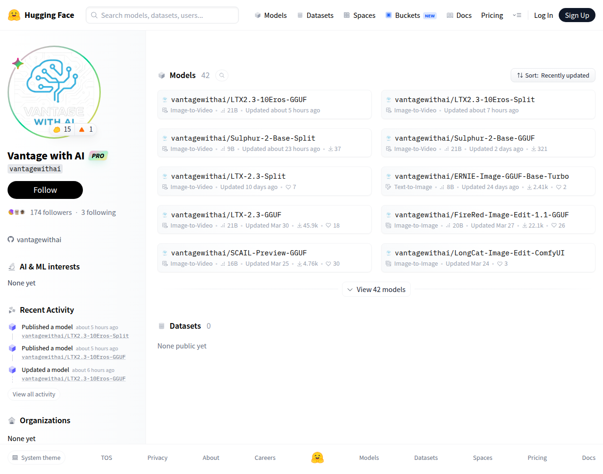

# Visited: https://huggingface.co/vantagewithai
**Time:** Fri May  8 23:17:43 UTC 2026

## Screenshot

## Raw HTML
[page.html](./page.html)

## Downloaded Media (3 files)
## Downloaded Media Files

## Other Links
- [/](/)
- [/Fishtiks](/Fishtiks)
- [/belmontsky](/belmontsky)
- [/datasets](/datasets)
- [/docs](/docs)
- [/enterprise](/enterprise)
- [/front/build/kube-87b6ff9/style.css](/front/build/kube-87b6ff9/style.css)
- [/huggingface](/huggingface)
- [/join](/join)
- [/js/script.js](/js/script.js)
- [/login](/login)
- [/models](/models)
- [/pricing](/pricing)
- [/privacy](/privacy)
- [/pro](/pro)
- [/spaces](/spaces)
- [/storage](/storage)
- [/terms-of-service](/terms-of-service)
- [/vantagewithai](/vantagewithai)
- [/vantagewithai/ERNIE-Image-GGUF-Base-Turbo](/vantagewithai/ERNIE-Image-GGUF-Base-Turbo)
- [/vantagewithai/FireRed-Image-Edit-1.1-GGUF](/vantagewithai/FireRed-Image-Edit-1.1-GGUF)
- [/vantagewithai/LTX-2.3-GGUF](/vantagewithai/LTX-2.3-GGUF)
- [/vantagewithai/LTX-2.3-Split](/vantagewithai/LTX-2.3-Split)
- [/vantagewithai/LTX2.3-10Eros-GGUF](/vantagewithai/LTX2.3-10Eros-GGUF)
- [/vantagewithai/LTX2.3-10Eros-Split](/vantagewithai/LTX2.3-10Eros-Split)
- [/vantagewithai/LongCat-Image-Edit-ComfyUI](/vantagewithai/LongCat-Image-Edit-ComfyUI)
- [/vantagewithai/SCAIL-Preview-GGUF](/vantagewithai/SCAIL-Preview-GGUF)
- [/vantagewithai/Sulphur-2-Base-GGUF](/vantagewithai/Sulphur-2-Base-GGUF)
- [/vantagewithai/Sulphur-2-Base-Split](/vantagewithai/Sulphur-2-Base-Split)
- [/vantagewithai/activity/all](/vantagewithai/activity/all)
- [/vantagewithai/activity/community](/vantagewithai/activity/community)
- [/vantagewithai/activity/upvotes](/vantagewithai/activity/upvotes)
- [/vantagewithai/datasets](/vantagewithai/datasets)
- [/vantagewithai/models](/vantagewithai/models)
- [/yarax](/yarax)
- [https://apply.workable.com/huggingface/](https://apply.workable.com/huggingface/)
- [https://cdnjs.cloudflare.com/ajax/libs/KaTeX/0.12.0/katex.min.css](https://cdnjs.cloudflare.com/ajax/libs/KaTeX/0.12.0/katex.min.css)
- [https://de5282c3ca0c.edge.sdk.awswaf.com/de5282c3ca0c/526cf06acb0d/challenge.js](https://de5282c3ca0c.edge.sdk.awswaf.com/de5282c3ca0c/526cf06acb0d/challenge.js)
- [https://fonts.googleapis.com/css2?family=IBM+Plex+Mono:wght@400;600;700&display=swap](https://fonts.googleapis.com/css2?family=IBM+Plex+Mono:wght@400;600;700&display=swap)
- [https://fonts.googleapis.com/css2?family=Source+Sans+Pro:ital,wght@0,200;0,300;0,400;0,600;0,700;1,200;1,300;1,400;1,600;1,700&display=swap](https://fonts.googleapis.com/css2?family=Source+Sans+Pro:ital,wght@0,200;0,300;0,400;0,600;0,700;1,200;1,300;1,400;1,600;1,700&display=swap)
- [https://fonts.gstatic.com](https://fonts.gstatic.com)
- [https://github.com/vantagewithai](https://github.com/vantagewithai)
- [https://huggingface.co/vantagewithai](https://huggingface.co/vantagewithai)

## Stats
- Links: 48
- Media: 3
