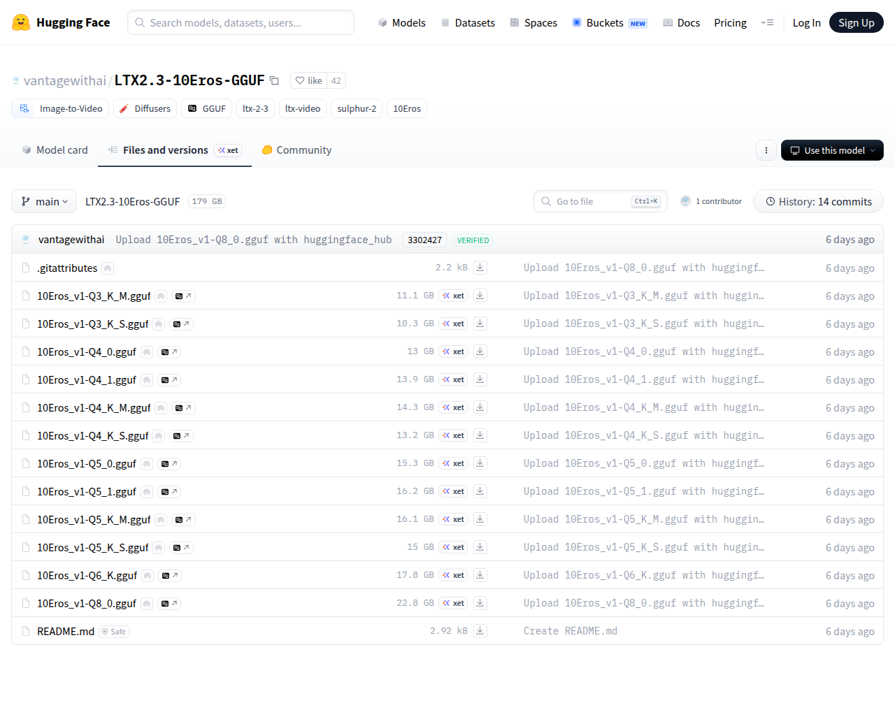

# Visited: https://huggingface.co/vantagewithai/LTX2.3-10Eros-GGUF/tree/main
**Time:** Thu May 14 15:37:39 UTC 2026

## Screenshot

## Raw HTML
[page.html](./page.html)

## Downloaded Media (1 files)
## Downloaded Media Files

## Other Links
- [/](/)
- [/datasets](/datasets)
- [/docs](/docs)
- [/enterprise](/enterprise)
- [/front/build/kube-1daa235/style.css](/front/build/kube-1daa235/style.css)
- [/join](/join)
- [/js/script.js](/js/script.js)
- [/login](/login)
- [/models](/models)
- [/models?library=diffusers](/models?library=diffusers)
- [/models?library=gguf](/models?library=gguf)
- [/models?other=10Eros](/models?other=10Eros)
- [/models?other=ltx-2-3](/models?other=ltx-2-3)
- [/models?other=ltx-video](/models?other=ltx-video)
- [/models?other=sulphur-2](/models?other=sulphur-2)
- [/models?pipeline_tag=image-to-video](/models?pipeline_tag=image-to-video)
- [/pricing](/pricing)
- [/spaces](/spaces)
- [/storage](/storage)
- [/vantagewithai](/vantagewithai)
- [/vantagewithai/LTX2.3-10Eros-GGUF](/vantagewithai/LTX2.3-10Eros-GGUF)
- [/vantagewithai/LTX2.3-10Eros-GGUF/blob/main/.gitattributes](/vantagewithai/LTX2.3-10Eros-GGUF/blob/main/.gitattributes)
- [/vantagewithai/LTX2.3-10Eros-GGUF/blob/main/10Eros_v1-Q3_K_M.gguf](/vantagewithai/LTX2.3-10Eros-GGUF/blob/main/10Eros_v1-Q3_K_M.gguf)
- [/vantagewithai/LTX2.3-10Eros-GGUF/blob/main/10Eros_v1-Q3_K_S.gguf](/vantagewithai/LTX2.3-10Eros-GGUF/blob/main/10Eros_v1-Q3_K_S.gguf)
- [/vantagewithai/LTX2.3-10Eros-GGUF/blob/main/10Eros_v1-Q4_0.gguf](/vantagewithai/LTX2.3-10Eros-GGUF/blob/main/10Eros_v1-Q4_0.gguf)
- [/vantagewithai/LTX2.3-10Eros-GGUF/blob/main/10Eros_v1-Q4_1.gguf](/vantagewithai/LTX2.3-10Eros-GGUF/blob/main/10Eros_v1-Q4_1.gguf)
- [/vantagewithai/LTX2.3-10Eros-GGUF/blob/main/10Eros_v1-Q4_K_M.gguf](/vantagewithai/LTX2.3-10Eros-GGUF/blob/main/10Eros_v1-Q4_K_M.gguf)
- [/vantagewithai/LTX2.3-10Eros-GGUF/blob/main/10Eros_v1-Q4_K_S.gguf](/vantagewithai/LTX2.3-10Eros-GGUF/blob/main/10Eros_v1-Q4_K_S.gguf)
- [/vantagewithai/LTX2.3-10Eros-GGUF/blob/main/10Eros_v1-Q5_0.gguf](/vantagewithai/LTX2.3-10Eros-GGUF/blob/main/10Eros_v1-Q5_0.gguf)
- [/vantagewithai/LTX2.3-10Eros-GGUF/blob/main/10Eros_v1-Q5_1.gguf](/vantagewithai/LTX2.3-10Eros-GGUF/blob/main/10Eros_v1-Q5_1.gguf)
- [/vantagewithai/LTX2.3-10Eros-GGUF/blob/main/10Eros_v1-Q5_K_M.gguf](/vantagewithai/LTX2.3-10Eros-GGUF/blob/main/10Eros_v1-Q5_K_M.gguf)
- [/vantagewithai/LTX2.3-10Eros-GGUF/blob/main/10Eros_v1-Q5_K_S.gguf](/vantagewithai/LTX2.3-10Eros-GGUF/blob/main/10Eros_v1-Q5_K_S.gguf)
- [/vantagewithai/LTX2.3-10Eros-GGUF/blob/main/10Eros_v1-Q6_K.gguf](/vantagewithai/LTX2.3-10Eros-GGUF/blob/main/10Eros_v1-Q6_K.gguf)
- [/vantagewithai/LTX2.3-10Eros-GGUF/blob/main/10Eros_v1-Q8_0.gguf](/vantagewithai/LTX2.3-10Eros-GGUF/blob/main/10Eros_v1-Q8_0.gguf)
- [/vantagewithai/LTX2.3-10Eros-GGUF/blob/main/README.md](/vantagewithai/LTX2.3-10Eros-GGUF/blob/main/README.md)
- [/vantagewithai/LTX2.3-10Eros-GGUF/colab](/vantagewithai/LTX2.3-10Eros-GGUF/colab)
- [/vantagewithai/LTX2.3-10Eros-GGUF/commit/0de183f3a66c75e943fe62e074b952a76f092ae7](/vantagewithai/LTX2.3-10Eros-GGUF/commit/0de183f3a66c75e943fe62e074b952a76f092ae7)
- [/vantagewithai/LTX2.3-10Eros-GGUF/commit/29ecca9e1a9955d610fd70ce548621e95e6f8c03](/vantagewithai/LTX2.3-10Eros-GGUF/commit/29ecca9e1a9955d610fd70ce548621e95e6f8c03)
- [/vantagewithai/LTX2.3-10Eros-GGUF/commit/3302427e80ee1823f494795268b8d31beca08ad7](/vantagewithai/LTX2.3-10Eros-GGUF/commit/3302427e80ee1823f494795268b8d31beca08ad7)
- [/vantagewithai/LTX2.3-10Eros-GGUF/commit/5ef92635098231e49d59b4dc905bb9390b057b57](/vantagewithai/LTX2.3-10Eros-GGUF/commit/5ef92635098231e49d59b4dc905bb9390b057b57)
- [/vantagewithai/LTX2.3-10Eros-GGUF/commit/69f12fde043308647ec5d46f076c3b57aae3721a](/vantagewithai/LTX2.3-10Eros-GGUF/commit/69f12fde043308647ec5d46f076c3b57aae3721a)
- [/vantagewithai/LTX2.3-10Eros-GGUF/commit/87215539f907a7070883ae14301df31a6f6dcb54](/vantagewithai/LTX2.3-10Eros-GGUF/commit/87215539f907a7070883ae14301df31a6f6dcb54)
- [/vantagewithai/LTX2.3-10Eros-GGUF/commit/a911078d9948f1695b5dd836f4d1a6f03d3eb879](/vantagewithai/LTX2.3-10Eros-GGUF/commit/a911078d9948f1695b5dd836f4d1a6f03d3eb879)
- [/vantagewithai/LTX2.3-10Eros-GGUF/commit/a9ad67a0943e6536e41e1665279b02f0b64aad99](/vantagewithai/LTX2.3-10Eros-GGUF/commit/a9ad67a0943e6536e41e1665279b02f0b64aad99)
- [/vantagewithai/LTX2.3-10Eros-GGUF/commit/b7bb616d1dcb7a5971900a289bd550a67f13cfe7](/vantagewithai/LTX2.3-10Eros-GGUF/commit/b7bb616d1dcb7a5971900a289bd550a67f13cfe7)
- [/vantagewithai/LTX2.3-10Eros-GGUF/commit/d44f23b4727616b7bba3a144630f6ebff4593707](/vantagewithai/LTX2.3-10Eros-GGUF/commit/d44f23b4727616b7bba3a144630f6ebff4593707)
- [/vantagewithai/LTX2.3-10Eros-GGUF/commit/d9e1f02591dc8facf97fba5fb74c28d712ec1047](/vantagewithai/LTX2.3-10Eros-GGUF/commit/d9e1f02591dc8facf97fba5fb74c28d712ec1047)
- [/vantagewithai/LTX2.3-10Eros-GGUF/commit/f09db54ea032dc32edf3fff62a4ffe1ff57a8cfa](/vantagewithai/LTX2.3-10Eros-GGUF/commit/f09db54ea032dc32edf3fff62a4ffe1ff57a8cfa)
- [/vantagewithai/LTX2.3-10Eros-GGUF/commit/f9a0fe9d346df412e6526cd7045fb1cedcddcc77](/vantagewithai/LTX2.3-10Eros-GGUF/commit/f9a0fe9d346df412e6526cd7045fb1cedcddcc77)
- [/vantagewithai/LTX2.3-10Eros-GGUF/commits/main](/vantagewithai/LTX2.3-10Eros-GGUF/commits/main)

## Stats
- Links: 76
- Media: 1
