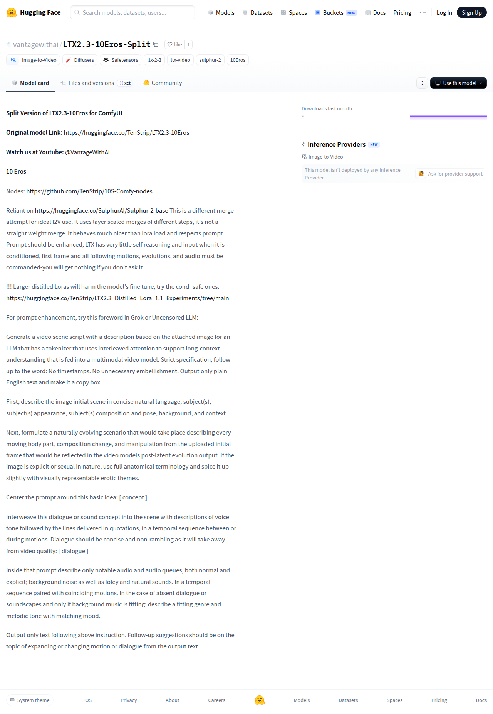

# Visited: https://huggingface.co/vantagewithai/LTX2.3-10Eros-Split
**Time:** Thu May 14 13:49:19 UTC 2026

## Screenshot

## Raw HTML
[page.html](./page.html)

## Downloaded Media (1 files)
## Downloaded Media Files

## Other Links
- [/](/)
- [/datasets](/datasets)
- [/docs](/docs)
- [/enterprise](/enterprise)
- [/front/build/kube-1daa235/style.css](/front/build/kube-1daa235/style.css)
- [/huggingface](/huggingface)
- [/join](/join)
- [/js/script.js](/js/script.js)
- [/login](/login)
- [/models](/models)
- [/models?library=diffusers](/models?library=diffusers)
- [/models?library=safetensors](/models?library=safetensors)
- [/models?other=10Eros](/models?other=10Eros)
- [/models?other=ltx-2-3](/models?other=ltx-2-3)
- [/models?other=ltx-video](/models?other=ltx-video)
- [/models?other=sulphur-2](/models?other=sulphur-2)
- [/models?pipeline_tag=image-to-video](/models?pipeline_tag=image-to-video)
- [/pricing](/pricing)
- [/privacy](/privacy)
- [/spaces](/spaces)
- [/spaces/huggingface/InferenceSupport/discussions/new?title=vantagewithai/LTX2.3-10Eros-Split&amp;description=React%20to%20this%20comment%20with%20an%20emoji%20to%20vote%20for%20%5Bvantagewithai%2FLTX2.3-10Eros-Split%5D(%2Fvantagewithai%2FLTX2.3-10Eros-Split)%20to%20be%20supported%20by%20Inference%20Providers.%0A%0A(optional)%20Which%20providers%20are%20you%20interested%20in%3F%20(Novita%2C%20Hyperbolic%2C%20Together%E2%80%A6)%0A](/spaces/huggingface/InferenceSupport/discussions/new?title=vantagewithai/LTX2.3-10Eros-Split&amp;description=React%20to%20this%20comment%20with%20an%20emoji%20to%20vote%20for%20%5Bvantagewithai%2FLTX2.3-10Eros-Split%5D(%2Fvantagewithai%2FLTX2.3-10Eros-Split)%20to%20be%20supported%20by%20Inference%20Providers.%0A%0A(optional)%20Which%20providers%20are%20you%20interested%20in%3F%20(Novita%2C%20Hyperbolic%2C%20Together%E2%80%A6)%0A)
- [/storage](/storage)
- [/tasks/image-to-video](/tasks/image-to-video)
- [/terms-of-service](/terms-of-service)
- [/vantagewithai](/vantagewithai)
- [/vantagewithai/LTX2.3-10Eros-Split](/vantagewithai/LTX2.3-10Eros-Split)
- [/vantagewithai/LTX2.3-10Eros-Split/colab](/vantagewithai/LTX2.3-10Eros-Split/colab)
- [/vantagewithai/LTX2.3-10Eros-Split/discussions](/vantagewithai/LTX2.3-10Eros-Split/discussions)
- [/vantagewithai/LTX2.3-10Eros-Split/kaggle](/vantagewithai/LTX2.3-10Eros-Split/kaggle)
- [/vantagewithai/LTX2.3-10Eros-Split/tree/main](/vantagewithai/LTX2.3-10Eros-Split/tree/main)
- [/vantagewithai/LTX2.3-10Eros-Split?library=diffusers](/vantagewithai/LTX2.3-10Eros-Split?library=diffusers)
- [https://apply.workable.com/huggingface/](https://apply.workable.com/huggingface/)
- [https://cdnjs.cloudflare.com/ajax/libs/KaTeX/0.12.0/katex.min.css](https://cdnjs.cloudflare.com/ajax/libs/KaTeX/0.12.0/katex.min.css)
- [https://de5282c3ca0c.edge.sdk.awswaf.com/de5282c3ca0c/526cf06acb0d/challenge.js](https://de5282c3ca0c.edge.sdk.awswaf.com/de5282c3ca0c/526cf06acb0d/challenge.js)
- [https://fonts.googleapis.com/css2?family=IBM+Plex+Mono:wght@400;600;700&display=swap](https://fonts.googleapis.com/css2?family=IBM+Plex+Mono:wght@400;600;700&display=swap)
- [https://fonts.googleapis.com/css2?family=Source+Sans+Pro:ital,wght@0,200;0,300;0,400;0,600;0,700;1,200;1,300;1,400;1,600;1,700&display=swap](https://fonts.googleapis.com/css2?family=Source+Sans+Pro:ital,wght@0,200;0,300;0,400;0,600;0,700;1,200;1,300;1,400;1,600;1,700&display=swap)
- [https://fonts.gstatic.com](https://fonts.gstatic.com)
- [https://github.com/TenStrip/10S-Comfy-nodes](https://github.com/TenStrip/10S-Comfy-nodes)
- [https://huggingface.co/SulphurAI/Sulphur-2-base](https://huggingface.co/SulphurAI/Sulphur-2-base)
- [https://huggingface.co/TenStrip/LTX2.3-10Eros](https://huggingface.co/TenStrip/LTX2.3-10Eros)
- [https://huggingface.co/TenStrip/LTX2.3_Distilled_Lora_1.1_Experiments/tree/main](https://huggingface.co/TenStrip/LTX2.3_Distilled_Lora_1.1_Experiments/tree/main)
- [https://huggingface.co/docs/inference-providers](https://huggingface.co/docs/inference-providers)
- [https://huggingface.co/vantagewithai/LTX2.3-10Eros-Split](https://huggingface.co/vantagewithai/LTX2.3-10Eros-Split)
- [https://www.youtube.com/@vantagewithai](https://www.youtube.com/@vantagewithai)

## Stats
- Links: 46
- Media: 1
