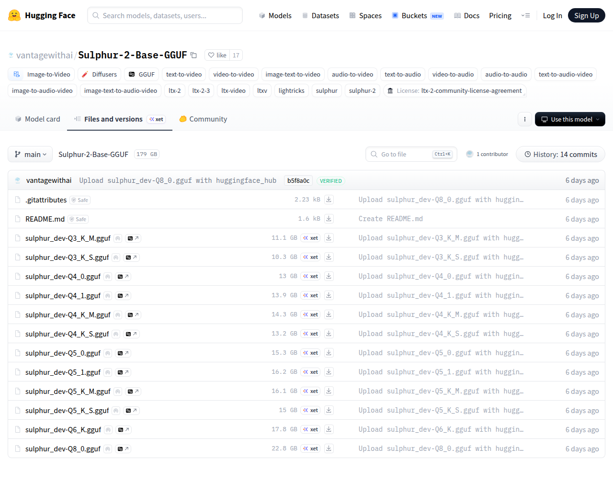

# Visited: https://huggingface.co/vantagewithai/Sulphur-2-Base-GGUF/tree/main
**Time:** Tue May 12 13:21:42 UTC 2026

## Screenshot

## Raw HTML
[page.html](./page.html)

## Downloaded Media (1 files)
## Downloaded Media Files

## Other Links
- [/](/)
- [/datasets](/datasets)
- [/docs](/docs)
- [/enterprise](/enterprise)
- [/front/build/kube-a077e7a/style.css](/front/build/kube-a077e7a/style.css)
- [/join](/join)
- [/js/script.js](/js/script.js)
- [/login](/login)
- [/models](/models)
- [/models?library=diffusers](/models?library=diffusers)
- [/models?library=gguf](/models?library=gguf)
- [/models?other=audio-to-audio](/models?other=audio-to-audio)
- [/models?other=audio-to-video](/models?other=audio-to-video)
- [/models?other=image-text-to-audio-video](/models?other=image-text-to-audio-video)
- [/models?other=image-text-to-video](/models?other=image-text-to-video)
- [/models?other=image-to-audio-video](/models?other=image-to-audio-video)
- [/models?other=lightricks](/models?other=lightricks)
- [/models?other=ltx-2](/models?other=ltx-2)
- [/models?other=ltx-2-3](/models?other=ltx-2-3)
- [/models?other=ltx-video](/models?other=ltx-video)
- [/models?other=ltxv](/models?other=ltxv)
- [/models?other=sulphur](/models?other=sulphur)
- [/models?other=sulphur-2](/models?other=sulphur-2)
- [/models?other=text-to-audio](/models?other=text-to-audio)
- [/models?other=text-to-audio-video](/models?other=text-to-audio-video)
- [/models?other=text-to-video](/models?other=text-to-video)
- [/models?other=video-to-audio](/models?other=video-to-audio)
- [/models?other=video-to-video](/models?other=video-to-video)
- [/models?pipeline_tag=image-to-video](/models?pipeline_tag=image-to-video)
- [/pricing](/pricing)
- [/spaces](/spaces)
- [/storage](/storage)
- [/vantagewithai](/vantagewithai)
- [/vantagewithai/Sulphur-2-Base-GGUF](/vantagewithai/Sulphur-2-Base-GGUF)
- [/vantagewithai/Sulphur-2-Base-GGUF/blob/main/.gitattributes](/vantagewithai/Sulphur-2-Base-GGUF/blob/main/.gitattributes)
- [/vantagewithai/Sulphur-2-Base-GGUF/blob/main/README.md](/vantagewithai/Sulphur-2-Base-GGUF/blob/main/README.md)
- [/vantagewithai/Sulphur-2-Base-GGUF/blob/main/sulphur_dev-Q3_K_M.gguf](/vantagewithai/Sulphur-2-Base-GGUF/blob/main/sulphur_dev-Q3_K_M.gguf)
- [/vantagewithai/Sulphur-2-Base-GGUF/blob/main/sulphur_dev-Q3_K_S.gguf](/vantagewithai/Sulphur-2-Base-GGUF/blob/main/sulphur_dev-Q3_K_S.gguf)
- [/vantagewithai/Sulphur-2-Base-GGUF/blob/main/sulphur_dev-Q4_0.gguf](/vantagewithai/Sulphur-2-Base-GGUF/blob/main/sulphur_dev-Q4_0.gguf)
- [/vantagewithai/Sulphur-2-Base-GGUF/blob/main/sulphur_dev-Q4_1.gguf](/vantagewithai/Sulphur-2-Base-GGUF/blob/main/sulphur_dev-Q4_1.gguf)
- [/vantagewithai/Sulphur-2-Base-GGUF/blob/main/sulphur_dev-Q4_K_M.gguf](/vantagewithai/Sulphur-2-Base-GGUF/blob/main/sulphur_dev-Q4_K_M.gguf)
- [/vantagewithai/Sulphur-2-Base-GGUF/blob/main/sulphur_dev-Q4_K_S.gguf](/vantagewithai/Sulphur-2-Base-GGUF/blob/main/sulphur_dev-Q4_K_S.gguf)
- [/vantagewithai/Sulphur-2-Base-GGUF/blob/main/sulphur_dev-Q5_0.gguf](/vantagewithai/Sulphur-2-Base-GGUF/blob/main/sulphur_dev-Q5_0.gguf)
- [/vantagewithai/Sulphur-2-Base-GGUF/blob/main/sulphur_dev-Q5_1.gguf](/vantagewithai/Sulphur-2-Base-GGUF/blob/main/sulphur_dev-Q5_1.gguf)
- [/vantagewithai/Sulphur-2-Base-GGUF/blob/main/sulphur_dev-Q5_K_M.gguf](/vantagewithai/Sulphur-2-Base-GGUF/blob/main/sulphur_dev-Q5_K_M.gguf)
- [/vantagewithai/Sulphur-2-Base-GGUF/blob/main/sulphur_dev-Q5_K_S.gguf](/vantagewithai/Sulphur-2-Base-GGUF/blob/main/sulphur_dev-Q5_K_S.gguf)
- [/vantagewithai/Sulphur-2-Base-GGUF/blob/main/sulphur_dev-Q6_K.gguf](/vantagewithai/Sulphur-2-Base-GGUF/blob/main/sulphur_dev-Q6_K.gguf)
- [/vantagewithai/Sulphur-2-Base-GGUF/blob/main/sulphur_dev-Q8_0.gguf](/vantagewithai/Sulphur-2-Base-GGUF/blob/main/sulphur_dev-Q8_0.gguf)
- [/vantagewithai/Sulphur-2-Base-GGUF/colab](/vantagewithai/Sulphur-2-Base-GGUF/colab)
- [/vantagewithai/Sulphur-2-Base-GGUF/commit/0d3e18e1e90ba40147035c11d1759bf1a77f3f91](/vantagewithai/Sulphur-2-Base-GGUF/commit/0d3e18e1e90ba40147035c11d1759bf1a77f3f91)

## Stats
- Links: 89
- Media: 1
