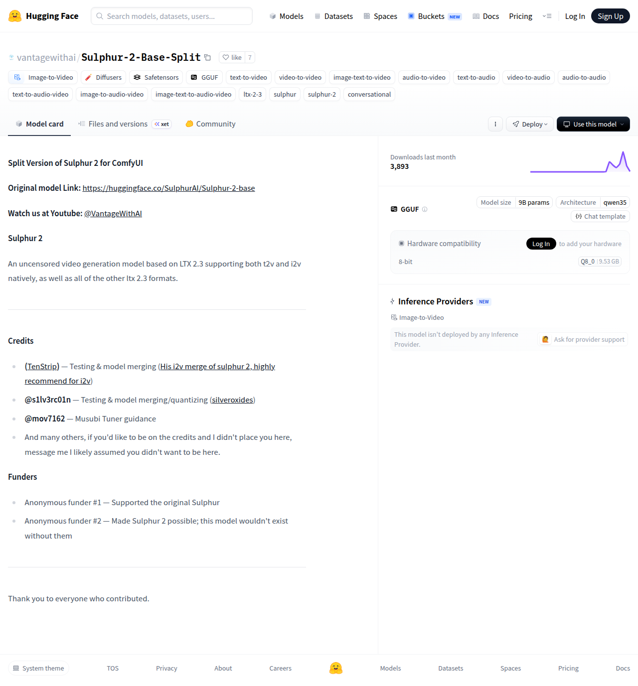

# Visited: https://huggingface.co/vantagewithai/Sulphur-2-Base-Split
**Time:** Thu May 14 14:07:48 UTC 2026

## Screenshot

## Raw HTML
[page.html](./page.html)

## Downloaded Media (1 files)
## Downloaded Media Files

## Other Links
- [/](/)
- [/datasets](/datasets)
- [/docs](/docs)
- [/enterprise](/enterprise)
- [/front/build/kube-1daa235/style.css](/front/build/kube-1daa235/style.css)
- [/huggingface](/huggingface)
- [/join](/join)
- [/js/script.js](/js/script.js)
- [/login](/login)
- [/models](/models)
- [/models?library=diffusers](/models?library=diffusers)
- [/models?library=gguf](/models?library=gguf)
- [/models?library=safetensors](/models?library=safetensors)
- [/models?other=audio-to-audio](/models?other=audio-to-audio)
- [/models?other=audio-to-video](/models?other=audio-to-video)
- [/models?other=conversational](/models?other=conversational)
- [/models?other=image-text-to-audio-video](/models?other=image-text-to-audio-video)
- [/models?other=image-text-to-video](/models?other=image-text-to-video)
- [/models?other=image-to-audio-video](/models?other=image-to-audio-video)
- [/models?other=ltx-2-3](/models?other=ltx-2-3)
- [/models?other=sulphur](/models?other=sulphur)
- [/models?other=sulphur-2](/models?other=sulphur-2)
- [/models?other=text-to-audio](/models?other=text-to-audio)
- [/models?other=text-to-audio-video](/models?other=text-to-audio-video)
- [/models?other=text-to-video](/models?other=text-to-video)
- [/models?other=video-to-audio](/models?other=video-to-audio)
- [/models?other=video-to-video](/models?other=video-to-video)
- [/models?pipeline_tag=image-to-video](/models?pipeline_tag=image-to-video)
- [/pricing](/pricing)
- [/privacy](/privacy)
- [/settings/local-apps#local-apps](/settings/local-apps#local-apps)
- [/spaces](/spaces)
- [/spaces/huggingface/InferenceSupport/discussions/new?title=vantagewithai/Sulphur-2-Base-Split&amp;description=React%20to%20this%20comment%20with%20an%20emoji%20to%20vote%20for%20%5Bvantagewithai%2FSulphur-2-Base-Split%5D(%2Fvantagewithai%2FSulphur-2-Base-Split)%20to%20be%20supported%20by%20Inference%20Providers.%0A%0A(optional)%20Which%20providers%20are%20you%20interested%20in%3F%20(Novita%2C%20Hyperbolic%2C%20Together%E2%80%A6)%0A](/spaces/huggingface/InferenceSupport/discussions/new?title=vantagewithai/Sulphur-2-Base-Split&amp;description=React%20to%20this%20comment%20with%20an%20emoji%20to%20vote%20for%20%5Bvantagewithai%2FSulphur-2-Base-Split%5D(%2Fvantagewithai%2FSulphur-2-Base-Split)%20to%20be%20supported%20by%20Inference%20Providers.%0A%0A(optional)%20Which%20providers%20are%20you%20interested%20in%3F%20(Novita%2C%20Hyperbolic%2C%20Together%E2%80%A6)%0A)
- [/storage](/storage)
- [/tasks/image-to-video](/tasks/image-to-video)
- [/terms-of-service](/terms-of-service)
- [/vantagewithai](/vantagewithai)
- [/vantagewithai/Sulphur-2-Base-Split](/vantagewithai/Sulphur-2-Base-Split)
- [/vantagewithai/Sulphur-2-Base-Split/colab](/vantagewithai/Sulphur-2-Base-Split/colab)
- [/vantagewithai/Sulphur-2-Base-Split/discussions](/vantagewithai/Sulphur-2-Base-Split/discussions)
- [/vantagewithai/Sulphur-2-Base-Split/kaggle](/vantagewithai/Sulphur-2-Base-Split/kaggle)
- [/vantagewithai/Sulphur-2-Base-Split/tree/main](/vantagewithai/Sulphur-2-Base-Split/tree/main)
- [/vantagewithai/Sulphur-2-Base-Split?library=diffusers](/vantagewithai/Sulphur-2-Base-Split?library=diffusers)
- [/vantagewithai/Sulphur-2-Base-Split?library=llama-cpp-python](/vantagewithai/Sulphur-2-Base-Split?library=llama-cpp-python)
- [/vantagewithai/Sulphur-2-Base-Split?local-app=docker-model-runner](/vantagewithai/Sulphur-2-Base-Split?local-app=docker-model-runner)
- [/vantagewithai/Sulphur-2-Base-Split?local-app=hermes-agent](/vantagewithai/Sulphur-2-Base-Split?local-app=hermes-agent)
- [/vantagewithai/Sulphur-2-Base-Split?local-app=lemonade](/vantagewithai/Sulphur-2-Base-Split?local-app=lemonade)
- [/vantagewithai/Sulphur-2-Base-Split?local-app=llama.cpp](/vantagewithai/Sulphur-2-Base-Split?local-app=llama.cpp)
- [/vantagewithai/Sulphur-2-Base-Split?local-app=ollama](/vantagewithai/Sulphur-2-Base-Split?local-app=ollama)
- [/vantagewithai/Sulphur-2-Base-Split?local-app=pi](/vantagewithai/Sulphur-2-Base-Split?local-app=pi)

## Stats
- Links: 69
- Media: 1
