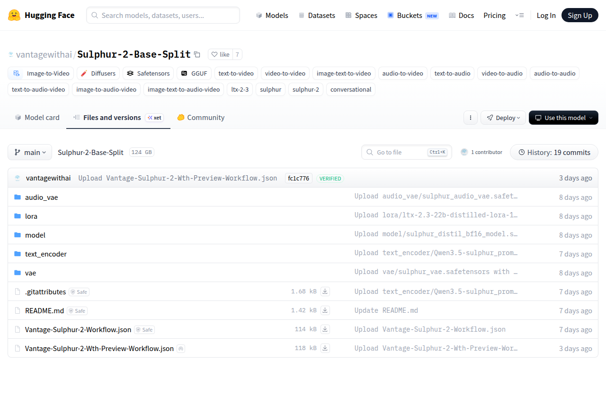

# Visited: https://huggingface.co/vantagewithai/Sulphur-2-Base-Split/tree/main
**Time:** Thu May 14 14:15:00 UTC 2026

## Screenshot

## Raw HTML
[page.html](./page.html)

## Downloaded Media (1 files)
## Downloaded Media Files

## Other Links
- [/](/)
- [/datasets](/datasets)
- [/docs](/docs)
- [/enterprise](/enterprise)
- [/front/build/kube-1daa235/style.css](/front/build/kube-1daa235/style.css)
- [/join](/join)
- [/js/script.js](/js/script.js)
- [/login](/login)
- [/models](/models)
- [/models?library=diffusers](/models?library=diffusers)
- [/models?library=gguf](/models?library=gguf)
- [/models?library=safetensors](/models?library=safetensors)
- [/models?other=audio-to-audio](/models?other=audio-to-audio)
- [/models?other=audio-to-video](/models?other=audio-to-video)
- [/models?other=conversational](/models?other=conversational)
- [/models?other=image-text-to-audio-video](/models?other=image-text-to-audio-video)
- [/models?other=image-text-to-video](/models?other=image-text-to-video)
- [/models?other=image-to-audio-video](/models?other=image-to-audio-video)
- [/models?other=ltx-2-3](/models?other=ltx-2-3)
- [/models?other=sulphur](/models?other=sulphur)
- [/models?other=sulphur-2](/models?other=sulphur-2)
- [/models?other=text-to-audio](/models?other=text-to-audio)
- [/models?other=text-to-audio-video](/models?other=text-to-audio-video)
- [/models?other=text-to-video](/models?other=text-to-video)
- [/models?other=video-to-audio](/models?other=video-to-audio)
- [/models?other=video-to-video](/models?other=video-to-video)
- [/models?pipeline_tag=image-to-video](/models?pipeline_tag=image-to-video)
- [/pricing](/pricing)
- [/settings/local-apps#local-apps](/settings/local-apps#local-apps)
- [/spaces](/spaces)
- [/storage](/storage)
- [/vantagewithai](/vantagewithai)
- [/vantagewithai/Sulphur-2-Base-Split](/vantagewithai/Sulphur-2-Base-Split)
- [/vantagewithai/Sulphur-2-Base-Split/blob/main/.gitattributes](/vantagewithai/Sulphur-2-Base-Split/blob/main/.gitattributes)
- [/vantagewithai/Sulphur-2-Base-Split/blob/main/README.md](/vantagewithai/Sulphur-2-Base-Split/blob/main/README.md)
- [/vantagewithai/Sulphur-2-Base-Split/blob/main/Vantage-Sulphur-2-Workflow.json](/vantagewithai/Sulphur-2-Base-Split/blob/main/Vantage-Sulphur-2-Workflow.json)
- [/vantagewithai/Sulphur-2-Base-Split/blob/main/Vantage-Sulphur-2-Wth-Preview-Workflow.json](/vantagewithai/Sulphur-2-Base-Split/blob/main/Vantage-Sulphur-2-Wth-Preview-Workflow.json)
- [/vantagewithai/Sulphur-2-Base-Split/colab](/vantagewithai/Sulphur-2-Base-Split/colab)
- [/vantagewithai/Sulphur-2-Base-Split/commit/1bf2d74f791c1999628771cc32b72da9a22e0c74](/vantagewithai/Sulphur-2-Base-Split/commit/1bf2d74f791c1999628771cc32b72da9a22e0c74)
- [/vantagewithai/Sulphur-2-Base-Split/commit/4f020905ca49a8b589aab165fc791dc45316d5df](/vantagewithai/Sulphur-2-Base-Split/commit/4f020905ca49a8b589aab165fc791dc45316d5df)
- [/vantagewithai/Sulphur-2-Base-Split/commit/6145fcbec32ea73fb2b2fbe412560a3b0e3161e2](/vantagewithai/Sulphur-2-Base-Split/commit/6145fcbec32ea73fb2b2fbe412560a3b0e3161e2)
- [/vantagewithai/Sulphur-2-Base-Split/commit/7625e1ba7c5e1ae723086545f531b6605272481a](/vantagewithai/Sulphur-2-Base-Split/commit/7625e1ba7c5e1ae723086545f531b6605272481a)
- [/vantagewithai/Sulphur-2-Base-Split/commit/a951d82d302c102b6f805a073baebf41bdba5223](/vantagewithai/Sulphur-2-Base-Split/commit/a951d82d302c102b6f805a073baebf41bdba5223)
- [/vantagewithai/Sulphur-2-Base-Split/commit/f803a5910446171222f09fd00d9fbcad44c84bd7](/vantagewithai/Sulphur-2-Base-Split/commit/f803a5910446171222f09fd00d9fbcad44c84bd7)
- [/vantagewithai/Sulphur-2-Base-Split/commit/f95bfe564fb739c3e188813d3965a0a91f734253](/vantagewithai/Sulphur-2-Base-Split/commit/f95bfe564fb739c3e188813d3965a0a91f734253)
- [/vantagewithai/Sulphur-2-Base-Split/commit/fc1c776c35900659a4c364e7c97734460a36997b](/vantagewithai/Sulphur-2-Base-Split/commit/fc1c776c35900659a4c364e7c97734460a36997b)
- [/vantagewithai/Sulphur-2-Base-Split/commits/main](/vantagewithai/Sulphur-2-Base-Split/commits/main)
- [/vantagewithai/Sulphur-2-Base-Split/discussions](/vantagewithai/Sulphur-2-Base-Split/discussions)
- [/vantagewithai/Sulphur-2-Base-Split/kaggle](/vantagewithai/Sulphur-2-Base-Split/kaggle)
- [/vantagewithai/Sulphur-2-Base-Split/resolve/main/.gitattributes?download=true](/vantagewithai/Sulphur-2-Base-Split/resolve/main/.gitattributes?download=true)

## Stats
- Links: 78
- Media: 1
