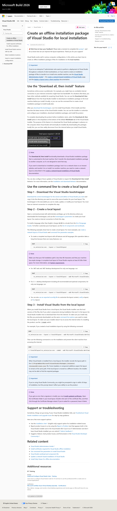

# Visited: https://learn.microsoft.com/en-us/visualstudio/install/create-an-offline-installation-of-visual-studio?view=visualstudio
**Time:** Tue May 12 11:15:06 UTC 2026

## Screenshot

## Raw HTML
[page.html](./page.html)

## Downloaded Media (0 files)
_No media files downloaded_

## Other Links
- [#](#)
- [#main](#main)
- [#step-1---download-the-visual-studio-bootstrapper](#step-1---download-the-visual-studio-bootstrapper)
- [../help-viewer/overview?view=visualstudio](../help-viewer/overview?view=visualstudio)
- [../ide/how-to-report-a-problem-with-visual-studio?view=visualstudio](../ide/how-to-report-a-problem-with-visual-studio?view=visualstudio)
- [/_themes/docs.theme/master/en-us/_themes/global/deprecation.js](/_themes/docs.theme/master/en-us/_themes/global/deprecation.js)
- [/en-us/visualstudio/install/update-visual-studio?#installation-and-download-behaviors-1](/en-us/visualstudio/install/update-visual-studio?#installation-and-download-behaviors-1)
- [/en-us/visualstudio/releases/2022/system-requirements/](/en-us/visualstudio/releases/2022/system-requirements/)
- [/en-us/visualstudio/releases/2026/vs-system-requirements/](/en-us/visualstudio/releases/2026/vs-system-requirements/)
- [/static/assets/0.4.03413.7809-3b89a05c/scripts/en-us/index-docs.js](/static/assets/0.4.03413.7809-3b89a05c/scripts/en-us/index-docs.js)
- [/static/assets/0.4.03413.7809-3b89a05c/styles/site.css](/static/assets/0.4.03413.7809-3b89a05c/styles/site.css)
- [command-line-parameter-examples?view=visualstudio#using---layout-to-create-a-network-layout-or-a-local-cache](command-line-parameter-examples?view=visualstudio#using---layout-to-create-a-network-layout-or-a-local-cache)
- [create-a-network-installation-of-visual-studio?view=visualstudio](create-a-network-installation-of-visual-studio?view=visualstudio)
- [create-a-network-installation-of-visual-studio?view=visualstudio#configure-the-contents-of-a-layout](create-a-network-installation-of-visual-studio?view=visualstudio#configure-the-contents-of-a-layout)
- [create-a-network-installation-of-visual-studio?view=visualstudio#download-the-visual-studio-bootstrapper-to-create-the-layout](create-a-network-installation-of-visual-studio?view=visualstudio#download-the-visual-studio-bootstrapper-to-create-the-layout)
- [create-a-network-installation-of-visual-studio?view=visualstudio&amp;#fix-a-layout](create-a-network-installation-of-visual-studio?view=visualstudio&amp;#fix-a-layout)
- [create-a-network-installation-of-visual-studio?view=visualstudio&amp;#verify-a-layout](create-a-network-installation-of-visual-studio?view=visualstudio&amp;#verify-a-layout)
- [deploy-a-layout-onto-a-client-machine?view=visualstudio](deploy-a-layout-onto-a-client-machine?view=visualstudio)
- [https://aka.ms/feedback/suggest?space=8](https://aka.ms/feedback/suggest?space=8)
- [https://aka.ms/learnlayoutfeedback](https://aka.ms/learnlayoutfeedback)
- [https://aka.ms/vs/admin/feedback](https://aka.ms/vs/admin/feedback)
- [https://aka.ms/vs/admin/guide](https://aka.ms/vs/admin/guide)
- [https://aka.ms/yourcaliforniaprivacychoices](https://aka.ms/yourcaliforniaprivacychoices)
- [https://github.com/MicrosoftDocs/visualstudio-docs/blob/main/docs/install/create-an-offline-installation-of-visual-studio.md](https://github.com/MicrosoftDocs/visualstudio-docs/blob/main/docs/install/create-an-offline-installation-of-visual-studio.md)
- [https://go.microsoft.com/fwlink/?LinkId=521839](https://go.microsoft.com/fwlink/?LinkId=521839)
- [https://go.microsoft.com/fwlink/?linkid=2259814](https://go.microsoft.com/fwlink/?linkid=2259814)
- [https://go.microsoft.com/fwlink/p/?LinkID=2092881](https://go.microsoft.com/fwlink/p/?LinkID=2092881)
- [https://js.monitor.azure.com/scripts/c/ms.jsll-4.min.js](https://js.monitor.azure.com/scripts/c/ms.jsll-4.min.js)
- [https://learn.microsoft.com/en-us/contribute](https://learn.microsoft.com/en-us/contribute)
- [https://learn.microsoft.com/en-us/legal/termsofuse](https://learn.microsoft.com/en-us/legal/termsofuse)
- [https://learn.microsoft.com/en-us/lifecycle/faq/internet-explorer-microsoft-edge](https://learn.microsoft.com/en-us/lifecycle/faq/internet-explorer-microsoft-edge)
- [https://learn.microsoft.com/en-us/previous-versions/](https://learn.microsoft.com/en-us/previous-versions/)
- [https://learn.microsoft.com/en-us/principles-for-ai-generated-content](https://learn.microsoft.com/en-us/principles-for-ai-generated-content)
- [https://learn.microsoft.com/en-us/visualstudio/install/create-an-offline-installation-of-visual-studio?view=visualstudio](https://learn.microsoft.com/en-us/visualstudio/install/create-an-offline-installation-of-visual-studio?view=visualstudio)
- [https://techcommunity.microsoft.com/t5/microsoft-learn-blog/bg-p/MicrosoftLearnBlog](https://techcommunity.microsoft.com/t5/microsoft-learn-blog/bg-p/MicrosoftLearnBlog)
- [https://visualstudio.microsoft.com/vs/support/#talktous](https://visualstudio.microsoft.com/vs/support/#talktous)
- [https://wcpstatic.microsoft.com/mscc/lib/v2/wcp-consent.js](https://wcpstatic.microsoft.com/mscc/lib/v2/wcp-consent.js)
- [https://www.microsoft.com/legal/intellectualproperty/Trademarks/](https://www.microsoft.com/legal/intellectualproperty/Trademarks/)
- [install-certificates-for-visual-studio-offline?view=visualstudio](install-certificates-for-visual-studio-offline?view=visualstudio)
- [media/visualstudio/download-all-then-install-from-installer.png?view=visualstudio](media/visualstudio/download-all-then-install-from-installer.png?view=visualstudio)
- [troubleshooting-installation-issues?view=visualstudio](troubleshooting-installation-issues?view=visualstudio)
- [update-a-network-installation-of-visual-studio?view=visualstudio](update-a-network-installation-of-visual-studio?view=visualstudio)
- [use-command-line-parameters-to-install-visual-studio?view=visualstudio](use-command-line-parameters-to-install-visual-studio?view=visualstudio)
- [use-command-line-parameters-to-install-visual-studio?view=visualstudio#layout-command-and-command-line-parameters](use-command-line-parameters-to-install-visual-studio?view=visualstudio#layout-command-and-command-line-parameters)
- [use-command-line-parameters-to-install-visual-studio?view=visualstudio#list-of-language-locales](use-command-line-parameters-to-install-visual-studio?view=visualstudio#list-of-language-locales)
- [workload-and-component-ids?view=visualstudio](workload-and-component-ids?view=visualstudio)

## Stats
- Links: 46
- Media: 0
