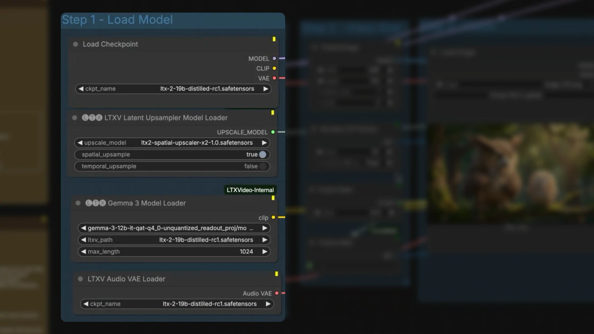
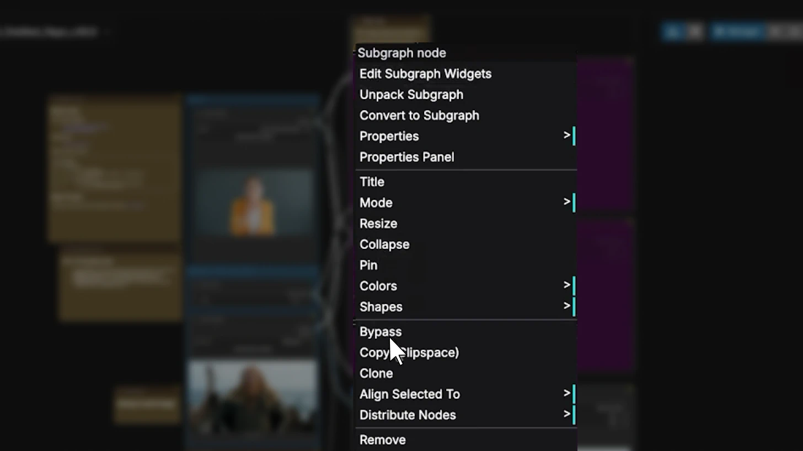
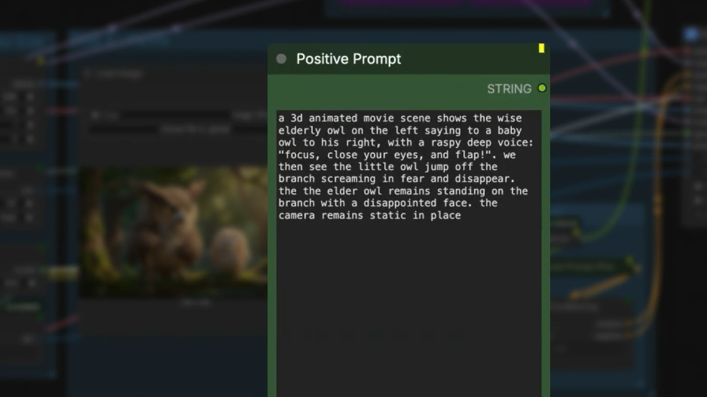
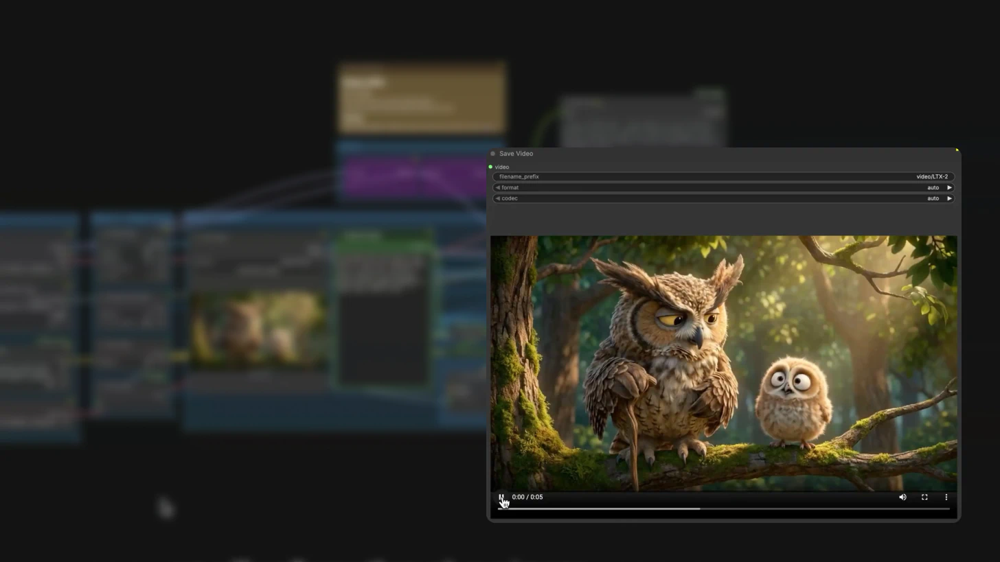
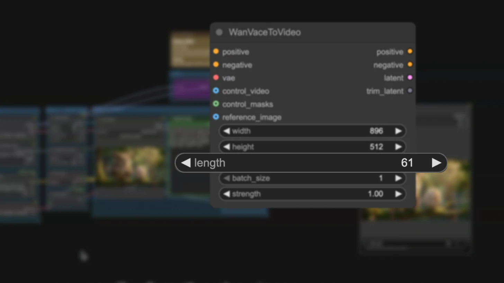
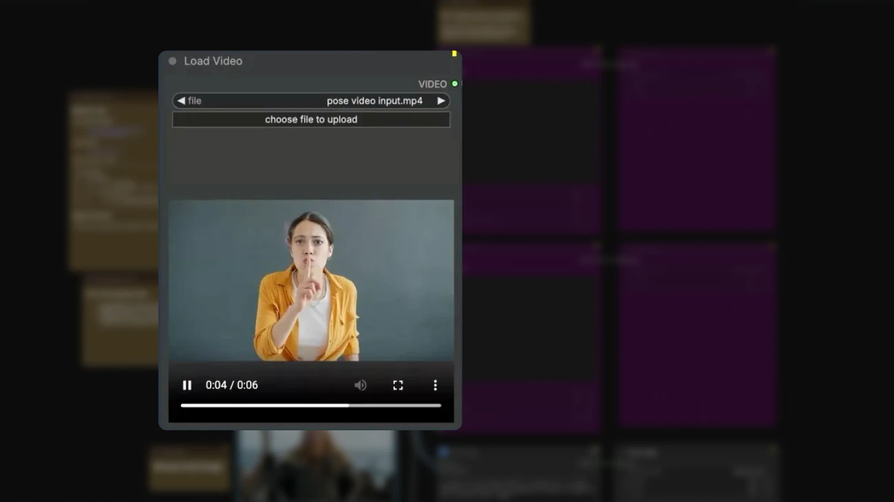

## Downloaded Media Files

- [695c06aa63b560e217a68363_LTX_2_Technical_Report_compressed.pdf](./media/695c06aa63b560e217a68363_LTX_2_Technical_Report_compressed.pdf) (331 KB)

- [CPRA%20Notice%20-%20UPLOADED.pdf](./media/CPRA%20Notice%20-%20UPLOADED.pdf) (319 KB)
- [Privacy%20Policy%20-%20LTX%20Platform.pdf](./media/Privacy%20Policy%20-%20LTX%20Platform.pdf) (378 KB)
