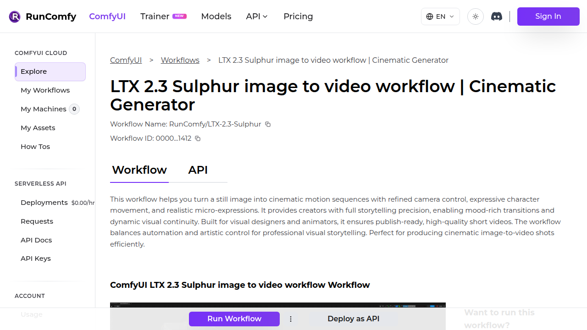

# Visited: https://www.runcomfy.com/comfyui-workflows/ltx-2-3-sulphur-image-to-video-workflow-in-comfyui-cinematic-motion-creator
**Time:** Thu May 14 13:12:31 UTC 2026

## Screenshot

## Raw HTML
[page.html](./page.html)

## Downloaded Media (13 files)
## Downloaded Media Files

- [comfyui-wan2-2-fun-inp-workflow-first-to-last-frame-interpolation-1272.mp4](./media/comfyui-wan2-2-fun-inp-workflow-first-to-last-frame-interpolation-1272.mp4) (978 KB)
- [comfyui-z-depth-maps-workflow-create-houdini-animations-1131.mp4](./media/comfyui-z-depth-maps-workflow-create-houdini-animations-1131.mp4) (749 KB)
- [hunyuanvideo-i2v-workflow-in-comfyui-premium-image-to-video-generation-1202.mp4](./media/hunyuanvideo-i2v-workflow-in-comfyui-premium-image-to-video-generation-1202.mp4) (2038 KB)
- [ltx-2-3-image-to-video-in-comfyui-realistic-motion-workflow-1373.mp4](./media/ltx-2-3-image-to-video-in-comfyui-realistic-motion-workflow-1373.mp4) (1679 KB)
- [ltx-2-3-sulphur-image-to-video-workflow-in-comfyui-cinematic-motion-creator-1412.mp4](./media/ltx-2-3-sulphur-image-to-video-workflow-in-comfyui-cinematic-motion-creator-1412.mp4) (755 KB)
- [sonic-advanced-lip-sync-portrait-animation-framework-1191.mp4](./media/sonic-advanced-lip-sync-portrait-animation-framework-1191.mp4) (957 KB)
- [steadydancer-in-comfyui-i2v-human-animation-workflow-1318.mp4](./media/steadydancer-in-comfyui-i2v-human-animation-workflow-1318.mp4) (654 KB)
- [uno-for-comfyui-consistent-subject-generation-1218.mp4](./media/uno-for-comfyui-consistent-subject-generation-1218.mp4) (546 KB)
- [wonder3d-single-view-3d-reconstruction-1168.mp4](./media/wonder3d-single-view-3d-reconstruction-1168.mp4) (1116 KB)
- [ltx-2-3-sulphur-image-to-video-workflow-in-comfyui-cinematic-motion-creator-1412-example_01.mp4](./media/ltx-2-3-sulphur-image-to-video-workflow-in-comfyui-cinematic-motion-creator-1412-example_01.mp4) (873 KB)
- [ltx-2-3-sulphur-image-to-video-workflow-in-comfyui-cinematic-motion-creator-1412-example_02.mp4](./media/ltx-2-3-sulphur-image-to-video-workflow-in-comfyui-cinematic-motion-creator-1412-example_02.mp4) (849 KB)
- [ltx-2-3-sulphur-image-to-video-workflow-in-comfyui-cinematic-motion-creator-1412-example_03.mp4](./media/ltx-2-3-sulphur-image-to-video-workflow-in-comfyui-cinematic-motion-creator-1412-example_03.mp4) (879 KB)

## Other Links
- [#acknowledgements](#acknowledgements)
- [#empty-latent](#empty-latent)
- [#generate-high-resolution](#generate-high-resolution)
- [#generate-low-resolution](#generate-low-resolution)
- [#how-to-use-comfyui-ltx-2-3-sulphur-image-to-video-workflow](#how-to-use-comfyui-ltx-2-3-sulphur-image-to-video-workflow)
- [#image-preprocess](#image-preprocess)
- [#key-models-in-comfyui-ltx-2-3-sulphur-image-to-video-workflow](#key-models-in-comfyui-ltx-2-3-sulphur-image-to-video-workflow)
- [#key-nodes-in-comfyui-ltx-2-3-sulphur-image-to-video-workflow](#key-nodes-in-comfyui-ltx-2-3-sulphur-image-to-video-workflow)
- [#lantent-upscale](#lantent-upscale)
- [#ltx-2-3-sulphur-image-to-video-workflow-cinematic-image-to-video-with-controllable-motion](#ltx-2-3-sulphur-image-to-video-workflow-cinematic-image-to-video-with-controllable-motion)
- [#model](#model)
- [#number-conversion](#number-conversion)
- [#optional-extras](#optional-extras)
- [#output](#output)
- [#prompt](#prompt)
- [#resources](#resources)
- [#video-settings](#video-settings)
- [/](/)
- [/_next/image?url=%2Fassets%2Fimages%2Fdiscord.svg&amp;w=48&amp;q=75](/_next/image?url=%2Fassets%2Fimages%2Fdiscord.svg&amp;w=48&amp;q=75)
- [/_next/image?url=%2Fassets%2Fimages%2Flogo.png&amp;w=256&amp;q=75](/_next/image?url=%2Fassets%2Fimages%2Flogo.png&amp;w=256&amp;q=75)
- [/_next/static/chunks/11370-6d98e1666eb79ec0.js?dpl=dpl_CQaCuznXSeWue3Rs5SZTMUp7bN5m](/_next/static/chunks/11370-6d98e1666eb79ec0.js?dpl=dpl_CQaCuznXSeWue3Rs5SZTMUp7bN5m)
- [/_next/static/chunks/12866-eb57942804e09089.js?dpl=dpl_CQaCuznXSeWue3Rs5SZTMUp7bN5m](/_next/static/chunks/12866-eb57942804e09089.js?dpl=dpl_CQaCuznXSeWue3Rs5SZTMUp7bN5m)
- [/_next/static/chunks/17858-9c94df6478e08493.js?dpl=dpl_CQaCuznXSeWue3Rs5SZTMUp7bN5m](/_next/static/chunks/17858-9c94df6478e08493.js?dpl=dpl_CQaCuznXSeWue3Rs5SZTMUp7bN5m)
- [/_next/static/chunks/2008-8bf5e441cf635e12.js?dpl=dpl_CQaCuznXSeWue3Rs5SZTMUp7bN5m](/_next/static/chunks/2008-8bf5e441cf635e12.js?dpl=dpl_CQaCuznXSeWue3Rs5SZTMUp7bN5m)
- [/_next/static/chunks/22161-30feac441a4534c6.js?dpl=dpl_CQaCuznXSeWue3Rs5SZTMUp7bN5m](/_next/static/chunks/22161-30feac441a4534c6.js?dpl=dpl_CQaCuznXSeWue3Rs5SZTMUp7bN5m)
- [/_next/static/chunks/23051-ce84a710d960ebe7.js?dpl=dpl_CQaCuznXSeWue3Rs5SZTMUp7bN5m](/_next/static/chunks/23051-ce84a710d960ebe7.js?dpl=dpl_CQaCuznXSeWue3Rs5SZTMUp7bN5m)
- [/_next/static/chunks/24955-7e187e4ed59b1599.js?dpl=dpl_CQaCuznXSeWue3Rs5SZTMUp7bN5m](/_next/static/chunks/24955-7e187e4ed59b1599.js?dpl=dpl_CQaCuznXSeWue3Rs5SZTMUp7bN5m)
- [/_next/static/chunks/3069-4d8d8b8c64bd972b.js?dpl=dpl_CQaCuznXSeWue3Rs5SZTMUp7bN5m](/_next/static/chunks/3069-4d8d8b8c64bd972b.js?dpl=dpl_CQaCuznXSeWue3Rs5SZTMUp7bN5m)
- [/_next/static/chunks/35236-35b26d6c6e3dc0a3.js?dpl=dpl_CQaCuznXSeWue3Rs5SZTMUp7bN5m](/_next/static/chunks/35236-35b26d6c6e3dc0a3.js?dpl=dpl_CQaCuznXSeWue3Rs5SZTMUp7bN5m)
- [/_next/static/chunks/35498-5c53fee94f5bb1b3.js?dpl=dpl_CQaCuznXSeWue3Rs5SZTMUp7bN5m](/_next/static/chunks/35498-5c53fee94f5bb1b3.js?dpl=dpl_CQaCuznXSeWue3Rs5SZTMUp7bN5m)
- [/_next/static/chunks/38749-f661f86f8a3438e7.js?dpl=dpl_CQaCuznXSeWue3Rs5SZTMUp7bN5m](/_next/static/chunks/38749-f661f86f8a3438e7.js?dpl=dpl_CQaCuznXSeWue3Rs5SZTMUp7bN5m)
- [/_next/static/chunks/39123-bae8afa2d229817e.js?dpl=dpl_CQaCuznXSeWue3Rs5SZTMUp7bN5m](/_next/static/chunks/39123-bae8afa2d229817e.js?dpl=dpl_CQaCuznXSeWue3Rs5SZTMUp7bN5m)
- [/_next/static/chunks/3995-9e42b01561c58de7.js?dpl=dpl_CQaCuznXSeWue3Rs5SZTMUp7bN5m](/_next/static/chunks/3995-9e42b01561c58de7.js?dpl=dpl_CQaCuznXSeWue3Rs5SZTMUp7bN5m)
- [/_next/static/chunks/40300-a64d7a5df2e9e479.js?dpl=dpl_CQaCuznXSeWue3Rs5SZTMUp7bN5m](/_next/static/chunks/40300-a64d7a5df2e9e479.js?dpl=dpl_CQaCuznXSeWue3Rs5SZTMUp7bN5m)
- [/_next/static/chunks/40491-521341737561b92b.js?dpl=dpl_CQaCuznXSeWue3Rs5SZTMUp7bN5m](/_next/static/chunks/40491-521341737561b92b.js?dpl=dpl_CQaCuznXSeWue3Rs5SZTMUp7bN5m)
- [/_next/static/chunks/49280-452dec61be99f7d3.js?dpl=dpl_CQaCuznXSeWue3Rs5SZTMUp7bN5m](/_next/static/chunks/49280-452dec61be99f7d3.js?dpl=dpl_CQaCuznXSeWue3Rs5SZTMUp7bN5m)
- [/_next/static/chunks/50005-b384c4cd21d35ef9.js?dpl=dpl_CQaCuznXSeWue3Rs5SZTMUp7bN5m](/_next/static/chunks/50005-b384c4cd21d35ef9.js?dpl=dpl_CQaCuznXSeWue3Rs5SZTMUp7bN5m)
- [/_next/static/chunks/5363-5e4e14c44ebbf1e1.js?dpl=dpl_CQaCuznXSeWue3Rs5SZTMUp7bN5m](/_next/static/chunks/5363-5e4e14c44ebbf1e1.js?dpl=dpl_CQaCuznXSeWue3Rs5SZTMUp7bN5m)
- [/_next/static/chunks/56374-da90f7d2c09bd0af.js?dpl=dpl_CQaCuznXSeWue3Rs5SZTMUp7bN5m](/_next/static/chunks/56374-da90f7d2c09bd0af.js?dpl=dpl_CQaCuznXSeWue3Rs5SZTMUp7bN5m)
- [/_next/static/chunks/67418-f7c43ccdb5cb9e45.js?dpl=dpl_CQaCuznXSeWue3Rs5SZTMUp7bN5m](/_next/static/chunks/67418-f7c43ccdb5cb9e45.js?dpl=dpl_CQaCuznXSeWue3Rs5SZTMUp7bN5m)
- [/_next/static/chunks/6ea58dfc-fee26350a5b38ac3.js?dpl=dpl_CQaCuznXSeWue3Rs5SZTMUp7bN5m](/_next/static/chunks/6ea58dfc-fee26350a5b38ac3.js?dpl=dpl_CQaCuznXSeWue3Rs5SZTMUp7bN5m)
- [/_next/static/chunks/71267-721afbf88de81beb.js?dpl=dpl_CQaCuznXSeWue3Rs5SZTMUp7bN5m](/_next/static/chunks/71267-721afbf88de81beb.js?dpl=dpl_CQaCuznXSeWue3Rs5SZTMUp7bN5m)
- [/_next/static/chunks/76937-969846e189ceab30.js?dpl=dpl_CQaCuznXSeWue3Rs5SZTMUp7bN5m](/_next/static/chunks/76937-969846e189ceab30.js?dpl=dpl_CQaCuznXSeWue3Rs5SZTMUp7bN5m)
- [/_next/static/chunks/80957-92273499476d9949.js?dpl=dpl_CQaCuznXSeWue3Rs5SZTMUp7bN5m](/_next/static/chunks/80957-92273499476d9949.js?dpl=dpl_CQaCuznXSeWue3Rs5SZTMUp7bN5m)
- [/_next/static/chunks/81510-a94f54e11a64915d.js?dpl=dpl_CQaCuznXSeWue3Rs5SZTMUp7bN5m](/_next/static/chunks/81510-a94f54e11a64915d.js?dpl=dpl_CQaCuznXSeWue3Rs5SZTMUp7bN5m)
- [/_next/static/chunks/83683-56ed4cd22346396c.js?dpl=dpl_CQaCuznXSeWue3Rs5SZTMUp7bN5m](/_next/static/chunks/83683-56ed4cd22346396c.js?dpl=dpl_CQaCuznXSeWue3Rs5SZTMUp7bN5m)
- [/_next/static/chunks/88236-f39f7c178c532736.js?dpl=dpl_CQaCuznXSeWue3Rs5SZTMUp7bN5m](/_next/static/chunks/88236-f39f7c178c532736.js?dpl=dpl_CQaCuznXSeWue3Rs5SZTMUp7bN5m)
- [/_next/static/chunks/88488-eb2323d06b7e5c64.js?dpl=dpl_CQaCuznXSeWue3Rs5SZTMUp7bN5m](/_next/static/chunks/88488-eb2323d06b7e5c64.js?dpl=dpl_CQaCuznXSeWue3Rs5SZTMUp7bN5m)
- [/_next/static/chunks/97306-aa9f9a453f3b16e2.js?dpl=dpl_CQaCuznXSeWue3Rs5SZTMUp7bN5m](/_next/static/chunks/97306-aa9f9a453f3b16e2.js?dpl=dpl_CQaCuznXSeWue3Rs5SZTMUp7bN5m)
- [/_next/static/chunks/99388-721a873fa8aba45a.js?dpl=dpl_CQaCuznXSeWue3Rs5SZTMUp7bN5m](/_next/static/chunks/99388-721a873fa8aba45a.js?dpl=dpl_CQaCuznXSeWue3Rs5SZTMUp7bN5m)

## Stats
- Links: 134
- Media: 13
